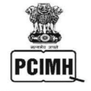
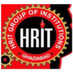
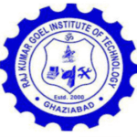
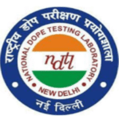
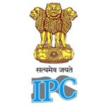

<figure>

<figcaption>

Pharmacopoeia Commission for Indian Medicine & Homoeopathy

</figcaption>

</figure>

<figure>

<figcaption>

Mewar Group of Institutions

</figcaption>

</figure>

<figure>

<figcaption>

Jind Institute of Engineering & Technology

</figcaption>

</figure>

<figure>

<figcaption>

HRIT Group of Institutions

</figcaption>

</figure>

<figure>

<figcaption>

Raj Kumar Goel Institute of Technology

</figcaption>

</figure>

<figure>

<figcaption>

Institute of Technology & Science (ITS) Ghaziabad

</figcaption>

</figure>

<figure>

<figcaption>

Akums Drugs & Pharmaceuticals Ltd.

</figcaption>

</figure>

<figure>

<figcaption>

National Dope Testing Laboratory New Delhi

</figcaption>

</figure>

<figure>

<figcaption>

Indian Pharmacopoeia Commission

</figcaption>

</figure>

<figure>

<figcaption>

Sanskar Educational Group

</figcaption>

</figure>
