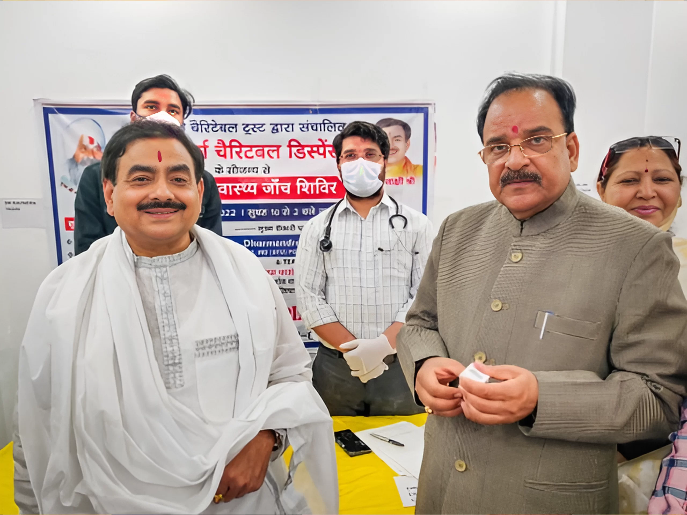
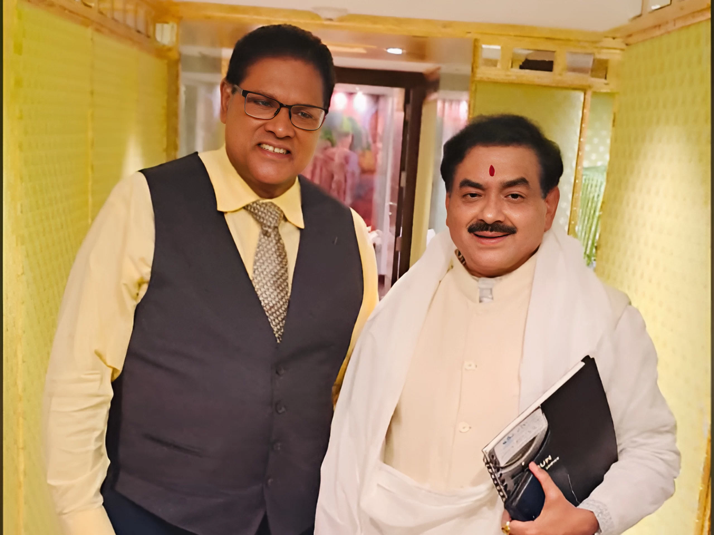
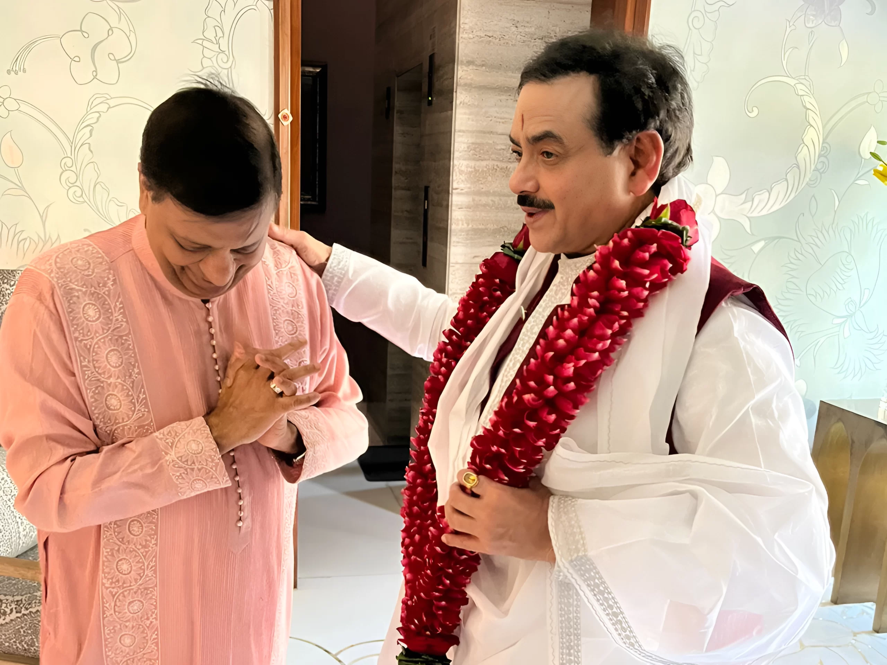
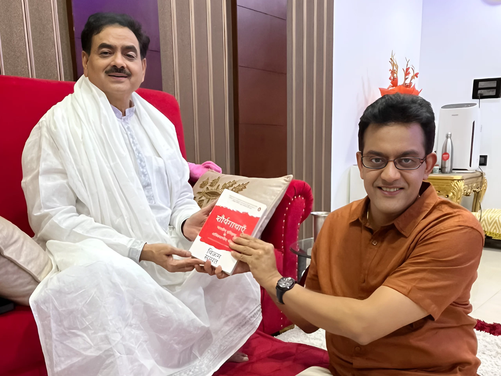
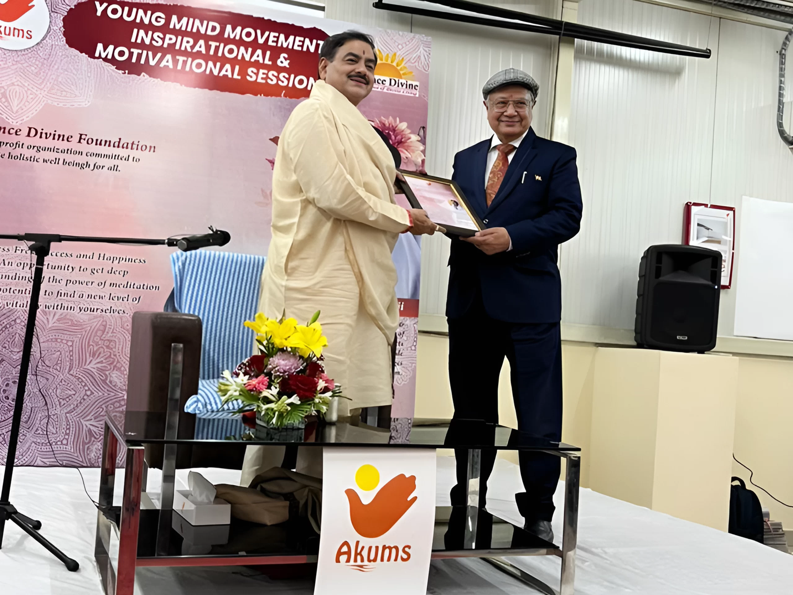
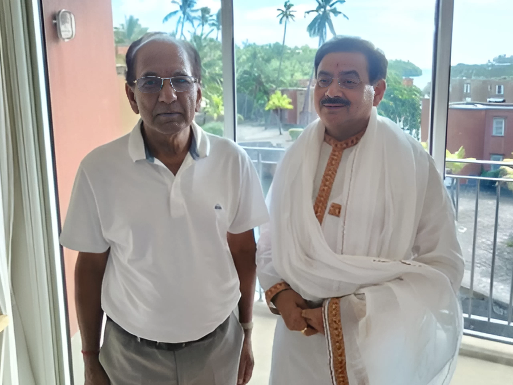

<figure>

<figcaption>

Hon'ble Shri Rajnath Singh, Minister of Defence, Government of India, with Sakshi Shree - "Life-changing insights and empowerment from Sakshi Shree's program!"

</figcaption>

</figure>

<figure>

<figcaption>

Shri Ajay Bhatt, Ex-Union Minister of State for Defense & Tourism, with Sakshi Shree during a Free Health Checkup Camp organized by Science Divine Foundation

</figcaption>

</figure>

<figure>

<figcaption>

Shri Kailash Chaudhary, Ex-Union Minister of State for Agriculture with Sakshi Shree during his visit to Siddha Sudarshan Sakshi Dham in Ghaziabad (Delhi NCR)

</figcaption>

</figure>

<figure>

<figcaption>

Chandrikapersad Santokhi, President Republic of Suriname, with Sakshi Shree during a visit to India in January 2023

</figcaption>

</figure>

<figure>

<figcaption>

Anil Gupta (CMD of KEI industries), taking blessings from Sakshi Shree, during his visit to Siddha Sudarshan Sakshi Dham in Ghaziabad (Delhi NCR)

</figcaption>

</figure>

<figure>

<figcaption>

Dr. Vikram Sampat, Famous Indian historian and Sakshi Shree's disciple - "Sakshi Shree's teaching brought me inner peace and purpose!"

</figcaption>

</figure>

<figure>

<figcaption>

Mr. DC Jain (Ex Chairman & Managing Director, Akums Drugs & Pharmaceuticals Ltd) at Akum Delhi HQ during Sakshi Shree's Meditation Event

</figcaption>

</figure>

<figure>

<figcaption>

Shri Anil Bachoo, Ex Vice Prime Minister of Mauritius, with Sakshi Shree

</figcaption>

</figure>
