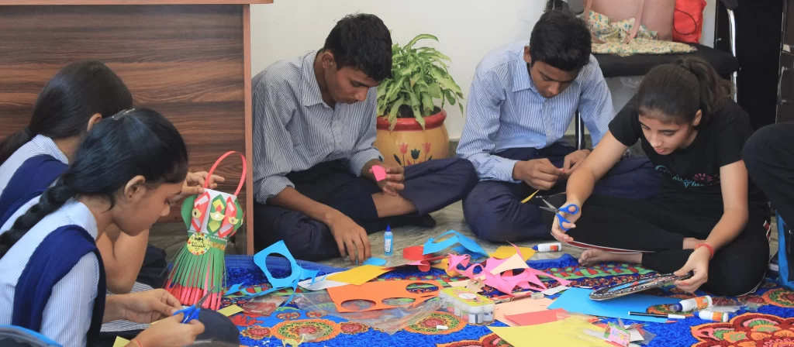

# Vocation: Skills for Self-Reliance

Our EVM centers offer age-appropriate vocational training through community volunteers, helping children develop practical skills for future employment and entrepreneurship.

# We help children explore:

- Basic digital literacy and computer skills
- Communication and essential soft skills

- Artistic expression and traditional craftsmanship
- Sports, teamwork, and leadership skills

These centers will equip children to dream big and earn with dignity, preparing them for a future where they can support themselves and contribute to society.
