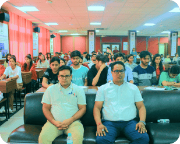
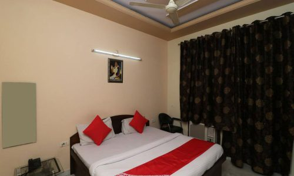
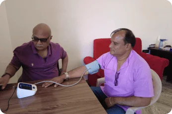
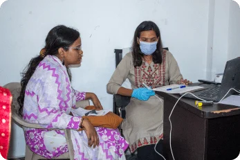
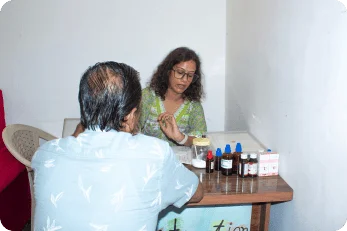
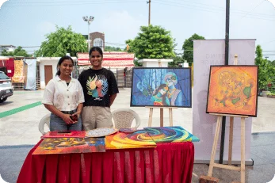

## Life

## Transforming

Meditation Retreat

Looking to activate your mind’s full potential !!  
Join us on a 3-day advanced meditation retreat 🧘‍♀️

## 25th - 27th November, Haridwar

[Book Now](#PAYMENT) [Get a free consultation](#consultation) 

## 40+ YEARS OF SPIRITUAL GUIDANCE BY SAKSHI SHREE

## 5M+

## Lives Impacted  
Worldwide

## 1,000+

## Meditation Events Organized Globally

## 9/10

## Experience Inner Peace  
and Clarity

## Seeker

Success Stories

**“I can’t believe I didn’t find this sooner”**  
I cannot believe I didn’t find this sooner. The clarity of life I found through Guruji’s teachings and meditation techniques cannot be measured in terms of money. Highly recommend everyone to attend his meditation camp and experience it yourself .

 **Dheeraj Madaan** Management Consultant

**“Got rid of the stress & negativity.”**  
Guruji’s meditation kriyas are extremely simple to follow. His spiritual teachings and Sanjeevani kriya helped me get rid of the stress & negativity that was stopping me from going deep into meditation and made me an extremely calm-minded person. The concept of Sakshi is life transformational. Truly the best investment of my life in myself!

 **Nancy Thakur** Marketing manager

**“Sakshi Shree Ji’s meditation has been live transformative”**  
I am immensely grateful for the guidance and wisdom imparted by my revered Sakshi Shri Guruji. His teachings on meditation have been transformative, not only calming my mind but also helping me navigate life’s challenges with a newfound clarity.

 **Yogendra Sharma** Civil Services Faculty

## Why attend this meditation retreat?

Enhance mental clarity

Improve decision making, concentration and create a more resilient mind.

Manifest your life goals

Channelise the power of your mind to build a life of your dreams and unlock a clear path towards your fullest human potential.

Improve emotional well-being

Improve emotional wellbeing by reducing stress, anxiety, and negative thinking patterns and become unshakably positive.

Boost overall health

Feel rejuvenated through the physical benefits of meditation like lowered blood pressure, improved sleep, and heightened energy level. 

Find inner peace

Experience a sense of tranquility amidst life’s daily chaos, developing a  
calmer mind and peaceful heart

## Meet

## Sakshi Shree

Sakshi Shree is a world-renowned mystic and enlightened spiritual master with over 40 years of intense research and experience in guiding seekers on the path of designing their destiny. Based in Ghaziabad in Delhi NCR, he is a former Indian civil servant who has founded the Science Divine Foundation and is spearheading the Young Mind Movement.

As the visionary behind Science Divine, Sakshi Shree blends ancient wisdom with modern values, leading individuals to profound self-awareness and inner peace through meditation. His transformative techniques are uniquely designed to empower each person to tap into their innate, limitless potential, achieving both material success and spiritual heights.

Read More.. Sakshi Shree’s impact is truly global – he has transformed millions of lives across the world. His meditation workshops attract seekers from India and abroad, testament to the universal appeal and effectiveness of his teachings.  
What sets Sakshi Shree apart is his ability to make ancient spiritual knowledge practical and accessible for today’s world. He strongly believes that every individual has the power to reshape their destiny using his innovative methods.  
Bask in the light of Sakshi Shree Ji’s spiritual presence in this 3-day meditation retreat and be ready to see some real changes!Experience his extraordinary gift in an exclusive one-on-one meeting where he reveals your life’s path, core issues and solutions — without you speaking a word. Don’t just believe; experience it yourself! [Book Now](#PAYMENT) [Get a free consultation](#consultation) 

## Sakshi Shree with

## World Leaders

## and Media

\[elementor-template id="25999"\]

## What You’ll Learn

Science of Manifestation  
Unleash Your Mind’s Hidden Power Science of Thoughtlessness  
Your Ticket to Mental Zen Science of Joyful Living  
Unlock Your Inner Bliss Science of Manifestation  
Unleash Your Mind’s Hidden Power 

### Problem

Ever tried to stay positive and manifest your dream life, only to feel trapped by negativity and limiting beliefs? We’ve all been there. Those motivational speeches might give you a temporary boost, but when reality hits, that positivity often vanishes.

### Solution

Mind power meditation, a scientifically-backed technique that transforms your mind into your personal superpower and you become unshakably positive.

### Benefit

Whether you’re dreaming of glowing skin, a rocking body, aiming for career growth or finding your soulmate, this practice helps you manifest your life goals like a pro. It’s time to turn your mind into the genie you’ve always wanted!

Science of Thoughtlessness  
Your Ticket to Mental Zen 

### Problem

You’ve heard it before: a calm mind is a powerful mind. But let’s be real—when was the last time you felt truly calm? If you’re like most of us, you’re probably battling burnout by the time you get home. The constant chatter in your mind doesn’t even let you catch a break during sleep.

### Solution

The science of thoughtlessness: It’s all about achieving a state of no mind, giving your brain the daily reset it desperately needs. Learn Sanjeevani kriya, a powerful meditation technique designed specifically for our always-on generation. Just half an hour of daily practice transforms your life.

### Benefit

Experience instant stress and anxiety reduction, enjoy deeper sleep, and feel your energy levels soar. This is your chance to finally experience true calm and unlock your mind’s full potential.

Science of Joyful Living  
Unlock Your Inner Bliss 

### Problem

Living each moment blissfully seems impossible in our chaotic world. We often identify ourselves with material possessions, power, status, or fame and tie our happiness to these external factors, leaving us vulnerable to life’s ups and downs.

### Solution

The science of joyful living teaches you to be Sakshi—a witness to life without attachment. Through inner cleansing meditation, you’ll learn to choose happiness unconditionally, regardless of external events.

### Benefit

Experience a soul detox that flushes out negative emotions, letting love and happiness bloom from within. You’ll learn to navigate life’s ups and downs without getting caught in the drama. Your journey to lasting, unconditional happiness starts now!

[Book Now](#PAYMENT) [Get a free consultation](#consultation)

## Who is this for?

### Yearning for love and relationship

### Get physically and mentally fit

### Wanting to achieve success in career

### Seeking inner peace and fulfillment

### Struggling with stress & anxiety

### People of all age groups

## How to

Book Your Spot 

## Step 1:

## Submit the event booking form

Choose a deluxe, super deluxe or premium room as per your preference and click on the Book Now button. Fill out the form with all the details.

## Step 2:

## Confirm your booking

Confirm your booking by paying online. We use this contribution for our social initiatives such as educating underprivileged kids for free or distributing free food to needy people etc.

## Step 3:

## Begin Your Journey of Transformation

The big day is here! Reach on the first day of the event at **Nishkaam sewa trust Bhagirathi Nagar, Bhoopatwala, Haridwar.** by 10: 00 a.m. and take your room keys from the reception desk. Be seated on time in the hall to encounter divine wisdom from Sakshi Shree

## Invest in Your

## Spiritual Growth

## Deluxe Stay

## ₹ 20,000   ₹ 10,000

 [Book Now](https://pages.razorpay.com/pl_Q3uR4KX1zFMdPa/view)

## Super Deluxe Stay

## ₹ 24,000   ₹ 12,000

 [Book Now](https://pages.razorpay.com/pl_Q3uPWLa44WT93X/view)

## Your Comfortable Stay

Delux Stay Super Delux Stay Delux Stay 

Super Delux Stay 

What’s included

### Lunch, breakfast, dinner  
for 3 days

### Accommodation for  
3 days

### Spiritual and Meditation Sessions for 3 days

## Program schedule

25th April 2025 26th April 2025 27th April 2025 25th April 2025 26th April 2025 27th April 2025 Meditation Retreat

[Book Now](#PAYMENT) [Get a free consultation](#consultation)

## See what people are saying

## About Sakshi Shree

[Book Now](#PAYMENT) [Get a free consultation](#consultation)

## Book a Free Consultation

Contact us by filling out this form and our experts will contact you immediately. We’re here to help you on your journey of personal transformation in all the dimensions of your life.

## E-mail us

- [info@sciencedivine.org](mailto:info@sciencedivine.org)

## Call us

- [+91 875-063-3336](tel:+91%20875-063-3336)
- [+91 859-598-7648](tel:+91%20859-598-7648)

## Follow Us On

[Facebook](https://www.facebook.com/SakshiShreeEnglish) [Instagram](https://www.instagram.com/sakshishreeofficial/) [Youtube](https://www.youtube.com/@SakshiShree)

## Visit us

- [Nishkaam sewa trust, Haridwar, Uttarakhand 249411](https://maps.app.goo.gl/JtMuVQhjrpjQ3dsB8)

<iframe src="https://www.google.com/maps/embed?pb=!1m18!1m12!1m3!1d890578.9976859431!2d77.1493842971526!3d29.316831785982664!2m3!1f0!2f0!3f0!3m2!1i1024!2i768!4f13.1!3m3!1m2!1s0x390947423645f96d%3A0x3210a1c160a3dae8!2sNishkam%20Sewa%20Trust!5e0!3m2!1sen!2sin!4v1742647194014!5m2!1sen!2sin" width="600" height="450" style="border:0;" allowfullscreen loading="lazy" referrerpolicy="no-referrer-when-downgrade"></iframe>

## Frequently asked questions

What should I bring to the retreat?

Just bring yourself, an open heart, and comfortable clothing. We’ll take care of everything else, allowing you to focus entirely on your transformative journey.

Is there a dress code?

We encourage you to embrace the spirit of India! For ladies, flowing kurtas, elegant suits, or graceful sarees are perfect. Gentlemen, feel free to don comfortable kurtas, shirts, or T-shirts paired with relaxed trousers. The key is to wear something that makes you feel at ease and connected to the experience.

What’s included in my contribution?

Your contribution opens the door to a all-inclusive 3-day transformative experience. This covers your comfortable accommodation, nourishing meals (breakfast, lunch, and dinner), and full access to all meditation events and spiritual sessions.

How is each day structured?

Immerse yourself in a day of growth and discovery from 9 a.m. to 5 p.m. We’ve thoughtfully included two rejuvenating 15-minute tea breaks and a generous 2-hour lunch break. This schedule allows you ample time to absorb your learnings, reflect, and recharge.

What can I expect from this transformative event?

Prepare for a journey of self-discovery! Guruji begins by unveiling fundamental concepts crucial for every seeker. Over three enlightening days, you’ll explore the science of manifestation, experience the power of thoughtlessness, and discover the art of joyful living. Participate in guided meditation kriyas led by Guruji himself, and end each day with an illuminating question and answer session.

Can I seek guidance on specific life areas?

Absolutely! While Guruji provides profound, universal insights, you’re encouraged to ask about specific concerns – be it career, relationships, or health – during our interactive question-answer rounds.

What payment methods do you accept?

We’ve made it convenient for you with a range of secure payment options. Choose from all major debit and credit cards, UPI, or net banking. Your transaction security is our priority.

Tell me about the accommodation.

Your comfort is paramount to us. Choose between our three categories deluxe, super deluxe and premium rooms. All room types are on a twin sharing basis. All room types have AC and geysers. All of our rooms have been designed to provide a peaceful haven for reflection and rest after a day of spiritual growth.

What kind of meals can I expect?

Just bring yourself, an open heart, and comfortable clothing. We’ll take care of everything else, allowing you to focus entirely on your transformative journey.

Copyright © \[hfe\_current\_year\] \[hfe\_site\_title\] | Powered by \[hfe\_site\_title\]
