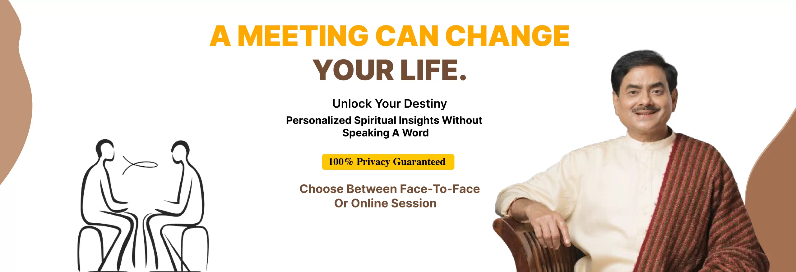
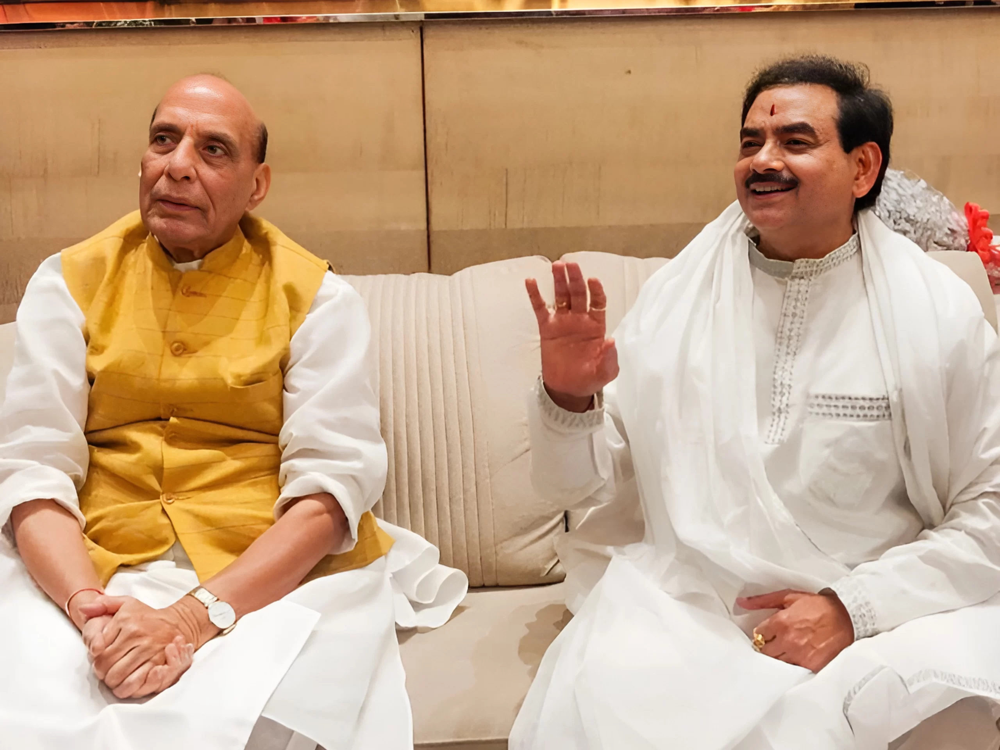
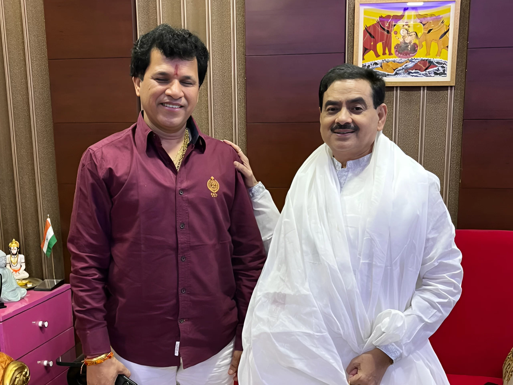

 [Book Your Slot](#) 

# MEET

## Sakshi Shree

## Enlightened Spiritual Master | Ex-Civil Servant

Sakshi Shree is a world-renowned mystic and an enlightened spiritual master with over 40 years of intense research and experience personally guiding seekers on the path of designing their destiny.

A visionary based in Ghaziabad, he is a former Indian civil servant who founded the Science Divine Foundation to touch millions of lives. His specially curated life-transforming spiritual retreats in India and abroad attract thousands from all age groups and cultural backgrounds.

Sakshi Shree strongly believes that each individual has the innate potential to achieve both material success and spiritual enlightenment. His timeless philosophy and techniques are an excellent blend of ancient spiritual wisdom and time-tested values of the present world. His transformative techniques are designed to empower individuals to tap into their limitless potential and lead more fulfilling lives. He has helped transform millions of lives across the globe. His devotion to social welfare shines through the Science Divine Vidhyapeeth School, an initiative providing free education and nourishment to underprivileged children. This endeavor demonstrates Sakshi Shree's unwavering commitment to elevating society as a whole.

Experience his extraordinary gift in an exclusive one-on-one meeting where he reveals your life's path, core issues and solutions — without you speaking a word. Don't just believe; experience it yourself!

[Book Your Slot](#)

# Rewrite

# Your Story

### What This Meeting Offers:

### Instant Life Reading

Your life's story revealed without speaking a word

### Personalized Spiritual Guidance

Tailored guidance to navigate your unique life journey

### Transformative Solutions

Powerful remedies to overcome life's challenges

### Ancient Wisdom, Modern Application

Timeless spiritual insights adapted for today's world

# Transformative

## Encounters

## Seeker Success Stories

### Nancy Thakur  
SRCC, ISB, Gurgaon

**"I owe all my success to Sakshi Shree"**  
  
When I met Guruji, I felt this incredible peace just sitting in front of him as if I had come home. Before I could even ask, he cleared all my doubts. Within a few months, I got a great job offer with a huge pay bump, and my work-life balance improved big time. I also met my wonderful partner, all thanks to Guruji's blessings! Miracles indeed happen to those who believe.

### Riya Singh  
Home Maker, Bulandshahr

**"I became the best version of myself after meeting Sakshi Shree"**  
  
In my meeting with Guruji, he wrote the story of my life in a few minutes. He not only helped me solve problems in my life but also helped me find purpose and meaning in life. I am forever thankful to him for guiding me with his teachings and meditations, enabling me to live a life full of joy and become the best version of myself.

### Dheeraj Madaan  
IIT ROORKEE, IIM LUCKNOW

**"Meeting Sakshi Shree is pure Magic"**  
  
Meeting Sakshi Shree Guruji was magical and life-changing. As an engineer from IIT, I was completely logical, but meeting Guruji made me believe in something beyond, a universal higher power guiding us all. Honestly, it cannot be expressed in words and you need to meet him to experience it yourself.

### Nishant Sahu  
CA, Delhi

**"My Life changed completely after the meeting"**  
  
Guruji’s insights in our private meeting were truly magical. Due to Guruji’s guidance, my life changed completely and I became like a magnet for attracting opportunities and positive people. Recently, I cleared my CA exam with the exact marks that I manifested. Life becomes easy if you have a true spiritual Guruji like Sakshi Shree.

# The Sakshi Shree

## Difference

## Decades of Wisdom, Personalized for You

**Sakshi Shree** brings 40 years of rigorous spiritual sadhana and research to every consultation. Unlike generic astrolgers and palmists.

## Sakshi Shree's Approach

40 years of intense spiritual sadhana and research

Personalized life reading

Specific remedies for your life challenges

Tailored spiritual practices

Ongoing in-person spiritual guidance

## Generic astrology / Palmistry

Limited knowledge; Information gathered from secondary sources

General horoscopes

Vague, universal advice

One-size-fits-all meditation techniques

One-time consultations, no support

## In the Limelight

## Sakshi Shree with World Leaders and Media

### Hon'ble Shri Rajnath Singh,

Minister of Defence, Government of India, with _**Sakshi Shree**_

### Shri Anil Bachoo,

Ex-Vice Prime Minister of Mauritius, with _**Sakshi Shree**_

### Shri Ajay Bhatt,

Ex-Union Minister of State for Defense & Tourism, with _**Sakshi Shree**_ during a Free Health Checkup Camp organized by _**Science Divine Foundation**_

### Dr. Vikram Sampat,

Famous Indian historian and Sakshi Shree's disciple - _**"Sakshi Shree's** teaching brought me inner peace and purpose!"_

### Shri Kailash Chaudhary,

Ex-Union Minister of State for Agriculture with _**Sakshi Shree**_ during his visit to Siddha Sudarshan Sakshi Dham in Ghaziabad (Delhi NCR)

### Mr. DC Jain,

(Ex Chairman & Managing Director, Akums Drugs & Pharmaceuticals Ltd) at Akum Delhi HQ during Sakshi Shree's Meditation Event

[Deep-Connection-Between-Meditation-and-the-Soul](https://sciencedivine.org/wp-content/uploads/2024/08/Deep-Connection-Between-Meditation-and-the-Soul.webp) [Mind-Power-Meditation-Cover-Course-book-now](https://sciencedivine.org/wp-content/uploads/2024/08/Mind-Power-Meditation-Cover-Course-book-now-scaled.webp) [Science-of-Joyful-Living-course](https://sciencedivine.org/wp-content/uploads/2024/08/Science-of-Joyful-Living-course-Cover-0000-scaled.webp) [Sanjeevani-Kriya](https://sciencedivine.org/wp-content/uploads/2024/08/Sanjeevani-Kriya-Cover-0000-scaled.webp) [How-Energy-Flow-Shapes-Your-Physical](https://sciencedivine.org/wp-content/uploads/2024/08/How-Energy-Flow-Shapes-Your-Physical.webp)

## Your  
Session Supports

## Jhugghi Kids Education

Your transformative session with Sakshi Shree does more than change your life - it helps change the lives of underprivileged children.

## To book the session

## Donate Rs. 6100-/ for Jhuggi Jhopadi Siksha Sewa Mission

## Tax Exemption is applicable for all donations under the IT Act \[80G\]

### Free Education:

Classes from Nursery to VI

### Nourishment:

Daily nutritious meals provided

### Complete Care:

Uniforms, books, and materials supplied

### Skill Development:

Vocational training opportunities

## Frequently Asked Questions

1\. What is the main focus of the event?

The main focus is to help people live a better, more spiritual and enriched life.

2\. What should I bring with me to the event?

Bring an open heart, comfortable attire, and a journal.

3\. Is there a dress code for the event?

No, there is no specific dress code for the event.

4\. How can I register for the event?

You can go on our website and register yourself with few details.

## Contact Us

Have any questions or want to reach out ? Please feel free contact us :

### [Phone](tel:+91%209315944774)

[+91 9315944774](<tel:+91 9315944774>)

### [E-mail](mailto:info@sciencedivine.org)

[info@sciencedivine.org](mailto:info@sciencedivine.org)

### Hotel Mukut Regency

Plot no. CC1, Sector 13, Vasundhara, Ghaziabad

# Seats are filling fast. Don’t miss this opportunity.
