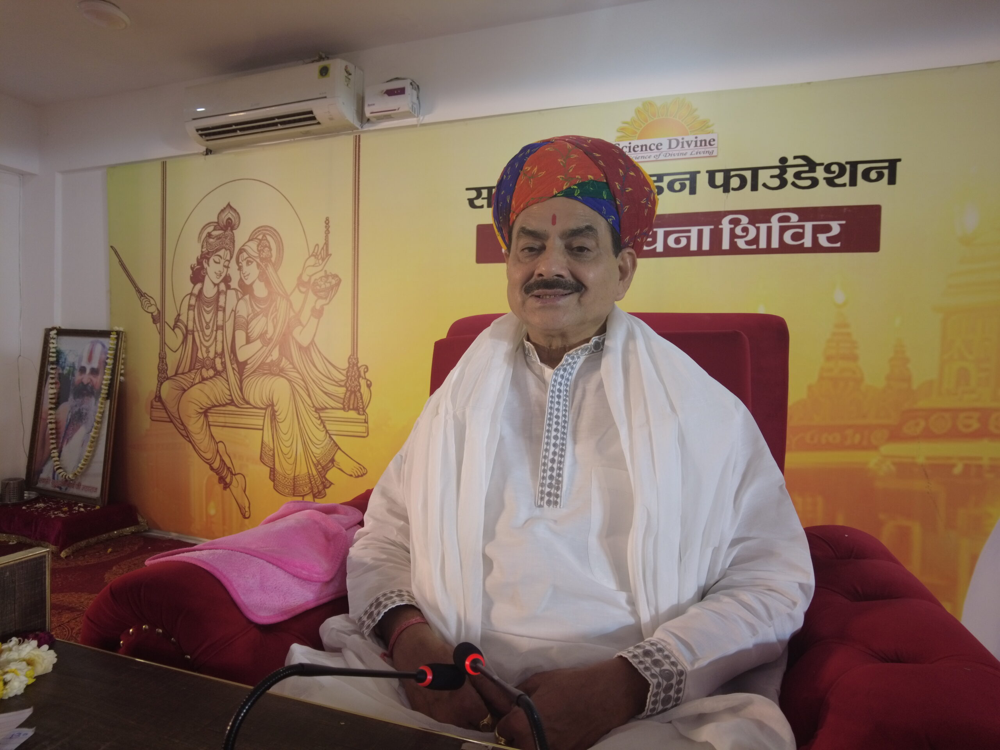

## Sakshi Shree - 
A spiritual master and mystic!

In the supermarket of spirituality, today, spiritual masters have been replaced by strange readymade systems, stereotype techniques and methods of meditation which have no soul in them. They are like generic over-the-counter pills doing more harm than good.  Sakshi Shree will guide you with specific spiritual processes, meditations, or remedies best suited to your intrinsic nature because your stories, struggles and scars are very personal and unique.

Experience it yourself through an exclusive one-on-one meeting with Sakshi Shree... Do not believe unless you experience it yourself.

[MEET SAKSHI SHREE](https://sciencedivine.org/personal-session/)  

## Discover Inner Serenity,  
Embrace Outer Realtiy

Sakshi Shree is a Spiritual Master, a  Mystic, and the founder of the Young Mind Movement for unleashing the limitless powers of the young minds across the world.

Ever since he was endowed with divine powers by his own guru Swami Sudarshanacharya Ji Maharaj, he left the comforts and powers that he enjoyed as one of top-most bureaucrats in India and devoted his life to rescuing people from their drudgeries through meditation and spirituality. 

## SPEAKER AT

\[elementor-template id="9093"\] 

## INITIATIVES BY SAKSHI SHREE

## 01

## Discover Inner Serenity, Embrace Outer Realtiy

Science Divine spreads the message of love and meditation the world over and creates a new humanity of self-realized souls with sound body and sound mind.

[Know more](https://sciencedivine.org/about-science-divine-movement/)

## 02

## Jhuggi Jhopadi Shiksha Sewa Mission

Jhuggi Jhopadi Shiksha Sewa Mission is a registered non-profit NGO that has been working since 2010 to alleviate the living conditions of children living in the slum clusters by providing them with modern education free of cost.  

[Know more](http://jhuggijhopadi.org)

## 03

## Young Mind Movement

This movement is aimed at empowering young individuals with the tools and techniques necessary to navigate the challenges of modern life with ease and grace and to help them unleash their true potential.

## From the pen of Sakshi Shree

## blogs

## Join the community

Get access to Exclusive audios, videos, blogs,newsletters, and more! Subscribe now to access a world of unique content, deep insights , and insider knowledge.
