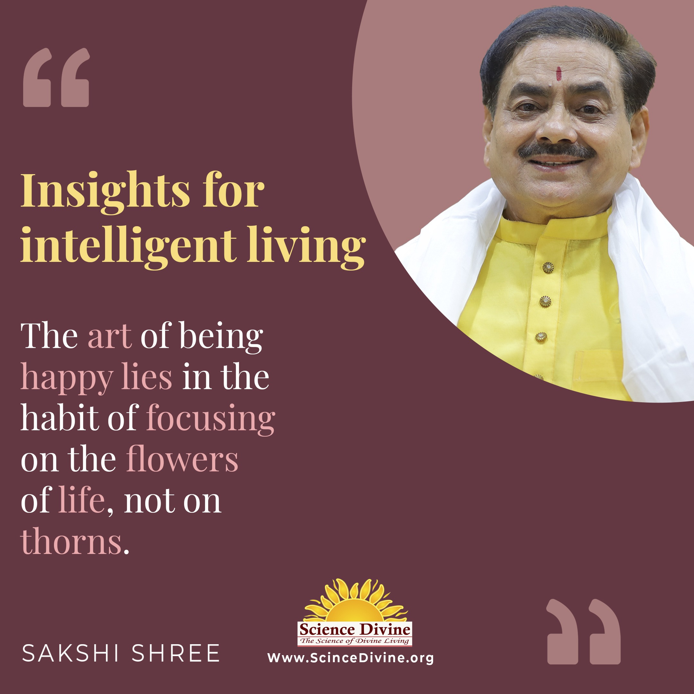

## Addictions

Find Your Freedom: Overcoming Addiction with Help and Hope

Addiction can happen for many reasons, often as a way to cope with difficult emotions or situations. It's a struggle that affects not only our bodies but also our hearts and minds, leaving us feeling overwhelmed and trapped in a cycle we can't break. We at Science Divine understand these struggles deeply. With compassion, understanding, and under Sakshi Shree's guidance we offer a helping hand to guide individuals through the challenges of addiction. Join us on a journey of healing and transformation. Break free from the grip of addiction and reclaim control of your life.

Articles Quotes Videos Podcasts Articles 

### [Meditation and Mental Health: Transformative Stories of Healing and Renewal](https://sciencedivine.org/meditation-and-mental-health/)

### [The Basics of Conscious mind and Subconscious mind](https://sciencedivine.org/conscious-mind-and-subconscious-mind/)

### [Yoga Poses for Peace of Mind](https://sciencedivine.org/yoga-for-peace-of-mind/)

### [How to Feel Calm: Easy Ways to Find Peace of Mind](https://sciencedivine.org/what-is-peace-of-mind/)

### [Why Should You Prioritize Your Mental Health Every Day?](https://sciencedivine.org/what-is-mental-health/)

### [Yoga Nidra: Mastering the Art of Conscious Relaxation](https://sciencedivine.org/yoga-nidra/)

### [The Transformative Health Benefits of Regular Yoga Practice](https://sciencedivine.org/unlocking-wellness/)

### [The Ultimate Guide to Meditation for Better Sleep](https://sciencedivine.org/unlock-restful-nights/)

### [Mastering Meditation at Home: A Step-by-Step Guide to Inner Peace](https://sciencedivine.org/meditation-at-home/)

Quotes 

  

  

  

Videos 

Podcasts

Lorem ipsum dolor sit amet, consectetur adipiscing elit. Ut elit tellus, luctus nec ullamcorper mattis, pulvinar dapibus leo.

\[elementor-template id="8373"\]
