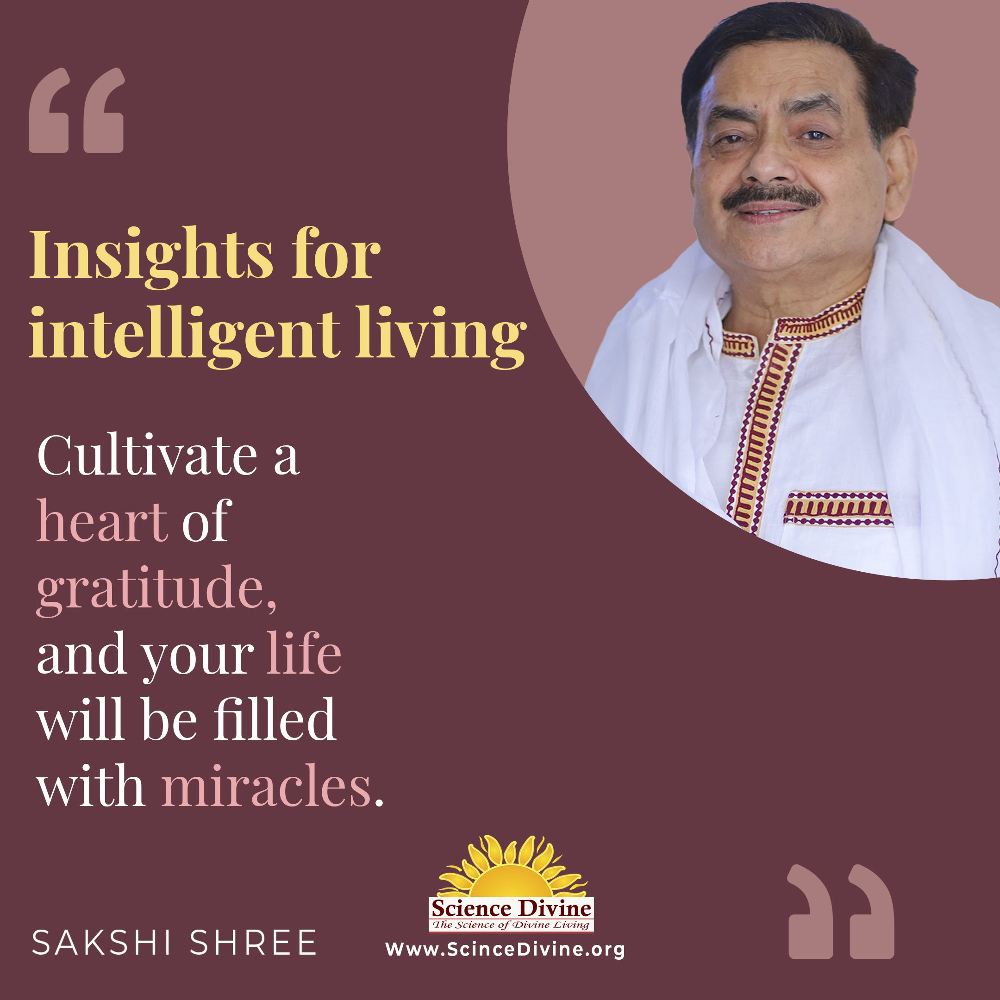

## Anxiety

Beating Anxiety Together: Simple Steps to Calm with Sakshi Shree

If feeling anxious about what lies ahead or overwhelmed by constant worry makes you feel lonely, then know that you are not alone. Anxiety has a way of magnifying life's challenges, making even the simplest tasks seem daunting. But there's hope and a way forward. Join us on a journey to discover peace amidst the chaos. Under Sakshi Shree's guidance, explore practical solutions and age-old wisdom to help calm your mind and ease your worries. Find support in a welcoming community as you overcome anxiety and regain control of your life.

Articles Quotes Videos Podcasts Articles 

### [7 Ways to Foster an Optimistic Mind](https://sciencedivine.org/optimistic-mind/)

### [How to Be Conscious: Wake Up Your Mind Every Day](https://sciencedivine.org/conscious/)

### [How to Feel Calm: Easy Ways to Find Peace of Mind](https://sciencedivine.org/what-is-peace-of-mind/)

### [Why Should You Prioritize Your Mental Health Every Day?](https://sciencedivine.org/what-is-mental-health/)

### [Benefits of Yoga for Hypertension Management](https://sciencedivine.org/yoga-for-hypertension/)

### [Yoga Nidra: Mastering the Art of Conscious Relaxation](https://sciencedivine.org/yoga-nidra/)

### [Exploring the Symbiotic Connection Between Yoga and Mindfulness Meditation](https://sciencedivine.org/unveiling-the-harmony/)

### [Meditation for Seniors: Embrace a Journey to Serenity and Healthy Aging](https://sciencedivine.org/meditation-for-seniors/)

### [Harmonizing Mind and Body: The Transformative Power of Yoga and Meditation](https://sciencedivine.org/harmonizing-mind-and-body/)

[Read More](https://sciencedivine.org/category/anxiety/)

Quotes 

  

  

  

Videos 

Podcasts Lorem ipsum dolor sit amet, consectetur adipiscing elit. Ut elit tellus, luctus nec ullamcorper mattis, pulvinar dapibus leo.

\[elementor-template id="8373"\]
