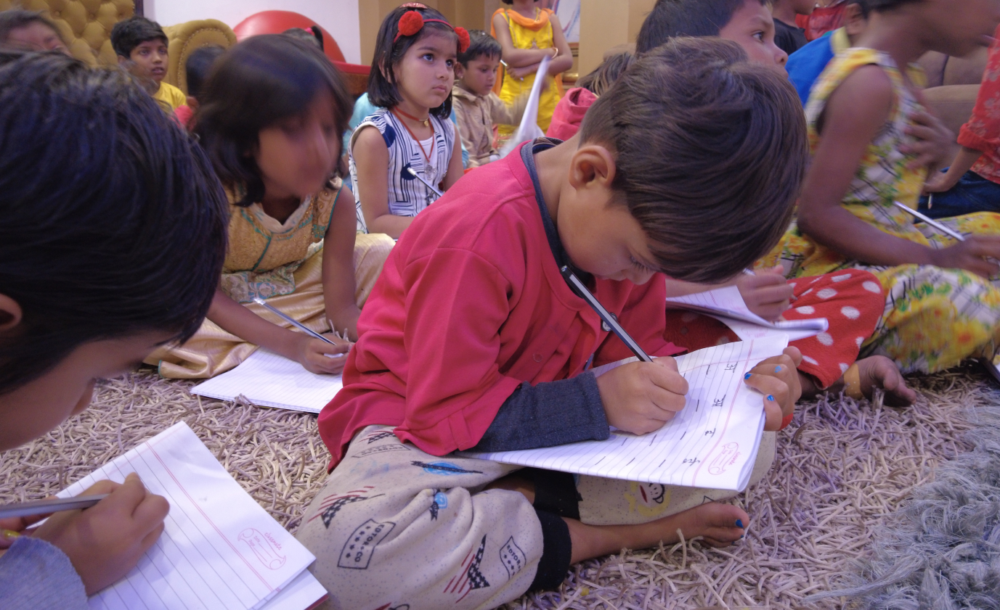
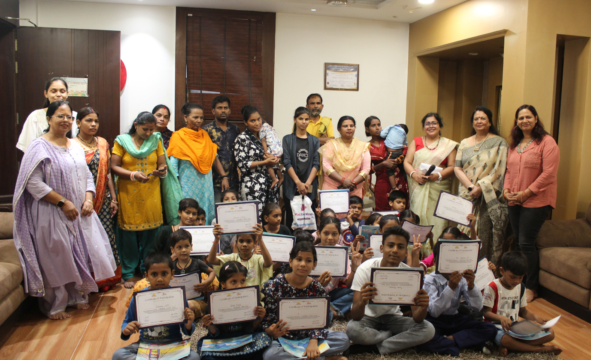
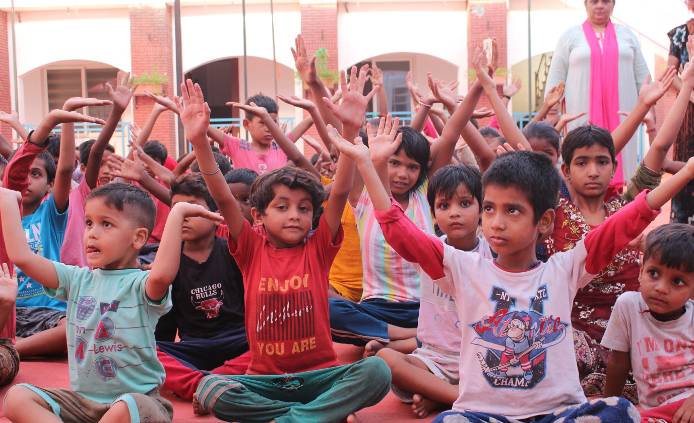
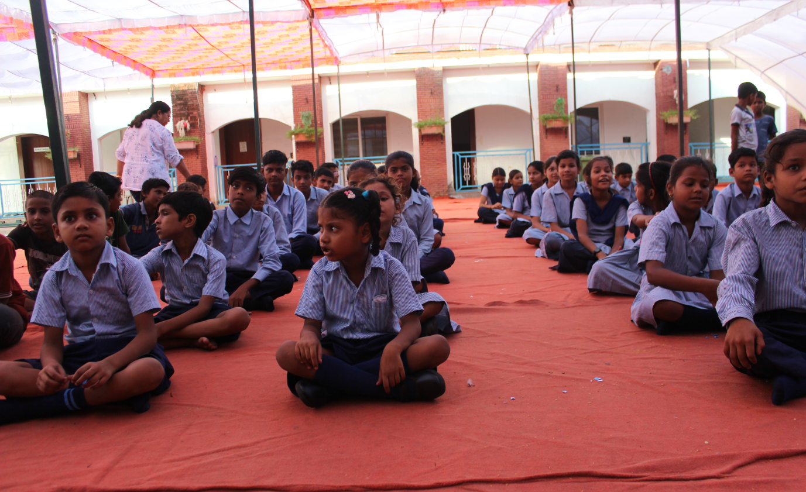
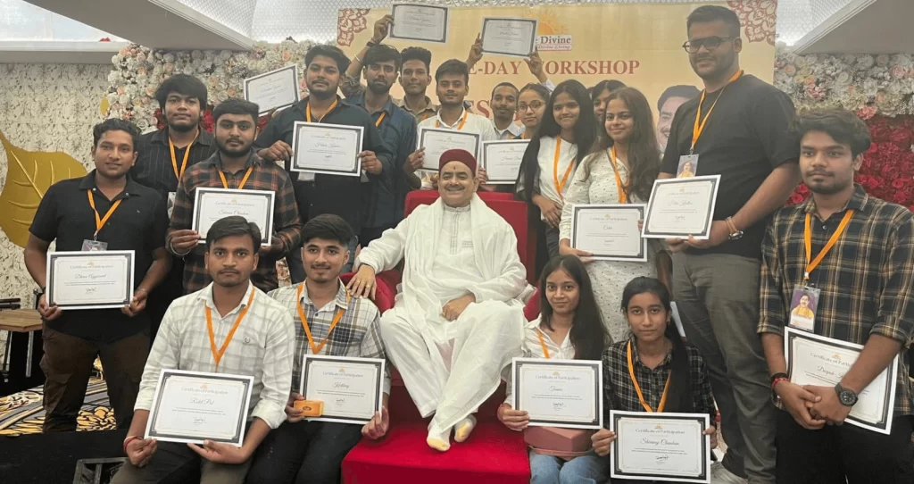
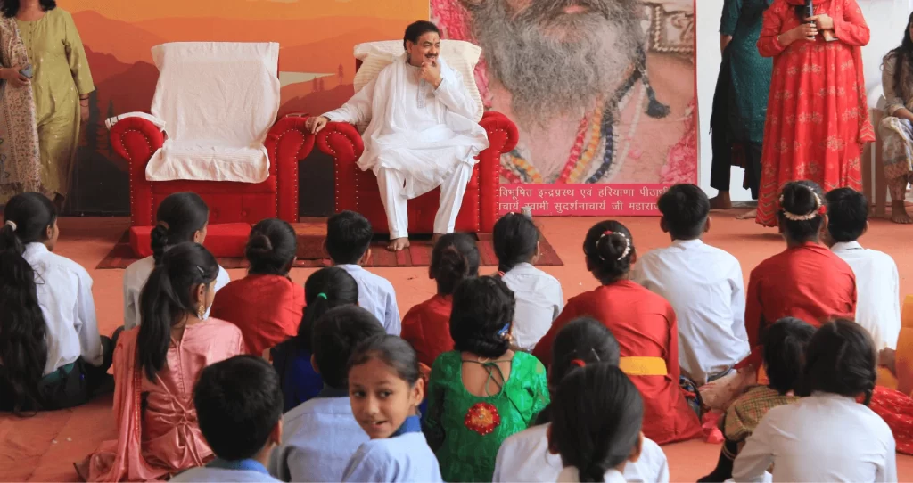

#### Experience the Silence That Speaks

And transform your life from within.

### Celebrating Sakshi shree Guruji's Birthday

#### Shiksha Sewa Mahotsav

#### A special Meditation, Pravachan & Blessings program

[Book Your Seat Before It’s Gone!](#scroll-btn-form) 

#### Date & Time

14th December, 2025 | 10:00 AM

#### Location

Siddha Sudarshan Sakshi Dham 9, Avanthika Rd, Chiranjiv Vihar, Shastri Nagar, Ghaziabad, Uttar Pradesh 201002

#### Entry Fee

Free (Registration Mandatory)

> "The deepest joy lies not in what you receive, but in the peace you discover when you choose to give."
> 
> — A Message from Guruji

## The Day's Agenda

1

10:00 AM - 10:30 AM

### Arrival & Welcome

Seating, introduction, and opening musical invocation to set a peaceful tone.

2

10:30 AM - 11:30 AM

### Guided Meditation

Experiencing "The Silence That Speaks" – a powerful hour of guided inner transformation.

3

11:30 AM - 12:30 PM

### Divine Pravachan

Guruji's discourse on selfless service, education, and inner peace (Shiksha Sewa).

4

12:30 PM - 01:00 PM

### Birthday Blessings

A special opportunity for individual and collective blessings from Skashi shree Guruji.

5

01:00 PM onwards

### Mahaprasad & Conclusion

Distribution of blessed food (Prasad) and departure.

## Glimpses of Sewa & Blessings

## Secure Your Seat Now

Limited Seats Available. Don't Miss This Opportunity.

Your details are secure and will not be shared. 

## The Significance of Shiksha Sewa

## A Celebration of Service

This Mahotsav is dedicated to the philosophy of selfless service ('Sewa'), particularly in the realm of education ('Shiksha'). It embodies Guruji's vision of empowering communities through knowledge and upliftment. Join us in honoring this legacy of profound contribution to society.  

## Guruji's Birthday Offering

Skashi shree Guruji's birthday is marked not just by personal celebration, but by intensifying our commitment to charitable and educational initiatives. Your participation directly supports ongoing projects that provide free schooling, vocational training, and mentorship to those in need.
