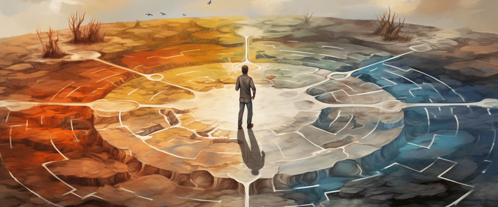

The Design Your Destiny: Science Divine Basic Course is a three and half hour online video course to help you achieve the state of Sound Body, Sound Mind and Self-Realization. The course covers three fundamental maxims or Three Maha Mantras for achieving all that you want in life from great material prosperity and riches to everlasting happiness or enlightenment. The course also help you to transform your mind, body and soul. 

To get acquainted with the Science Divine school of thought, we strongly advise you to begin with our Basic Course. In this course, you will know every basic aspect of our meditation tools and teachings that have been devised by Sakshi Shree himself. 

## 150+

Cumulative hours of this online course have already been consumed online.

## 10k+

people have already taken this course.

## Benefits Encompassed in the Design Your Destiny Journey

### Achieve your dreams and desires.

Turn your aspirations into reality by mastering techniques that align your efforts with your dreams, ensuring tangible accomplishments.

### Experience a higher state of consciousness

Elevate your awareness and perception, transcending the ordinary and exploring profound realms of consciousness.

### Live in the present and be happy unconditionally.

Embrace the present moment, finding unshakeable happiness within, regardless of external circumstances.

### Transform your mind, body and soul.

Undergo a holistic metamorphosis, nurturing your mental, physical, and spiritual dimensions for comprehensive growth and harmony.

### Manifest your dreams & desires.

Turn your aspirations into reality through effective manifestation techniques, bringing your dreams and desires to life.

### Remove your bad samskaras

Release negative patterns deeply ingrained within you, freeing yourself from limiting behaviors and embracing positive change.

## Design for Destiny is for ....

#### Students

##### Students seeking personal growth and clarity.

#### Professionals

##### Working professionals aiming for holistic success.

#### Seekers

##### Spiritual seekers on a path of self-discovery.

#### Thinkers

##### Thinkers eager to unlock their true potential.

## Course Outline

## Design Your Destiny

It is a 3.5 hour long video course, in which Sakshi Shree tells you about the 4 Science Divine Maxims or the Mahamantras, which are as follows: 

- The Science of Being in a State of No Mind. 
- The Science of Power of Thoughts. 
- The Science of Joyful Living. 
- The Science of Manifestation. 

### Elevate Your Life with Profound Benefits

- **Holistic Transformation:** Experience a comprehensive shift in mind, body, and soul.
- **Empowered Decision-Making:** Gain clarity for confident life choices.
- **Manifestation Mastery:** Learn techniques to manifest your aspirations.
- **Lasting Happiness:** Cultivate a positive and joyful mindset.
- **Self-Realization:** Embark on a journey of self-discovery and awareness.

 

Enrolling in the "Design Your Destiny: Science Divine Basic Course" brings a spectrum of benefits that touch every facet of your existence. Experience holistic transformation as you align your mind, body, and soul. Gain the power of empowered decision-making and manifest your aspirations with precision.

## Empower Your Life: Unleash Your Potential with the Benefits of 'Design Your Destiny' Course"

## TAKE CONTROL OF YOUR LIFE

Design Your Destiny : Rs 999/-

(Life Time Access)

Regular Price : Rs 5,100/-

[BUY NOW](https://www.udemy.com/course/inner-transformation-masterclass-with-sakshi-shree-hindi/)

"Design your destiny with purposeful intentions, for in every thought and action, you hold the brush that paints your life's canvas." - Sakshi Shree
