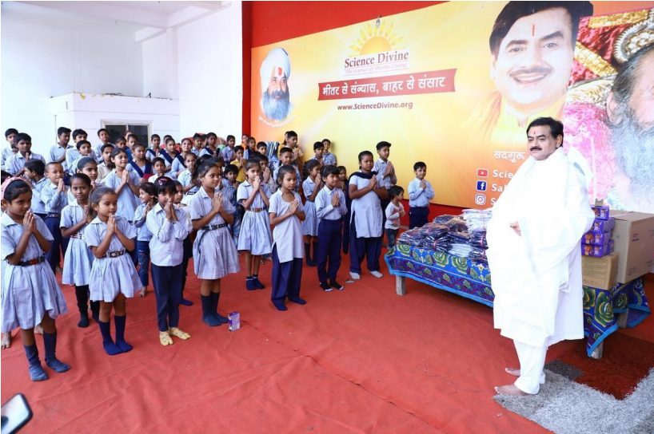
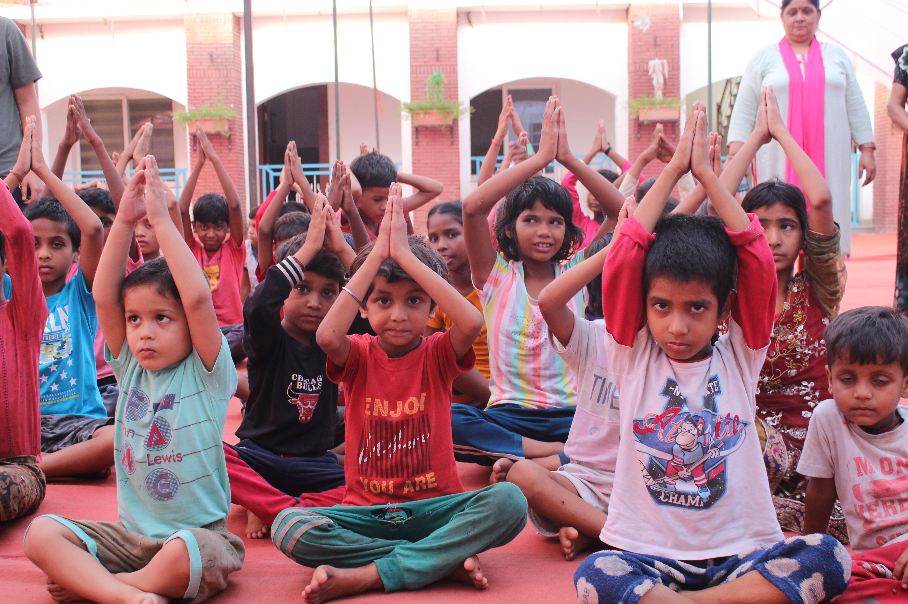
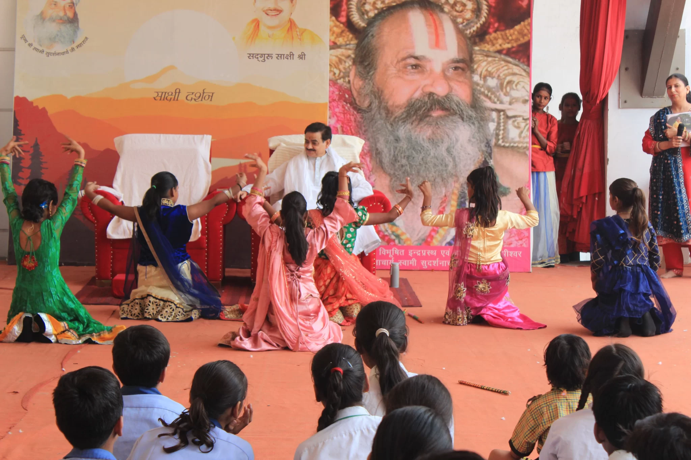
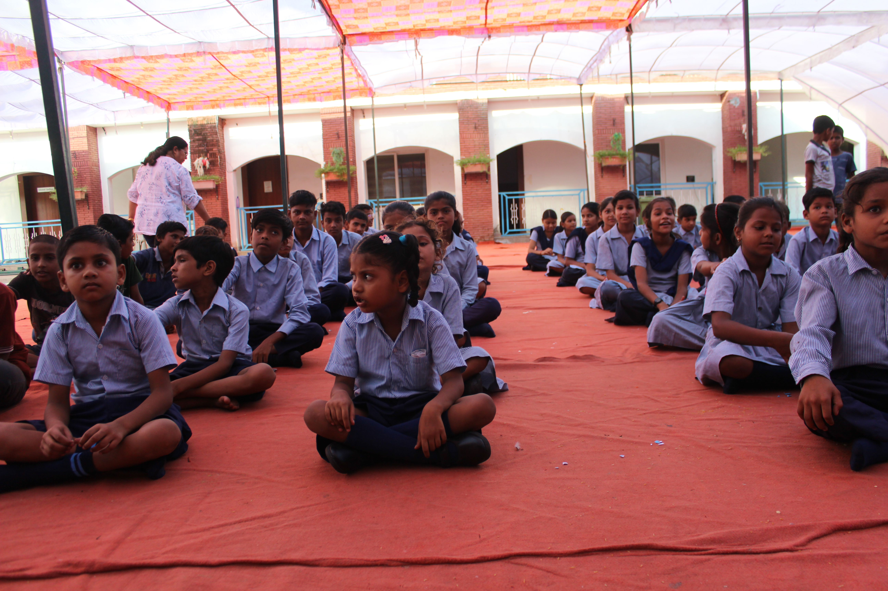

  Shiksha Sewa — Illuminating Young Minds 

# Shiksha Sewa — Illuminating Young Minds

## Through the Light of Knowledge

Every child is a divine spark of potential, waiting for the light of knowledge to awaken it. **Shiksha Seva**, inspired by the guiding vision of **Sadguru Sakshi Shree**, serves as a beacon of hope—transforming education into a sacred act of service (seva).

[Donate Now & Join the Journey of Light](#awakening-join)

## Our Mission — Education as Enlightenment 📖

Guided by the compassionate teachings of **Guru Sakshi Shree**, **Shiksha Seva** reaches the hearts of children who have long been forgotten by fortune—making every classroom a **temple of learning**, every lesson a **path toward self-realization**.

🌱 1,000+

### Children Empowered

Across rural and urban communities with essential education.

📚 Distribution

### Books & School Kits

Annual distribution of essential materials—a symbol of light and opportunity.

🎓 Scholarships

### Higher Learning

Opening doors to advanced education for talented young minds.

🕉️ Value-Based

### Education

Cultivating strong character and self-belief, rooted in Indian wisdom.

## How We Illuminate the Path 💡

1.

### Free & Subsidized Schooling

For children whose dreams deserve no price tag—education that uplifts, enlightens, and empowers.

2.

### After-School Enrichment

Art, music, science, and play blend together, nurturing creativity and curiosity for balanced growth.

3.

### Vocational & Career Guidance

Practical skills training and mentorship prepare youth to walk confidently into the world.

4.

### Life-Skills & Meditation Programs

Grounded in the wisdom of**Sadguru Sakshi Shree**, these sessions develop emotional strength, focus, and self-mastery.

## Voices of Transformation ⭐

> "Before Shiksha Seva, my path was dark. Today, I carry the lamp of learning—and I dream to become a teacher who lights the way for others.”

— Pooja, Age 14

   

## Join the Journey of Light

Be the sunrise for a child’s future. Your support helps Guru Sakshi Shree’s vision of universal education shine across every home and heart.

₹500

Book Sponsor

Sponsor **annual supplies** for one child (books and stationary).

[Donate ₹500](https://rzp.io/rzp/6mv20lwu)

₹2,500

Uniform Sponsor

Provides a **full school kit** including uniform, shoes, and bag for one student.

[Donate ₹2,500](https://rzp.io/rzp/gG9hHpYs)

₹5,000

EDUCATION SPONSOR (Most Impact)

Sponsors the **entire tuition and resources** for one child for a whole year.

[Donate ₹5,000](https://rzp.io/rzp/Pn6K97ab)

Other Amount

Scholarship Fund

Contributes to the **higher education scholarship fund** for deserving students.

[Other Amount](https://rzp.io/rzp/zWjHwq49)

### Explore Other Science Divine Initiatives

[Annapurna Sewa](https://sciencedivine.org/annapurna-sewa/)

Feeding Hearts, Nourishing Souls through sacred food offerings.

[Dhyan Sewa](https://sciencedivine.org/dhyan-sewa/)

Empowering lives through knowledge, health, and holistic well-being.

[Nirman Sewa](https://sciencedivine.org/nirman-sewa/)

The Spiritual Retreat & Wellness Center, established to help you achieve personal guidance, grace, and blessings
