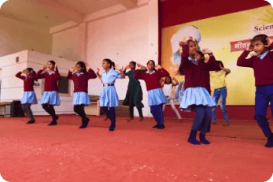

# Volunteers

Become part of the movement! Share your skills, time, and passion to help transform children's lives.

### Volunteer 1

Workshops across India

### Volunteer 2

Lives touched through meditation

### Volunteer 3

Teaching Hours delivered

We’re not just changing lives. We’re building a new India — child by child, soul by soul.

## How can you get involved as a volunteer?

## 01.

### Mentor a child in academics or life skills

## 03.

### Help organize events, workshops and drives

## 02.

### Teach a vocational skill you're proficient in

## 04.

### Become a meditation trainer for children

## Ways to serve:

## 01.

### Mentor a child in academics or life skills

## 02.

### Teach a vocational skill you're proficient in

## 03.

### Help organize events, workshops and drives

## 04.

### Become a meditation trainer for children

# Become a Volunteer

## Benefits of volunteering:

- [Make a tangible difference in children's lives](tel:9315944774)
- [Develop leadership and community service skills](mailto:info@sciencedivine.org)
- [Receive training in meditation and teaching](https://sciencedivine.org/)
- Join a community of like-minded changemakers

 Copyright © \[hfe\_current\_year\] \[hfe\_site\_title\] | Powered by \[hfe\_site\_title\]
