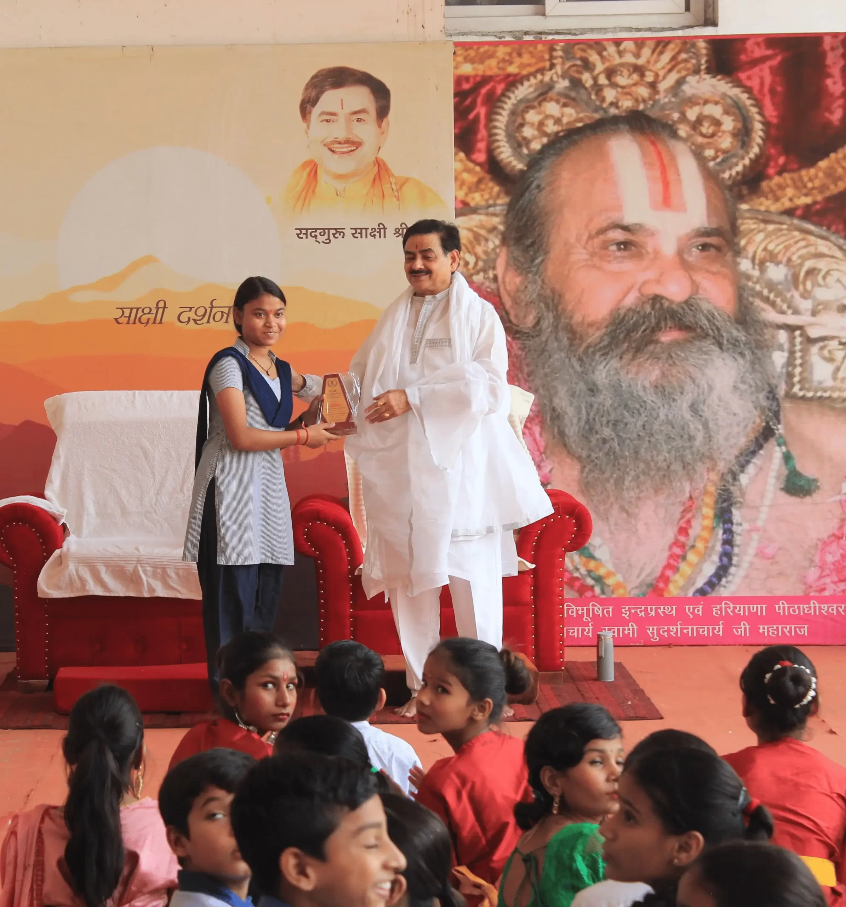
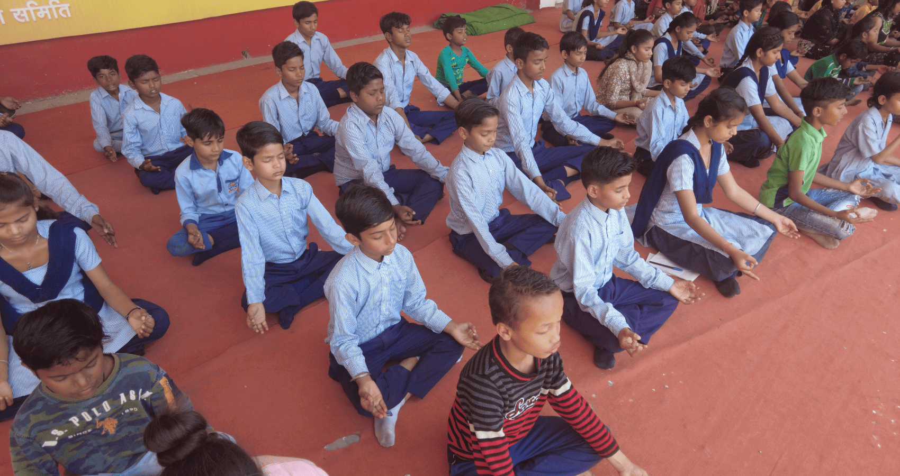
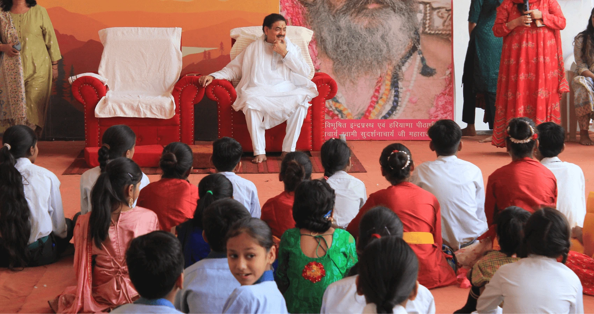
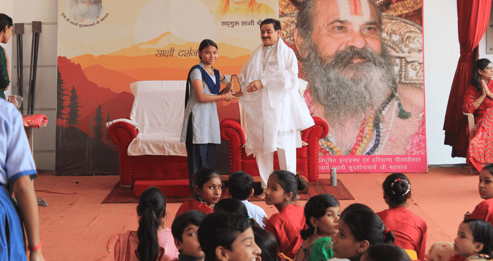
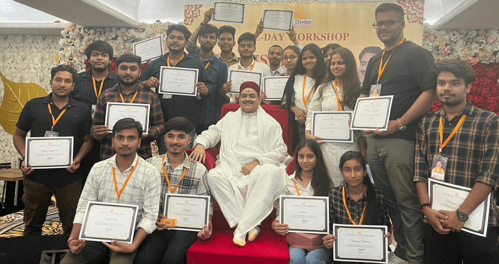
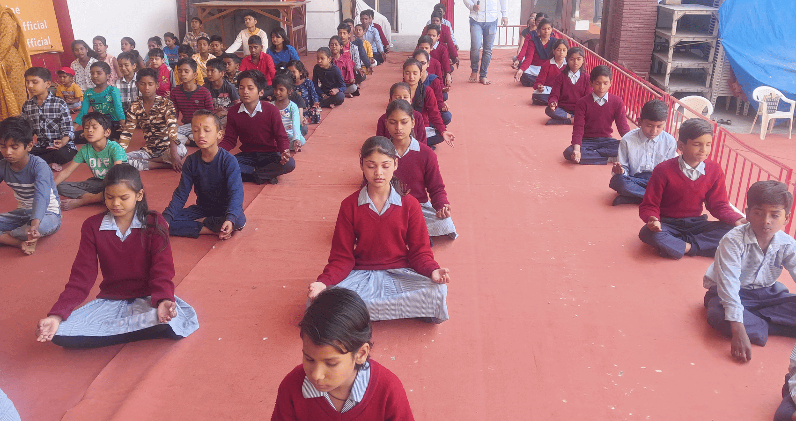
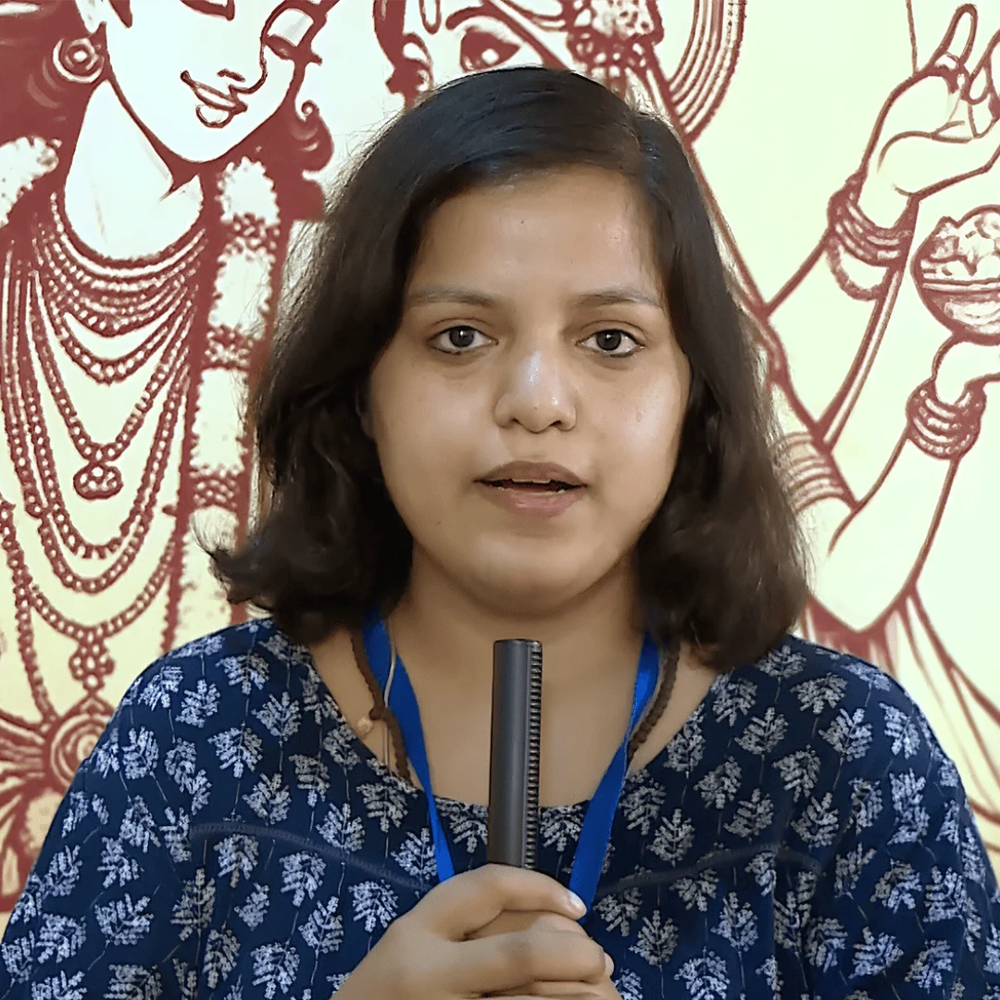
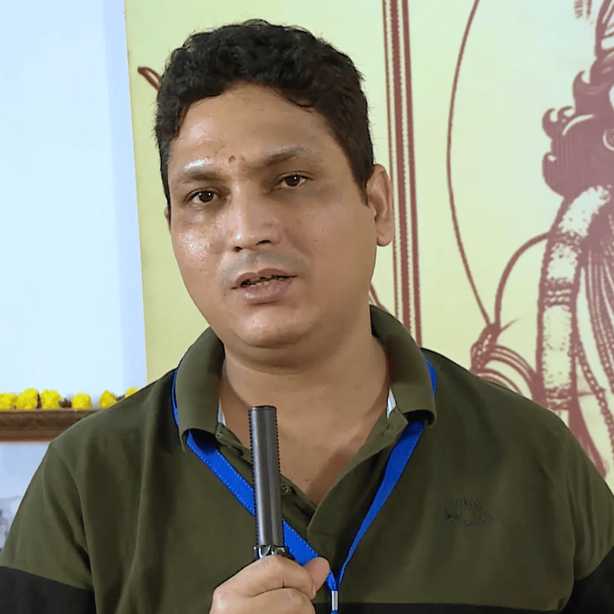

# Har Ghar Shiksha, Har Ghar Dhyan

Education and Meditation in Every Home.  
A massive movement for education and meditation.  
A commitment to the birth of a new humanity.

[Join the Movement](#Donate) [Learn More](#about)  

## Sakshi Shree's Commitment:

To create a new human being flourishing on earth, which is only possible through education and meditation.

## About Har Ghar Shiksha, Har Ghar Dhyan

**Empowering Every Individual Through Education and Meditation.**  
A visionary movement by Guru Sakshi Shree and the Science Divine Foundation, Har Ghar Shiksha, Har Ghar Dhyan brings together ancient wisdom and modern science to transform lives across communities.

### What

## Our Purpose

We awaken human potential through meditation and education. Our goal is to create conscious individuals who live joyfully and break cycles of poverty by providing inner transformation through Sanjeevani Kriya and quality education to underprivileged children.

### Science Divine Foundation

## Guiding Light in Meditation & Education

### 50,000+  
Lives

Changed Worldwide Through Meditation

### 12,000+  
Students Educated

Empowering 12,000+ students through quality education

## Enriching Over

## 100,000 Lives

## With Meditation and Education

### 20+  
years in operation

20+ years of dedicated educationals service.

### 45%  
girls' Educations

Fostering education, with 45% female students educated.

### We Solve Real Problems

## Transform Your Life

### Spiritual Growth

Discover your inner divinity and connect with your true self through guided meditation practices.

### Mental Clarity

Achieve peace of mind and enhanced focus through regular meditation practice.

### Knowledge for All

Access spiritual wisdom and practical knowledge that transforms daily life.

## How We Work

## 01.

## Community Outreach

### Dedicated volunteers, experienced in meditation practices, reach out to communities

 

## 03.

## Meditation For All

### Complimentary meditation sessions designed for all age groups

 

## 02.

## Educational Access

### Free educational programs for underprivileged children and adults

 

## 04.

## Creative Growth

### Extracurricular activities that nurture creativity and life skills

### Our

## Events

## Ranjana Sharma

Volunteer

## Archana Nirali

Volunteer

## Join the Divine Movement

### Together, we can bring the light of education to every underprivileged child and the peace of meditation to every troubled mind.

[Join Us Now](#Donate)

### They Believe In Us

## Transformative Experiences

After practicing Sanjeevani Kriya taught by Gurudev, I experienced feelings that are difficult to put into words. I felt an incredible sense of calm and a profound connection with my inner self. This beautiful practice has opened a doorway to deeper self-understanding. The peace I discovered within myself was truly transformative. Thank you, Gurudev, for sharing this life-changing practice. — Tulika Sharma  After working in finance for years, I was looking for something meaningful. Thanks to my sister, I discovered Sakshi Shree and Gurudev's Sanjeevani Kriya. This meditation practice is remarkably easy to learn and quick to do, yet it offers deep benefits. It's shown me that working on your inner self doesn't have to be complicated. I'm so thankful to Gurudev for this simple but life-changing practice. — Preeti Kimothi  Growing up in Dehradun, I searched for spiritual truth in ashrams and books, but something essential was always missing. The day I met Guruji, that missing piece was revealed—not through words but through presence. In meditation, I experienced unconditional divine love not as a concept but as a living reality within me. — Piyush Pasbola 

#### Donate to make a child's future brighter!

## drop us a line and keep in touch

