Sound Body | Sound Mind | Self Realisation

# SCIENCE DIVINE

## the science of divine living

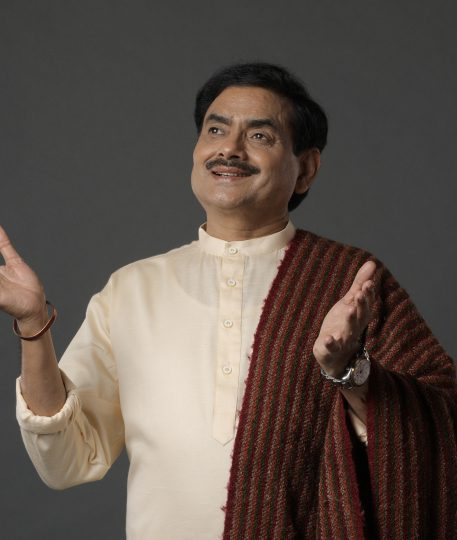

- Founded by the enlightened master Sakshi Shree, The Science Divine Movement is a mission to spread love, awareness, and meditation around the world.
- With the help of meditation, the Movement focuses on freeing individuals from belief systems, discriminations, rituals, and unfounded ideologies that stagnate their spiritual, mental, and physical evolution.

[Know more](#)  Facebook Telegram   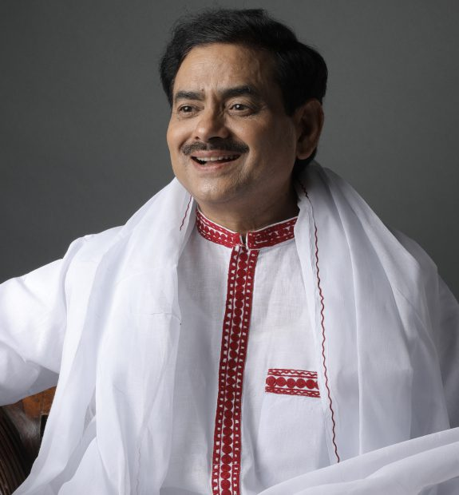

## Ascetic from outside, spiritual from inside.

Sakshi Shree is a Spiritual Master, a  Mystic, and the founder of the Young Mind Movement for unleashing the limitless powers of the young minds across the world. 

Ever since he was endowed with divine powers by his own guru Swami Sudarshanacharya Ji Maharaj, he left the comforts and powers that he enjoyed as one of top-most bureaucrats in India and devoted his life to rescuing people from their drudgeries through meditation and spirituality. 

With his spiritual powers, he can see your past, present, & future through an individual session and provide you with the remedies most suitable for you.

[PRESS THIS BUTTON](#)

## OUR UPCOMING EVENTS

Sakshi Shree is a new-age enlightened mentor who believes in using scientifically proven techniques to help people.

Our Upcoming events & marches

- 26th Jan 2023
- Delhi NCR

- [Book A Slot](#)
- [Share](#)

Our Upcoming events & marches

- 26th Jan 2023
- Delhi NCR

- [Book A Slot](#)
- [Share](#)

Our Upcoming events & marches

- 26th Jan 2023
- Delhi NCR

- [Book A Slot](#)
- [Share](#)

Our Upcoming events & marches

- 26th Jan 2023
- Delhi NCR

- [Book A Slot](#)
- [Share](#)

 

## YOUNG MIND MOVEMENT

## unleash your limitless potential

The Young Mind Movement, led by Sakshi Shree, is aimed at empowering young individuals with the tools and techniques necessary to navigate the challenges of modern life with ease and grace.

Under this innovative initiative, interactive sessions are being organized in various academic Institutes, research Institutes, and corporate offices. Through a series of immersive and interactive seminars, workshops, and interactive sessions, Participants also gain a deep understanding of the power of meditation and its potential to find a new level of energy and vitality within themselves.

[Know More...](#)

### Mind Power Meditation

Sakshi Shree is a new-age enlightened mentor who believes in using scientifically proven techniques to help people.

Sakshi Shree is a new-age enlightened mentor who believes in using scientifically proven techniques to help people.

[VIEW ALL COURSES](#) 

## Silence isn’t empty, its full.

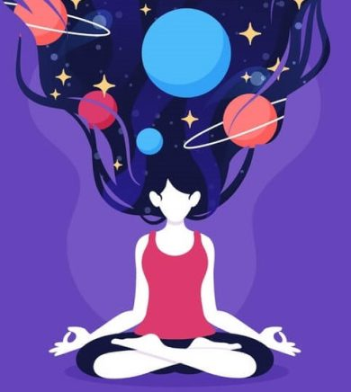

### Power of manifestaion

Sakshi Shree is a new-age enlightened mentor who believes in using scientifically proven techniques to help people. Proven techniques to help people.

[Read More...](#)
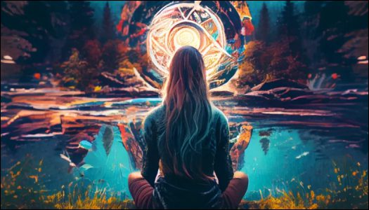

### Silence isn’t empty, its full.

Sakshi Shree is a new-age enlightened mentor who believes in using scientifically proven techniques to help people. Proven techniques to help people.

[Read More...](#)

### Silence isn’t empty, its full.

Sakshi Shree is a new-age enlightened mentor who believes in using scientifically proven techniques to help people. Proven techniques to help people.

[Read More...](#)

### Why no one understands you?

Sakshi Shree is a new-age enlightened mentor who believes in using scientifically proven techniques to help people. Proven techniques to help people.

[Read More...](#) [READ ALL BLOGS](#)
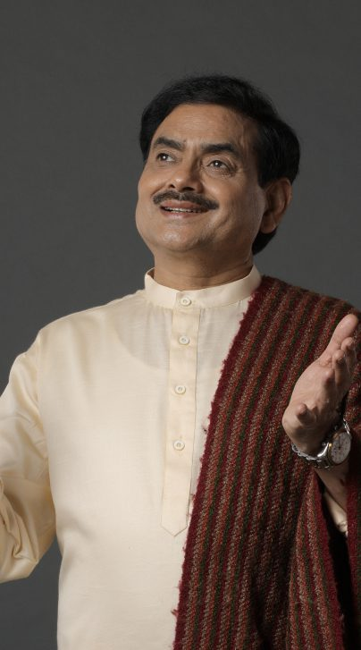

### This is the heading

Lorem ipsum dolor sit amet, consectetur adipiscing elit. Ut elit tellus, luctus nec ullamcorper mattis, pulvinar dapibus leo.

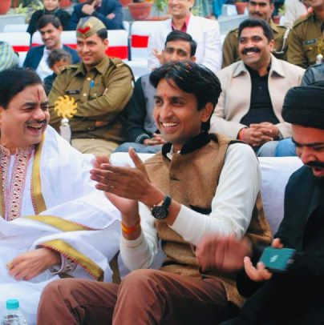

### This is the heading

Lorem ipsum dolor sit amet, consectetur adipiscing elit. Ut elit tellus, luctus nec ullamcorper mattis, pulvinar dapibus leo.

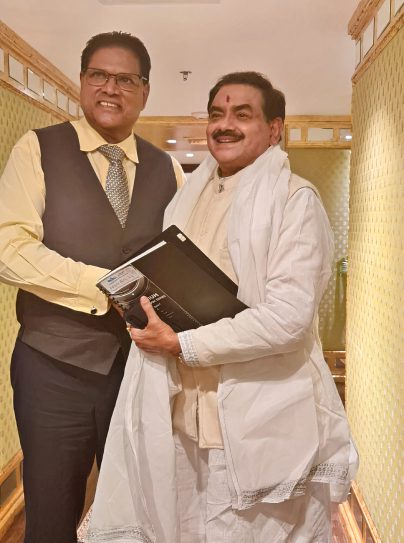

### This is the heading

Lorem ipsum dolor sit amet, consectetur adipiscing elit. Ut elit tellus, luctus nec ullamcorper mattis, pulvinar dapibus leo.

### This is the heading

Lorem ipsum dolor sit amet, consectetur adipiscing elit. Ut elit tellus, luctus nec ullamcorper mattis, pulvinar dapibus leo.

### This is the heading

Lorem ipsum dolor sit amet, consectetur adipiscing elit. Ut elit tellus, luctus nec ullamcorper mattis, pulvinar dapibus leo.

### This is the heading

Lorem ipsum dolor sit amet, consectetur adipiscing elit. Ut elit tellus, luctus nec ullamcorper mattis, pulvinar dapibus leo.

### This is the heading

Lorem ipsum dolor sit amet, consectetur adipiscing elit. Ut elit tellus, luctus nec ullamcorper mattis, pulvinar dapibus leo.

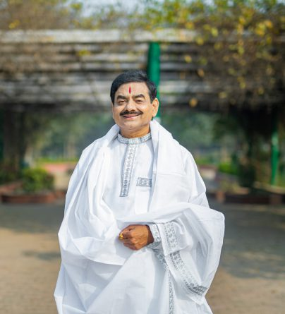

### This is the heading

Lorem ipsum dolor sit amet, consectetur adipiscing elit. Ut elit tellus, luctus nec ullamcorper mattis, pulvinar dapibus leo.

### This is the heading

Lorem ipsum dolor sit amet, consectetur adipiscing elit. Ut elit tellus, luctus nec ullamcorper mattis, pulvinar dapibus leo.

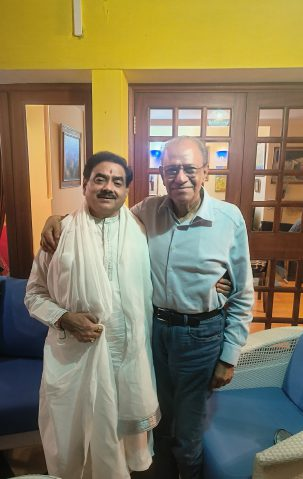

### This is the heading

Lorem ipsum dolor sit amet, consectetur adipiscing elit. Ut elit tellus, luctus nec ullamcorper mattis, pulvinar dapibus leo.

### This is the heading

Lorem ipsum dolor sit amet, consectetur adipiscing elit. Ut elit tellus, luctus nec ullamcorper mattis, pulvinar dapibus leo.

## THIS IS OUR GALLERY

Sakshi Shree is a new-age enlightened mentor who believes in using scientifically proven techniques to help people. Proven techniques to help people.

### This is the heading

Lorem ipsum dolor sit amet, consectetur adipiscing elit. Ut elit tellus, luctus nec ullamcorper mattis, pulvinar dapibus leo.

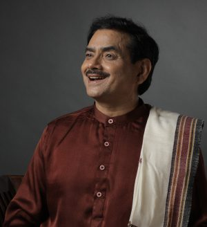

### This is the heading

Lorem ipsum dolor sit amet, consectetur adipiscing elit. Ut elit tellus, luctus nec ullamcorper mattis, pulvinar dapibus leo.

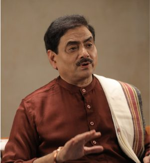

### This is the heading

Lorem ipsum dolor sit amet, consectetur adipiscing elit. Ut elit tellus, luctus nec ullamcorper mattis, pulvinar dapibus leo.

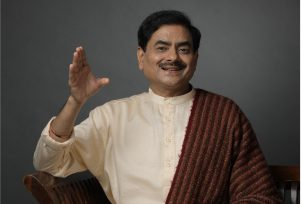

### This is the heading

Lorem ipsum dolor sit amet, consectetur adipiscing elit. Ut elit tellus, luctus nec ullamcorper mattis, pulvinar dapibus leo.

### This is the heading

Lorem ipsum dolor sit amet, consectetur adipiscing elit. Ut elit tellus, luctus nec ullamcorper mattis, pulvinar dapibus leo.

### This is the heading

Lorem ipsum dolor sit amet, consectetur adipiscing elit. Ut elit tellus, luctus nec ullamcorper mattis, pulvinar dapibus leo.

### This is the heading

Lorem ipsum dolor sit amet, consectetur adipiscing elit. Ut elit tellus, luctus nec ullamcorper mattis, pulvinar dapibus leo.

### Swaparna

### Swaparna Kaul

Sydney, Australia

All I can say is it is unbelievable. You feel a divine connection really sitting there. 

[READ EXPERIENCE](#)

## MEET VOLUNTEERS

Listen to what people have to say after they meet with Sakshi Shree in a life transformational one-to-one session. Connect with us **here** to book a session with Sakshi Shree. 

### Shama

### SHAMA GUPTA

ITS, GHAZIABAD

Sakshi Shree is a new-age enlightened mentor who believes in using scientifically proven techniques to help people. Proven techniques to help people.

[READ EXPERIENCE](#) 

### Varun

### VARUN JAIN

IMT, UTTKRAKHAND

Sakshi Shree is a new-age enlightened mentor who believes in using scientifically proven techniques to help people. Proven techniques to help people.

[READ EXPERIENCE](#)

## VOLUNTEERING  
IS A WAY OF GIVING BACK

### let us all bring the change

[READ ALL EXPERIENCES](#) [BECOME A VOLUNTEER](#)

## Get in touch with us today and embark on your spiritual journey

Sakshi Shree is a new-age enlightened mentor who believes in using scientifically proven techniques to help people.

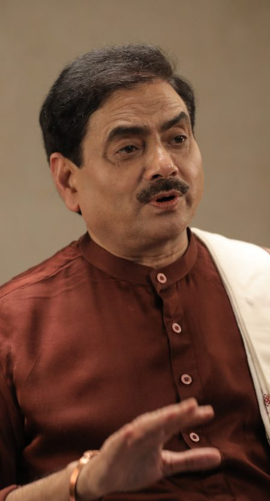 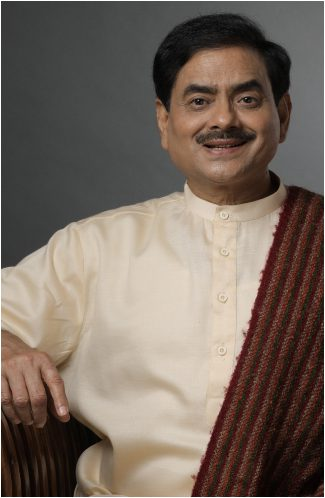
