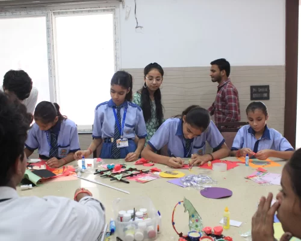

### Science Divine Foundation

## Awaken Your True Potential with Science Divine Movement

Journey towards conscious living through Sound Body, Sound Mind, and Self-Realization [Meet Sakshi Shree](https://sciencedivine.org/personal-session/) [Join Our Next Event](/event-new/) 

## Science Divine Movement

The Science Divine Movement is a global initiative helping people realize their optimum potential through definite scientific techniques for sound body, sound mind, and self-realization. Founded by enlightened spiritual master Sakshi Shree, it simplifies spirituality to become an integral part of everyday life, freeing humanity from ideologies and belief systems that have divided us through the ages.

Our fundamental maxim is "_Bheetar se sanyaas, bahar se sansaar_" - total participation in worldly life while enjoying complete inner renunciation.

## Find Solutions For ;

[

## Depression

](https://sciencedivine.org/Depression)[

## Anxiety

](https://sciencedivine.org/Anxiety)[

## Sleeping Disorder

](https://sciencedivine.org/Sleeping-Disorder)[

## Overthinking

](https://sciencedivine.org/Overthinking) [

## Parenting

](https://sciencedivine.org/Parenting)[

## Wellness

](https://sciencedivine.org/wellness)[

## Relationships

](https://sciencedivine.org/Relationship)

Discover Solutions for Everyday Challenges: Explore Sakshi Shree's teachings centered around overcoming common struggles such as depression, anxiety, anger, and more. Find practical guidance to navigate life's challenges and enhance your well-being.

## Find Solutions For :

Discover Solutions for Everyday hallenges: Explore Sakshi Shree's teachings centered around overcoming common struggles such as depression, anxiety, anger, and more. Find practical guidance to navigate life's challenges and enhance your well-being.  [

## Anxiety

](https://sciencedivine.org/Anxiety)[

## Depression

](https://sciencedivine.org/Depression)[

## Sleeping Disorder

](https://sciencedivine.org/Sleeping-Disorder)[

## Parenting

](https://sciencedivine.org/Parenting)[

## Overthinking

](https://sciencedivine.org/Overthinking)[

## Relationships

](https://sciencedivine.org/Relationship)[

## Wellness

](https://sciencedivine.org/wellness)

## Sakshi Shree

"Your thoughts create your reality. Choose them wisely, for they hold the power to design your destiny." . [Facebook-f](https://www.facebook.com/OfficialSakshiShree) [Instagram](https://www.instagram.com/sakshishreeofficial) [Youtube](https://www.youtube.com/@SakshiShree) [Linkedin-in](https://www.linkedin.com/in/sakshishree/)

## Recognized by  
Top Leaders & Media

\[elementor-template id="25999"\]

## Sakshi Wisdom

Delve into the profound insights and teachings of Sakshi Shree through our "Sakshi Wisdom" blog. Explore mindfulness, personal growth, and spiritual enlightenment to enrich your journey towards a balanced and fulfilling life.

### [Does Spirituality Require Renouncement of Materialism?](https://sciencedivine.org/spirituality-and-materialism/)

### [Spiritual Enlightenment: The Science of Breathing](https://sciencedivine.org/the-science-of-breathing/)

### [Is the Law of Attraction a Myth?](https://sciencedivine.org/power-of-law-of-attraction/)

### [Power Of Spirituality In Self Discovery](https://sciencedivine.org/power-of-spirituality-in-self-discovery/)

### [Master Your Own Fate](https://sciencedivine.org/master-your-own-fate/)

### [Easy Habits That Can Chage Your Life In a Month](https://sciencedivine.org/habits-that-can-change-your-life/)

## Empowering millions through conscious living.

\[elementor-template id="25120"\]

## Shiksha Sewa

## Science Divine Foundation

#### Our Initiatives

[Know More](https://sciencedivine.org/initiatives/)

## Annapurna Sewa

## Swastha Sewa

Enriching Lives Through Compassionate Initiatives: Empowering Education to Shape Brighter Futures, Nourishing Communities with Heartfelt Meals, and Ensuring Health Equity for All through Inclusive Healthcare Services.

## Har Ghar shiksha, Har ghar Dhyan

#### Empowering futures through education.

Science Divine provides free schooling for underprivileged children, aiming to shape brighter futures and break the cycle of poverty through quality education.

[Donate Now](https://rzp.io/rzp/XtVLpqil)

## Annapurna Sewa

#### Feeding hearts, one meal at a time

Annapurna Bhog initiative offers free meals to ensure no one goes hungry, fostering unity and compassion within communities.

[Donate Now](https://rzp.io/rzp/XtVLpqil)  

## Swastha Sewa

#### Healthcare for all, no exceptions.

Through Swastha Sewa, Science Divine provides free healthcare services, promoting well-being and ensuring access to essential medical care for all.

[Donate Now](https://rzp.io/rzp/XtVLpqil)

## UPCOMING EVENTS

\[elementor-template id="25944"\] [View our all Events](https://sciencedivine.org/event-new/)

## Join the community

Get access to Exclusive audios, videos, blogs,newsletters, and more! Subscribe now to access a world of unique content, deep insights , and insider knowledge.
