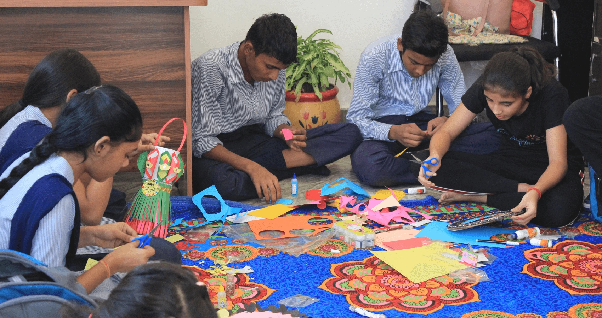
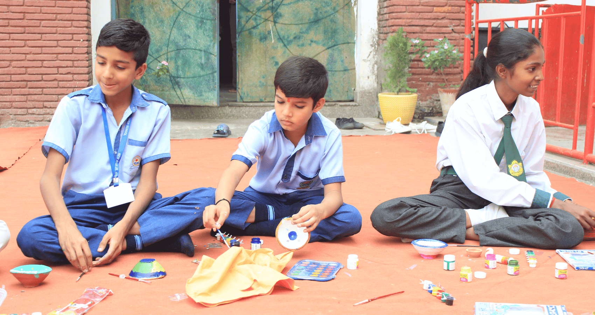
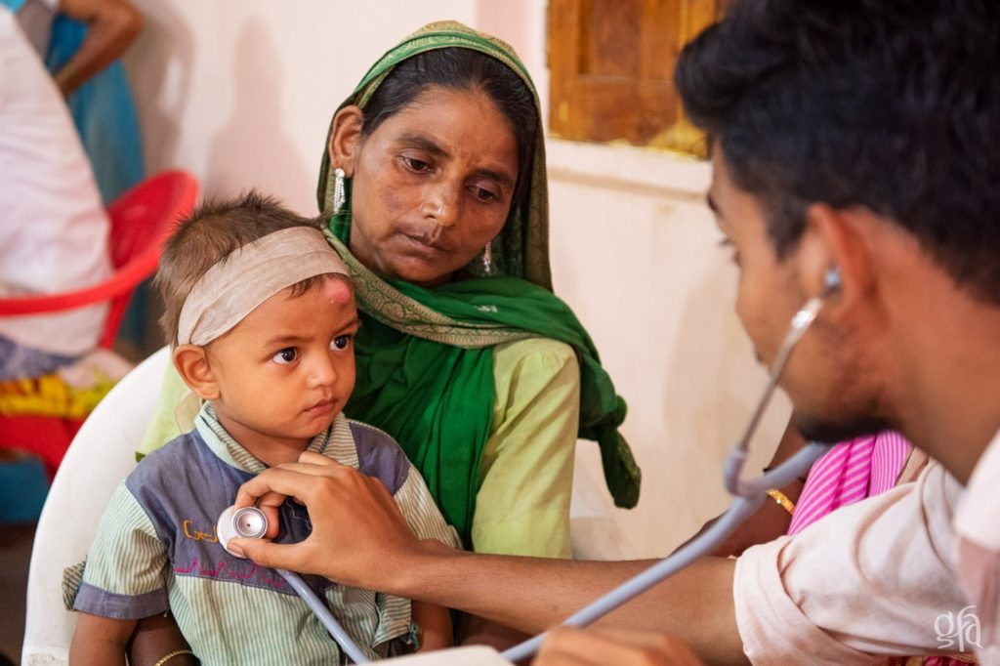
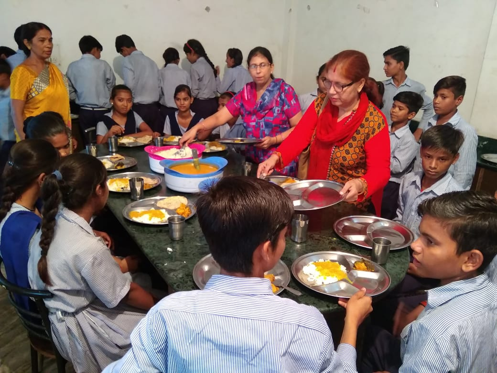
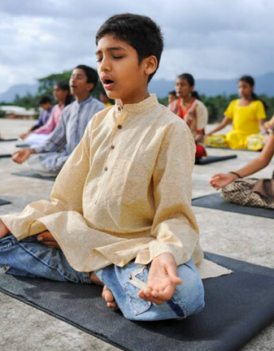

## SAVE HUMANITY

By spreading Science Divine MovementFor **Sound Body**, **Sound Mind**, **Self Realization** 

Have you experienced the guidance of Sakshi Shree?  
Do you wish his divine wisdom to touch millions and billions of hearts around the world?

He walks this path for you. The blessings, the teachings, the light—they reach you because of his unwavering efforts. Now, this mission can only grow with your support. Your contribution ensures that Sakshi Shree’s voice spreads further, changing lives everywhere.”

## [Shiksha Sewa](/shiksha-sewa)

#### Empowering futures through education

Achieved :₹ 3,00,000 0% To Be Raised :₹ 10,00,000 [Donate Now](https://pages.razorpay.com/pl_RdFnZzHa9b4WmZ/view)

Every child deserves the light of knowledge. Through Shiksha Sewa, we nurture young minds and shape brighter futures.

- Free education and books for underprivileged children
- Breaking the cycle of poverty through learning
- Guiding children towards confidence and growth
- Building a foundation for a better tomorrow

[know more](https://sciencedivine.org/education-sewa/)

## Dhyan Sewa

#### Spreading the Gift of Meditation

Achieved :₹ 5,00,000 0% To Be Raised :₹ 10,00,000 [Donate Now](https://rzp.io/rzp/gAfqVkYJ)

Meditation is the path to inner peace and harmony. Dhyan Sewa helps seekers reconnect with their true self.

- Organizing meditation camps and awareness programs
- Practical tools to overcome stress and anxiety
- Guidance for self-realization and inner bliss
- Creating a more conscious and peaceful society

[know more](https://sciencedivine.org/dhyan-sewa/)

## Annapurna Sewa

#### Feeding hearts, one meal at a time

Achieved :₹ 3,50,000 0% To Be Raised :₹ 10,00,000 [Donate Now](https://rzp.io/rzp/QQTFn4O)

No one should sleep hungry. Annapurna Sewa ensures that meals reach those in need with dignity and care.

- Nutritious meals for the hungry and needy
- Extending compassion through every plate served
- Restoring hope and smiles with each meal
- Serving humanity as service to the Divine

[know more](https://sciencedivine.org/annapurna-sewa/)

## Nirman Sewa

#### Spiritual Retreat & Wellness Center

Achieved :₹ 7,00,000 0% To Be Raised :₹ 10,00,000 [Donate Now](https://rzp.io/rzp/RnUeuKZ1)

Nirman Sewa is dedicated to building serene spiritual spaces where seekers can heal, meditate, and transform their lives. Your support helps us create retreat centres, conduct wellness programs, and offer guided sessions by Sakshi Shree for inner peace and self-realization.

- Building and maintaining spiritual retreat centres
- Meditation, wellness, and healing programs
- Spiritual workshops & satsangs
- Accessible spaces for inner growth and transformation

[know more](https://sciencedivine.org/nirman-sewa/)
