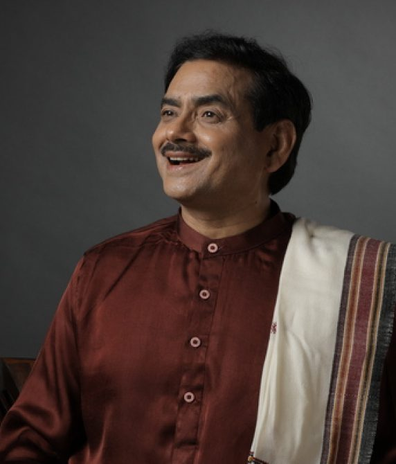

 0 +

This workshop by Sakshi Shree has already been conducted in 50+ cities in India and internationally. 

0 +

Life transformation workshops have already been conducted in 50+ cities. 

0 +

Participants have benefited and have been able to change the direction of their lives with the help of this workshop. 

1 st

Time in Los Angeles and you can be among the first few lucky ones.

KEYNOTE SPEAKER

## Sakshi Shree

Join Sakshi Shree, a beloved spiritual guide and mystic and founder of the Science Divine Foundation, on his inspiring USA tour. Imagine tapping into ancient wisdom passed down by sages combined with modern insights to transform your life. Sakshi Shree's seminars and workshops are more than just events. They're experiences where you'll learn to conquer fears, reduce stress, and unlock your true potential. Thousands have already found a deeper sense of purpose and joy through his teachings. This is your chance to connect with a compassionate mentor and embark on a journey of self-discovery and empowerment. Don’t miss out on this life-changing opportunity!

[meet sakshi shree](https://sciencedivine.org/session/) 

## Event Highlights

### Manifest Your Reality

This part of the course likely delves into the power of manifestation, helping individuals understand how their thoughts, beliefs, and actions shape their reality. It may include techniques for setting clear intentions, visualization, and aligning one's mindset with desired outcomes.

### Science of Thoughtfulness

This part could explore the psychology behind thought patterns and how they influence emotions, behaviors, and overall well-being. It may involve practices to cultivate positive thinking, mindfulness, and emotional intelligence.

### Secret of Blissful Living

This segment might focus on finding inner peace, happiness, and fulfillment. It could include teachings on gratitude, living in the present moment, and fostering a sense of contentment regardless of external circumstances.

### Art of Inner Cleansing

This part likely addresses the purification and healing of the mind, body, and spirit. Techniques for releasing negative energy, letting go of past traumas or limiting beliefs, and cultivating self-love and acceptance may be covered.

## Sakshi Shree

Founder of Science Divine & Young Mind Movement

 WHY TO ATTEND?

## Key Segments

This is not just another event; it’s a pivotal opportunity to challenge your perceptions and grow beyond your current boundaries. Whether you’ve been on a spiritual path for years or are just beginning to explore, Sakshi Shree’s sessions are meant to elevate your understanding of yourself and the universe.

Don’t miss out on this transformative experience. Join Sakshi Shree on this remarkable journey across the United States to discover the extraordinary within you.

### Personalized Guidance

Receive one-on-one spiritual mentoring from Sakshi Shree himself.

### Deep Insight

Explore profound spiritual teachings and gain clarity on life's purpose.

### Transformational Experience

Transform limiting beliefs, find inner peace, and unlock your true potential.

### Supportive Environment

Engage in a nurturing and supportive space conducive to personal growth.

## The Agenda

Rediscover Yourself  
Join us for an unforgettable experience that will ignite your inner fire and propel you towards personal growth and fulfillment. Through enlightening sessions with Sakshi Shree, you'll uncover the keys to unlocking your true potential, overcoming obstacles, and living a life of purpose and passion. Don't miss this opportunity to embark on a journey of self-discovery and transformation. Secure your spot today and take the first step towards a brighter future.

To Be Announced

Las Vegas, Nevada

To Be Announced

San Francisco, California

To Be Announced

San Jose , California

## Impressions/ Stories/Testimony

Hear what our attendees have to say about their experience! Our event has left a lasting impression on so many, and we’re excited to share their stories. From insightful workshops to inspiring speakers, our guests loved every moment. One attendee said it was like a retreat for the soul. Another couldn’t stop raving about the sense of community and peace they felt. See for yourself why our event is the spiritual experience everyone’s talking about!

https://www.youtube.com/watch?v=EiFMTSo8Ywshttps://www.youtube.com/watch?v=6bkJdkmAt20https://www.youtube.com/watch?v=5KmsxqJXACM

## Frequently Asked Questions

1\. What is the main focus of the event?

The main focus is to help people live a better, more spiritual and enriched life.

2\. What should I bring with me to the event?

Bring an open heart, comfortable attire, and a journal.

3\. Is there a dress code for the event?

No, there is no specific dress code for the event.

4\. How can I register for the event?

You can go on our website and register yourself with few details.

## Contact Us

Come along to experience the inspiring USA tour led by Sakshi Shree, a revered spiritual master and founder of the Science Divine Foundation. Immerse yourself in the transformative teachings that have reshaped the quest for self-discovery and empowerment.

##### To Know More

### [Phone](tel:+91%2098989898998)

[+91 9315944774](<tel:+91 9315944774>)

### [E-mail](mailto:info@sciencedivine.org)

[info@sciencedivine.org](mailto:info@sciencedivine.org)

## Sessions are filling fast. Don’t miss this opportunity.

\[elementor-template id="8996"\]
