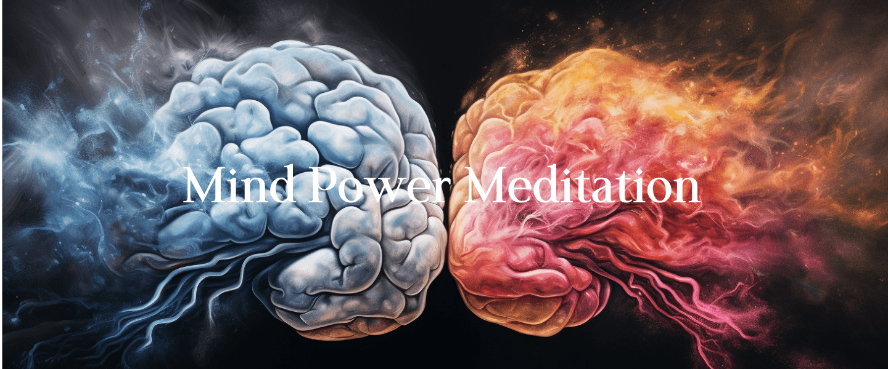

Mind Power Meditation is a transformative practice that harnesses the untapped potential of the mind to unlock inner strength, clarity, and manifestation abilities. Through this meditation technique, individuals learn to harness the power of their thoughts and focus them towards achieving their goals and desires.  

Over the past many years, the Mind Power Meditation has helped thousands of people over the stress and anxiety and achieve all that they wish for. 

## 500+

Colleges and Corporates have organized our workshops. 

## 10k+

Students and professionals have changes their lives for the better.

## Advantages of Mind Power Meditation

### Manifestation of your dreams & desires.

Unlock the art of manifesting your dreams and desires, transforming mere thoughts into tangible realities

### Heightened creativity and intuition.

Unleash your creative potential and intuitive insights, nurturing a deeper connection with your inner wisdom.

### Enhanced focus and concentration.

Experience heightened focus and unwavering concentration, empowering you to accomplish your goals with clarity and precision

### Improved physical health.

Nurture your body's well-being through this transformative practice, leading to enhanced physical vitality and health.

### Reduced stress and anxiety.

Discover the soothing power of this practice, easing stress and anxiety to pave the way for inner peace.

### Spiritual growth and self-discovery.

Embark on a journey of spiritual evolution and self-exploration, unveiling deeper layers of your true self.

## Mind Power Meditation is for

###### Students

## Enhance concentration, memory, and exam performance.

###### Professionals

##### Boost productivity, decision-making, and career growth.

###### Entrepreneurs

##### Amplify creativity, problem-solving, and business success.

###### Goal Setters

##### Manifest desires, align thoughts with goals, and achieve aspirations.

## Course Outline

## Mind Power Meditation

You need at least 20 minutes daily to practice the Mind Power Meditation. There are 4 steps in this meditation. 

- Freestyle fast & deep breathing.
- Intense humming. 
- Third Eye Meditation
- Visualization. 

### Positive Changes Await You:

- _**Enhanced Focus:**_ Sharpen your concentration for improved productivity.
- **Reduced Stress:** Experience inner calm and reduced anxiety levels.
- **Clearer Mindset:** Gain clarity for effective decision-making.
- **Manifestation Power:** Harness thoughts to manifest your aspirations.
- **Emotional Balance:** Attain emotional stability and well-being.

 

Mind Power Meditation is your key to unlocking a life of transformation and empowerment. By harnessing the untapped potential of your mind, you'll experience enhanced focus, reduced stress, and a clearer perspective.

#### "Empower Your Mind, Transform Your Life with Mind Power Meditation"

"Within the realm of your mind lies the boundless potential to shape your reality. Mind power meditation is the key to unlock this hidden treasure within." - Sakshi Shree
