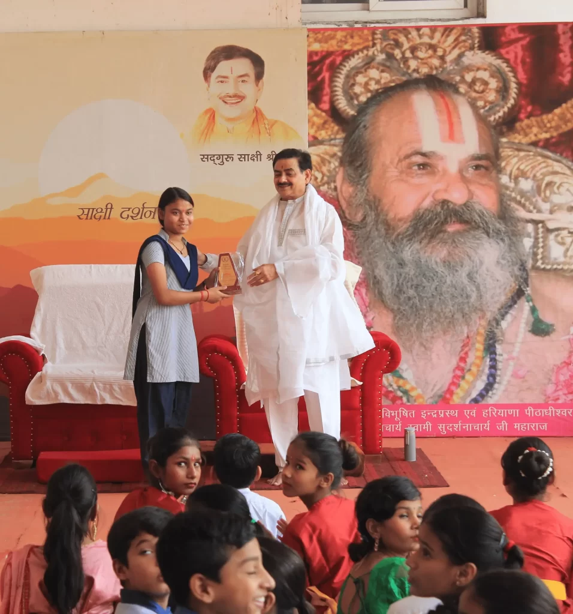
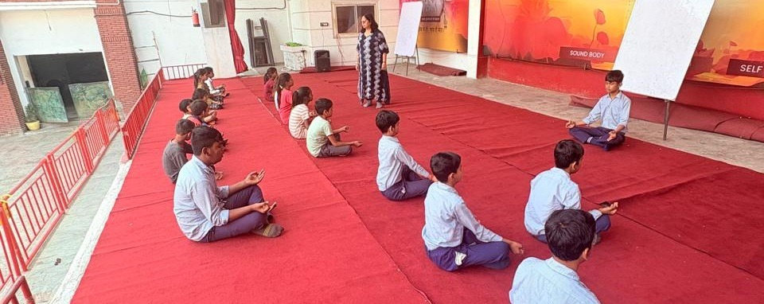
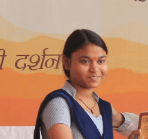
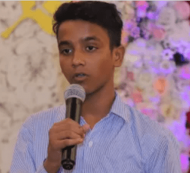

# Har Ghar Shiksha, Har Ghar Dhyan

Bringing education and meditation to the doorsteps of india and its forgotten children

An initiative by Sakshi Shree under the Science Divine Foundation Transforming lives in 700+ districts through Education, Vocation, and Meditation.

_"Education without meditation is incomplete; meditation without purpose is unfulfilled. Together, they create the enlightened human of tomorrow."_

_\- Sakshi Shree_

[Sponsor a child’s education](https://sciencedivine.org/har-ghar-shiksha-donation) [Join the movement](https://sciencedivine.org/har-ghar-shiksha-volunteers) 

### 300+

Meditation Workshops Conducted

### 3L+

Lives Transformed

### 150K+

Teaching Hours

### 700+

Districts Target

# Our Approach: The trinity

We believe in a holistic approach that nurtures the complete development of a child - intellectual, practical, and spiritual.

- [Education](#Content-438611667f6432d2cf9e)
- [Vocation](#Content-059263467f6432d2cf9e)
- [Meditation](#Content-589b92a67f6432d2cf9e)

# Education: Access That Builds Futures

We ensure that every child from marginalized communities, especially those in jhugghis, is admitted into the nearest public or private school.

# Our support includes:

- Enrollment assistance and administrative support
- One-on-one mentoring and after-school tutoring

- Uniforms, books, and essential learning supplies
- Safe and reliable transportation to schools

Education is the foundation upon which we build empowered lives. By ensuring access to quality education, we break generational cycles of poverty and open doors to unlimited possibilities.

# Vocation: Skills for Self-Reliance

Our EVM centers offer age-appropriate vocational training through community volunteers, helping children develop practical skills for future employment and entrepreneurship.

# We help children explore:

- Basic digital literacy and computer skills
- Communication and essential soft skills

- Artistic expression and traditional craftsmanship
- Sports, teamwork, and leadership skills

These centers will equip children to dream big and earn with dignity, preparing them for a future where they can support themselves and contribute to society.

# Meditation: Inner Strength from the Start

We teach scientific meditation practices from early childhood, developing mental, emotional and spiritual capacities that support lifelong success.

# Our meditation curriculum focuses on:

- Improving attention, concentration, and memory
- Building stress management and mental clarity

- Developing emotional intelligence and empathy
- Fostering positive character and identity formation

Meditation will be the foundation of resilience and inner growth, giving children the tools to navigate life’s challenges with composure and wisdom.

# Why is your support needed?

### 52 million

children in India live in extreme poverty

### 7.8 million

children are trapped in child labor

### 1 in 4 children

never sees the inside of a classroom

Without intervention, generations are stuck in poverty and lost potentia

Every child deserves a chance. With your help, we can give them that chance.

Tax exemption 80G provided

# Upcoming Events

[

## FREE MASTERCLASS : Discover the Power of Meditation to Find

Join Sakshi Shree, an enlightened spiritual master and mystic with 40 years of experience, as he helps you unlock the calm and clarity already within you. 13th April 2025                     Ghaziabad Up Coming](https://sciencedivine.org/sunday-event/)

## Every Sunday Events

A Satsang and Meditation Ceremony is being organized at Siddh Sudarshan Sakshi Dham on Sunday, 4th May 2025. Kindly collect your token on time and be sure to receive Guru Ji’s blessings, attend the satsang, and partake in the blessed meal (prasad). Add : Siddha Sudarshan Sakshi Dhaam, 8, Avantika, Chiranjeev Vihar, Ghaziabad Available Now[

## 3 Days Shivir in Haridwar

Sakshi Shree is a world-renowned mystic and enlightened spiritual master with over 40 years of intense research and experience in guiding seekers on the path of designing their destiny.  25th April 2025                         Haridwar Up Coming](https://sciencedivine.org/3days-workshop/)

# Impact So Far

### 300+ Meditation

Workshops across India

### 3+ Lakh

Lives touched through meditation

### 150,000+

Teaching Hours delivered

Thousands of Children enrolled and empowered

Hundreds of Volunteers supporting the mission

We’re not just changing lives. We’re building a new India — child by child, soul by soul.

# Stories of Transformation

**12-year-old Sneha wants to becoming a teacher**  
At just 12 years old, Sneha Kumari already knows her life’s purpose. Supported by her mother, who works as a housemaid in the city, and her father, who provides for the family from their village, Sneha has developed remarkable skills in mehndi art while nurturing a bigger dream: becoming a teacher. **“Education is the key to achieving something bigger,”** says Sneha, who wants to help children from underprivileged backgrounds like herself build better futures through learning.  Sneha Kumari Student **Khushi Rajput wants to be a Doctor**  
Khushi Rajput, along with her three siblings, is raised by their father, a driver, and their mother, a homemaker. This talented young girl has already made her mark by winning first prize in the Sanskriti Art and Craft Competition. “I want to show that no matter where you come from, you can achieve great things with hard work and passion,” says Khushi, whose dream is to become a doctor. By combining her artistic talents with academic dedication, she’s determined to bring healing and hope to others in the future.  Khushi Rajput Student **Meet Akhilesh: A Voice That Inspires**  
From overcoming stage fright to becoming his school’s most accomplished speaker, Akhilesh’s journey exemplifies the power of determination. His breakthrough moment came during an Independence Day celebration, where he delivered a compelling speech to an audience of over 500 people. “When I’m on stage, I feel unstoppable. It’s where I belong,” says Akhilesh, who has transformed from a hesitant performer into a confident public speaker. Despite his humble background, he continues to inspire audiences with his natural talent and commanding presence.  Akhilesh Student

# Recognized by Top Leaders & Media

\[elementor-template id="25999"\] [Sponsor a child’s education](https://sciencedivine.org/har-ghar-shiksha-donation) [Join the movement](https://sciencedivine.org/har-ghar-shiksha-volunteers)

# Contact Details

-  [9315944774](tel:9315944774)
- [info@sciencedivine.org](mailto:info@sciencedivine.org)
- [Sciencedivine.org](https://sciencedivine.org/)

# Follow us on

[Facebook](https://www.facebook.com/OfficialSakshishree/) [Linkedin-in](https://www.linkedin.com/company/science-divine-foundation/) [Instagram](https://www.instagram.com/sakshishreeofficial/)

# All donations are tax-exempt under Section 80(G)

Copyright © \[hfe\_current\_year\] \[hfe\_site\_title\] | Powered by \[hfe\_site\_title\]
