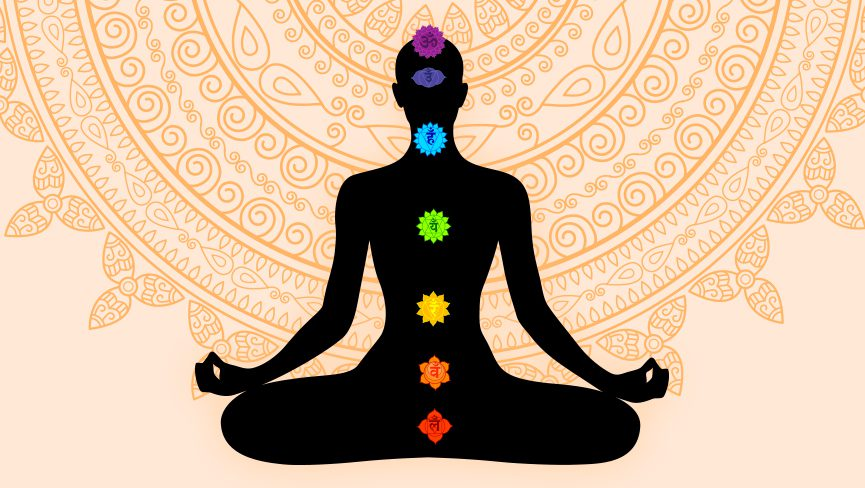
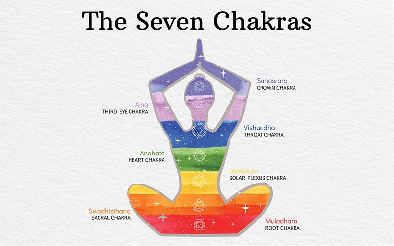
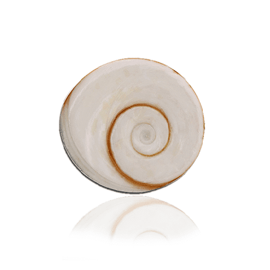

## Create Healthy Living

## Session of Relaxtion

Massage therapy has been shown to relieve depression, especially in people who have chronic fatigue syndrome other studies also suggest benefit.

### Welcomr to our

## Beauty Center

Narayana Health adheres to national and international standards for healthcare hospitals are NABH National Accreditation Board for

### Booking Now

Health is headquartered Bendalure operates network lswith Marfa eiusmod Pinterest in readymade 

### Gift Packages

Health is headquartered Bendalure operates network lswith Marfa eiusmod Pinterest in readymade 

### Offers & Deals

Health is headquartered Bendalure operates network lswith Marfa eiusmod Pinterest in readymade [

### Salt & Aroma

Every treatment is specifically design to offer a unique experience

](#)[

### Relaxation

Every treatment is specifically design to offer a unique experience

](#)[

### Massage Therapy

Every treatment is specifically design to offer a unique experience

](#)[

### Physiotherapy

Every treatment is specifically design to offer a unique experience

](#)

### Welcomr to our

## Pricing Plan

Narayana Health adheres to national and international standards for healthcare hospitals are NABH National Accreditation Board for

### Refrash & Revital

$ 9.99

- 30 min foot spa
- 50 min massage of your choice
- 40 min body treatment

[Purchase Now](#)

### Gragious Glow

$ 12.99

- 30 min foot spa
- 50 min massage of your choice
- 40 min body treatment

[Purchase Now](#)

### Your Indulgence

$ 25.99

- 30 min foot spa
- 50 min massage of your choice
- 40 min body treatment

[Purchase Now](#)

### Everyday Relax

## Get Appoinment

### Welcomr to our

## Photo Gallery

Narayana Health adheres to national and international standards for healthcare hospitals are NABH National Accreditation Board for

### Welcomr to our

## News Feeds

Narayana Health adheres to national and international standards for healthcare hospitals are NABH National Accreditation Board for

 [Anxiety](https://sciencedivine.org/category/anxiety/) | [Chakras](https://sciencedivine.org/category/chakras/) | [Manifestation](https://sciencedivine.org/category/manifestation/) | [MEDITATION](https://sciencedivine.org/category/meditation/) | [Relationships](https://sciencedivine.org/category/relationships/) | [Yoga](https://sciencedivine.org/category/yoga/)

## [What are the 7 Chakras & How They Affect Your Life](https://sciencedivine.org/7-chakras-of-body/)

In the quest for holistic health and spiritual awakening, the concept of the 7 chakras in our body plays a pivotal role. These energy centers, embedded in the ancient traditions of Eastern spirituality, are more than just metaphysical concepts. They are the roadmap to understanding our physical, emotional, and spiritual well-being. This article aims to demystify the 7 chakras of life and explore how they profoundly affect every aspect of our existence. What Are the 7 Chakras in Our Body ? : The term “chakra” originates from Sanskrit, meaning “wheel” or “disk“. In the context of yoga and meditation, these \[…\]

[Learn more ](https://sciencedivine.org/7-chakras-of-body/)[Anxiety](https://sciencedivine.org/category/anxiety/) | [Chakras](https://sciencedivine.org/category/chakras/) | [MEDITATION](https://sciencedivine.org/category/meditation/) | [Positive Thinking](https://sciencedivine.org/category/positive-thinking/) | [Relationships](https://sciencedivine.org/category/relationships/) | [Wellness](https://sciencedivine.org/category/wellness/) | [Yoga](https://sciencedivine.org/category/yoga/)

## [How to Activate Seven Chakras in Human Body](https://sciencedivine.org/seven-chakras/)

Are you seeking to unlock the full potential of your inner energy? The seven chakras of the body are key to achieving a balanced and harmonious life, acting as gateways to the vital energy that flows within us. This beginner’s guide to the seven chakras will introduce you to the concept of seven chakra meditation, seven chakra healing, and how to open all seven chakras, enhancing your physical, emotional, and spiritual well-being. The Seven Chakras: The concept of the Seven Chakras in the human body originates from ancient Indian metaphysics and is central to various spiritual practices, including yoga and \[…\]

[Learn more ](https://sciencedivine.org/seven-chakras/)[Chakras](https://sciencedivine.org/category/chakras/) | [Manifestation](https://sciencedivine.org/category/manifestation/) | [MEDITATION](https://sciencedivine.org/category/meditation/)

## [The Magic of Gomti Chakra: How It Can Change Your Life](https://sciencedivine.org/gomti-chakra/)

In the realm of spiritual and healing practices, the magic of Gomti Chakra stands out as a beacon of positive energy, prosperity, and protection. This small, naturally-formed shell, named after the sacred Gomti River in Dwarka, India, holds ancient powers and secrets that have been revered for generations. But what is Gomti Chakra, and how can it change your life? This article will explore the mystical properties of Gomti Chakra, its benefits, and practical ways to harness its energy to transform your existence. What is Gomti Chakra? Gomti Chakra, a rare natural phenomenon, is found in the Gomti River and \[…\]

[Learn more](https://sciencedivine.org/gomti-chakra/)     
