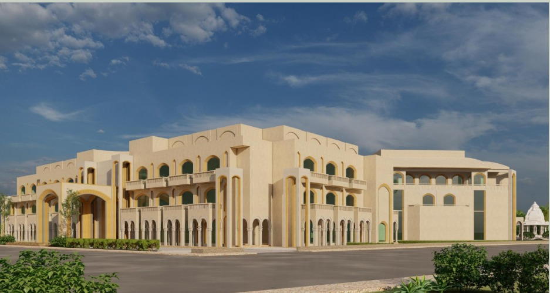
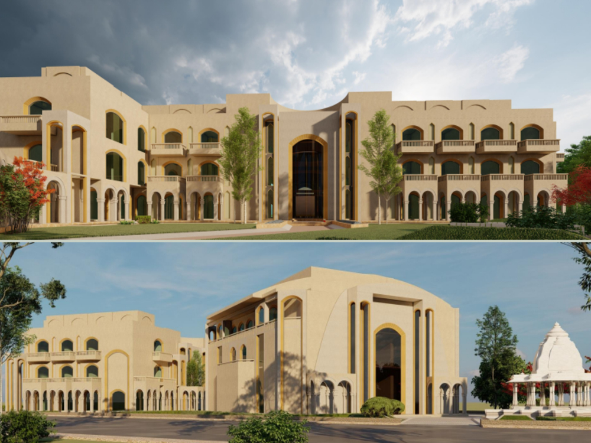

  SAKSHIDHAM INTERNATIONAL VRINDAVAN | Spiritual Retreat & Wellness 

A Sacred Space for Transformation

## SAKSHIDHAM INTERNATIONAL VRINDAVAN

The Spiritual Retreat & Wellness Center, established to help you achieve personal guidance, grace, and blessings for a **stress-free, successful, and happy life.**

**[Explore Membership](#membership) ** 

**### Guidance from Sadguru Sakshi Shree

"The institution provides definite scientific techniques and spiritual practices that will be offered to the members for sound enlightenment, and for the sincere members, it will serve as a center for spiritual upliftment and enlightenment for the sincere members."

### World-Class Facilities for Holistic Living

Fully Furnished Apartments

Auditorium & Satsang Hall

Wellness & Fitness Centre

Multi-cuisine Restaurant

Power Backup & 24 Hr Water Supply

Round The Clock Security

### Spiritual Membership Details

| Membership Level | Contribution (INR) | Key Privileges | Action |
| --- | --- | --- | --- |
| Founder Member | ₹ 11,00,000/- |   - 1 Deluxe Apartment provided. - 65 days stay per calendar year on priority. - Member of Working Committee.   | [Contribute Now](#donate) |
| Co-Founder Member | ₹ 5,00,000/- |   - Apartment (Krishna Apartment) provided. - 45 days stay per calendar year. - Free lodging/boarding on priority basis.   | [Contribute Now](#donate) |
| Diamond Member | ₹ 2,00,000/- |   - 11 days stay per calendar year. - Member of Working Committee.   | [Contribute Now](#donate) |
| Life Member | ₹ 1,00,000/- |   - Residential facilities for 5-day stay in a year. - Receive personal guidance & blessings.   | [Contribute Now](#donate) |
| Special Member | ₹ 51,000/- |   - Receive personal guidance & blessings. - Free lodging & boarding in Shivirs.   | [Contribute Now](#donate) |

\*Terms and conditions apply for all facilities and privileges as specified in the official brochure.

### Support Our Mission

TAX EXEMPTION

All Donations made in favour of \*\*"Siddhadatri Charitable Trust"\*\* are exempt from Income Tax u/s \*\*80 (G)\*\* of Income Tax Act 1961.

#### Bank Details for Contribution (NEFT/RTGS)

**Bank Name:** Bank of India

**Branch:** Harsoan, Ghaziabad

**A/c Name:** SIDDHADATRI CHARITABLE TRUST

**A/c Type:** Current

**A/c No.:** 711120110000140

**IFSC Code:** BKID0007111

### Photo Gallery of Sakshidham

      **
