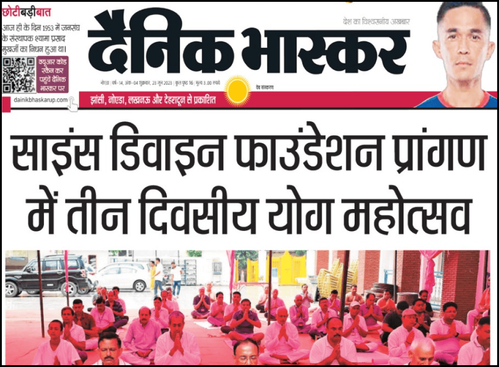
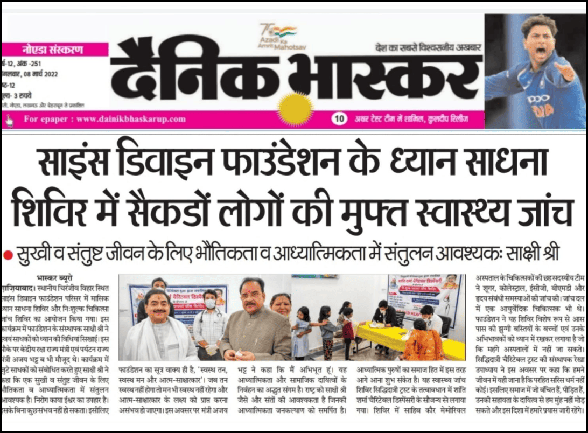
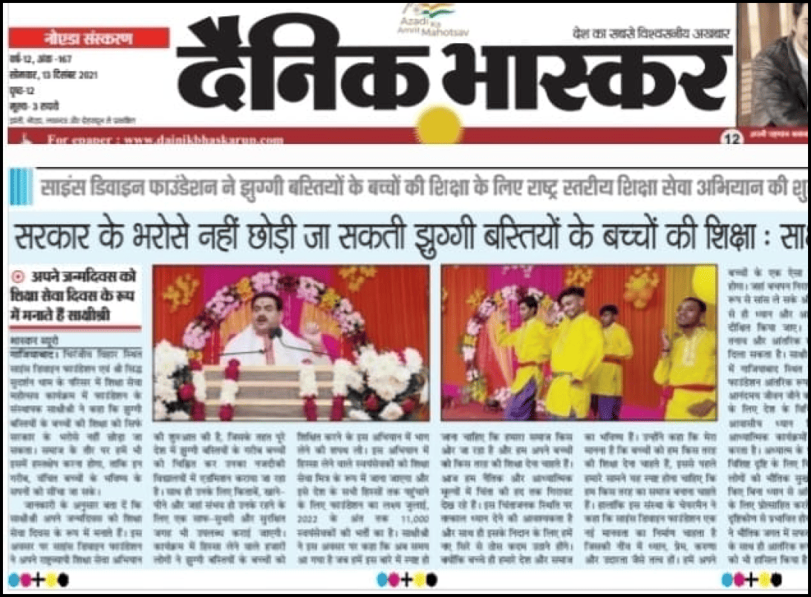
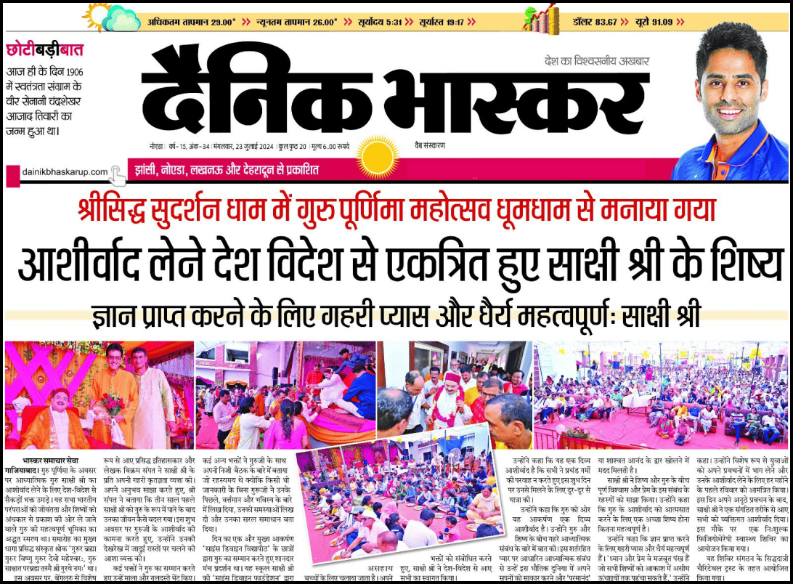
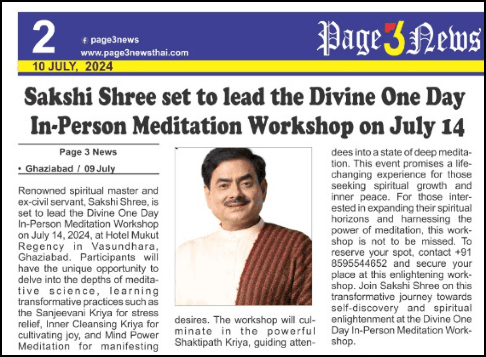
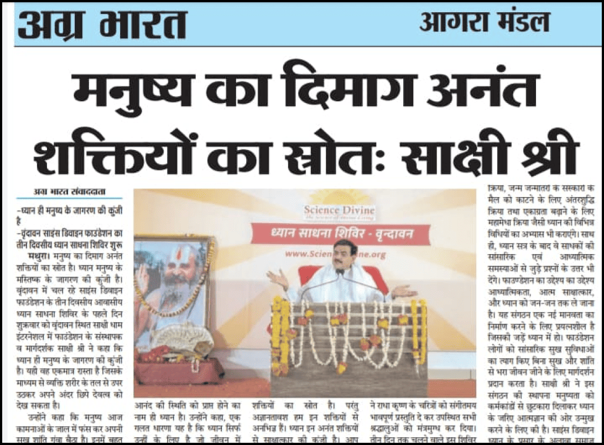
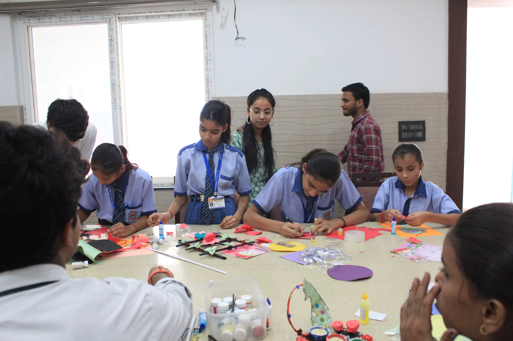
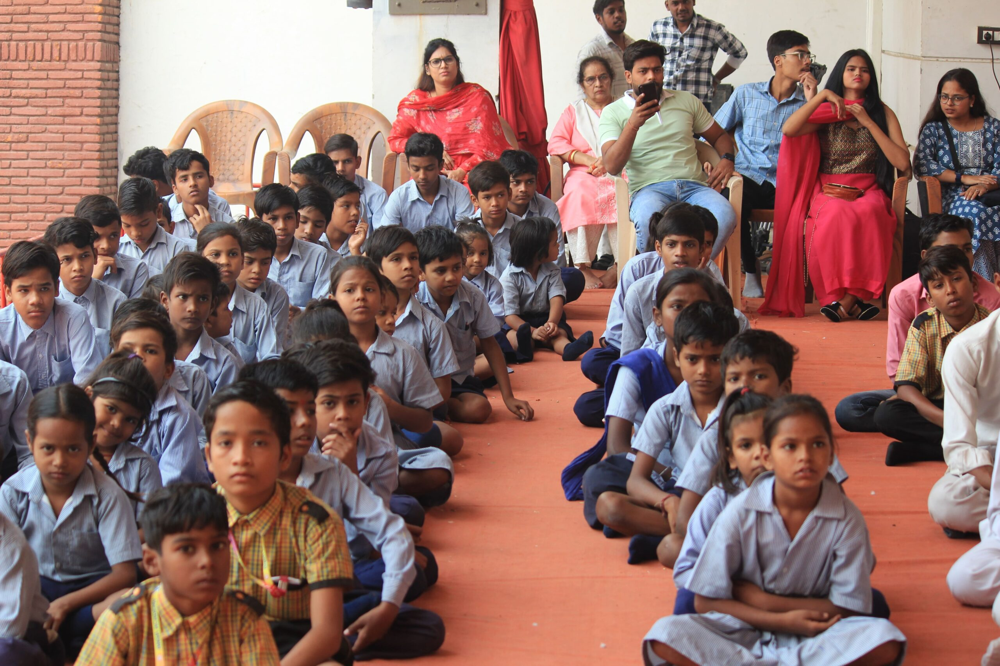
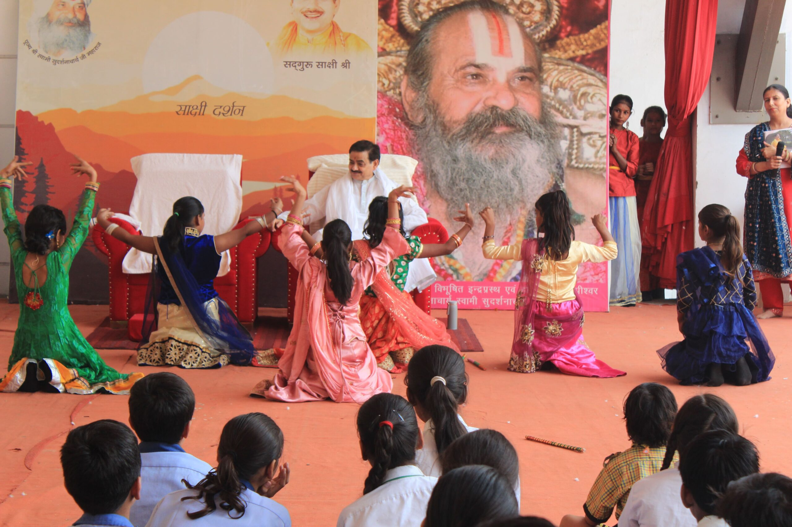

## Unlock the life you  
truly desire

Feeling stuck or facing challenges?  
Sakshi Shree reads your past, present, and future like an open book. Without you saying a single word, he writes down the main problems in your life and provides powerful, effective remedies.

  Hide Razorpay Logo   [Book Your Slot](https://pages.razorpay.com/pl_PrcL8yISHDkUaI/view)  [Get a call back](#consultation)

## 100% privacy guaranteed  
Choose Between Face to Face Or Online Session

## Unlock the life you  
truly desire

Feeling stuck or facing challenges?  
Sakshi Shree reads your past, present and future like an open book and without you speaking even a single word, he writes down the main problems of your life and provides powerful and effective remedies.

  Hide Razorpay Logo   [Book Your Slot](https://pages.razorpay.com/pl_PTV1eNFrJvhJGF/view)  [Get a call back](#consultation)

## 100% privacy guaranteed  
Choose Between Face to Face Or Online Session

## 40+ YEARS OF SPIRITUAL GUIDANCE BY SAKSHI SHREE

## 5M+

## Lives Impacted  
Worldwide

## 1,000+

## Meditation Events Organized Globally

## 9/10

## Experience Inner Peace  
and Clarity

## Rewrite Your Story

## What This Meeting Offers

## 1

Instant Life Reading

Discover the chapters of your life- revealed without saying a word

## 2

Transformative Solutions

Powerful yet simple remedies to overcome life’s challenges and achieve your goals

## 3

Personalized Spiritual Guidance

Tailored guidance to connect with your higher self and awaken your fullest human potential

 [Book your slot](#payment) [Get a call back](#consultation) 

## Meet Sakshi Shree

## Enlightened Spiritual Master

Sakshi Shree is a world-renowned mystic and an enlightened spiritual master with over 40 years of intense research and experience personally guiding seekers on the path of designing their destiny. 

A visionary based in Ghaziabad, he is a former Indian civil servant who founded the Science Divine Foundation to touch millions of lives. His specially curated life-transforming spiritual retreats in India and abroad attract thousands from all age groups and cultural backgrounds.

Read More Sakshi Shree strongly believes that each individual has the innate potential to achieve both material success and spiritual enlightenment. His timeless philosophy and techniques are an excellent blend of ancient spiritual wisdom and time-tested values of the present world. His transformative techniques are designed to empower individuals to tap into their limitless potential and lead more fulfilling lives. He has helped transform millions of lives across the globe. His devotion to social welfare shines through the Science Divine Vidhyapeeth School, an initiative providing free education and nourishment to underprivileged children. This endeavor demonstrates Sakshi Shree’s unwavering commitment to elevating society as a whole.  
Experience his extraordinary gift in an exclusive one-on-one meeting where he reveals your life’s path, core issues and solutions — without you speaking a word. Don’t just believe; experience it yourself! [Book your slot](#payment)

## Transformative Encounters

## Seeker Success Stroies

## The Sakshi Shree Difference

## Decades of wisdom, personalized for you

Sakshi Shree brings 40 years of rigorous spiritual sadhana and research to every consultation unlike generic astrolgers and palmists

## Sakshi Shree's Approach

- 40 years of intense spiritual sadhana and research
- Personalized life reading
- Specific remedies for your life challenges
- Tailored spiritual practices
- Ongoing in-person spiritual guidance

## Generic astrology Palmistry

- Limited knowledge; Information gathered from secondary sources
- General horoscopes
- Vague, universal advice
- One size fits all meditation techniques
- One time consultation, no support

## Sakshi Shree with World Leaders and Media

\[elementor-template id="9843"\]

## Supports Jhuggi Kids' Education

Your transformative session with Sakshi Shree does more than change your life  
– it helps change the lives of underprivileged children.

## To Book the session

## Donate [₹ 11000](https://pages.razorpay.com/pl_PTV1eNFrJvhJGF/view) for Jhuggi Jhopdi Shiksha Sewa Mission

\*Tax Exemption is applicable for all donations under the IT Act\[80G\]

  Hide Razorpay Logo   [Book Your Slot](https://pages.razorpay.com/pl_PrcL8yISHDkUaI/view) 

- **Free Education**  
    Classes from Nursery to VI
- **Nourishment**  
    Daily nutritious meals provided
- **Complete Care**  
    Uniforms, books, and materials supplied
- **Skill Development**  
    Vocational training opportunities

- **Free Education**  
    Classes from Nursery to VI
- **Nourishment**  
    Daily nutritious meals provided

- **Complete Care**  
    Uniforms, books, and materials supplied
- **Skill Development**  
    Vocational training opportunities

## How to Book Meeting

### Step 1:  
Confirm Your Participation

Lock in your session by making Contribution of **₹ 6100** for underprivileged kids education. It's your first step towards transformation!

### Step 2:  
Schedule your meeting

Our team will reach out to discuss your meeting preferences (online or face-to-face) and check your availability to find the perfect time for your enlightening encounter.

### Step 3:  
Begin Your Journey of Transformation

The big day is here! If you're meeting in person, arrive 30 minutes early to soak in the atmosphere. For online sessions, we'll ensure everything's set for a seamless experience. Get ready to dive deep into insights that will reshape your life!

## just ₹ 11000

  Hide Razorpay Logo   [Book Your Slot](https://pages.razorpay.com/pl_PrcL8yISHDkUaI/view)  [Get a call back](#consultation)

## Voices of Transformation

## See what people are saying after meeting Sakshi Shree

\[elementor-template id="25533"\]

## FAQs

Here are some common questions about "A Meeting Can Change Your Life."

Is the meeting online or offline?

Both options are available. Once you’ve made the payment, our team will coordinate with you to determine which option suits you best.

How will my appointment be scheduled?

After you make the payment, our team will contact you on call or whatsapp to check your availability and fix your appointment at a convenient time.

Do I need to bring anything to the meeting?

No, you don’t need to bring anything but we recommend you to keep details such as place, date and time of your birth handy for the meeting.

How long does a typical session with Guruji Sakshi Shree last?

A typical session lasts approximately 30 minutes. However, Guruji ensures that each individual receives the insights and guidance they need for a transformative experience.

What can I expect during my session with Guruji Sakshi Shree?

During your session, Guruji will provide personalized insights into your life’s challenges without you needing to speak. He’ll then offer tailored spiritual guidance, specific remedies, and practices suited to your unique journey. Many experience profound revelations and a sense of clarity after their meeting.

How does Guruji Sakshi Shree provide insights without me speaking?

Guruji has developed a unique ability through decades of spiritual practice to intuitively read a person’s energy and life circumstances. This allows him to provide accurate insights without requiring you to share information verbally.

Is there any preparation required before the meeting?

No special preparation is required. We recommend coming with an open mind and heart. If the session is online, ensure you have a quiet, private space and a stable internet connection.

Can I request guidance on specific areas of my life (e.g., career, relationships, health)?

Yes, while Guruji provides comprehensive insights, you’re welcome to ask for guidance on specific areas of concern during your session.

What forms of payment do you accept?

We accept all major debit cards, credit cards, UPI, and net banking options. All transactions are secure.

## Contact us

### E-mail

info@sciencedivine.org

### Phone

+91 93159 44774

### Address

Siddha Sudarshan Sakshi Dhaam, 8, Avantika, Chiranjeev Vihar, Ghaziabad

[Facebook](https://www.facebook.com/OfficialSakshishree/) [Youtube](https://www.youtube.com/@SakshiShree) [Instagram](https://www.instagram.com/sakshishreeofficial/)

<iframe src="https://www.google.com/maps/embed?pb=!1m18!1m12!1m3!1d7001.098021030636!2d77.4669147257707!3d28.67321939173053!2m3!1f0!2f0!3f0!3m2!1i1024!2i768!4f13.1!3m3!1m2!1s0x390cf2225b004e0d%3A0xae5320d2505e9f9f!2sSiddha%20Sudarshan%20Sakshi%20Dham!5e0!3m2!1sen!2sin!4v1733998097375!5m2!1sen!2sin" width="600" height="450" style="border:0;" allowfullscreen loading="lazy" referrerpolicy="no-referrer-when-downgrade"></iframe>

## Get A Call Back

Contact us by filling out this form and our experts will contact you immediately. We’re here to help you on your journey of personal transformation in all the dimensions of your life.
