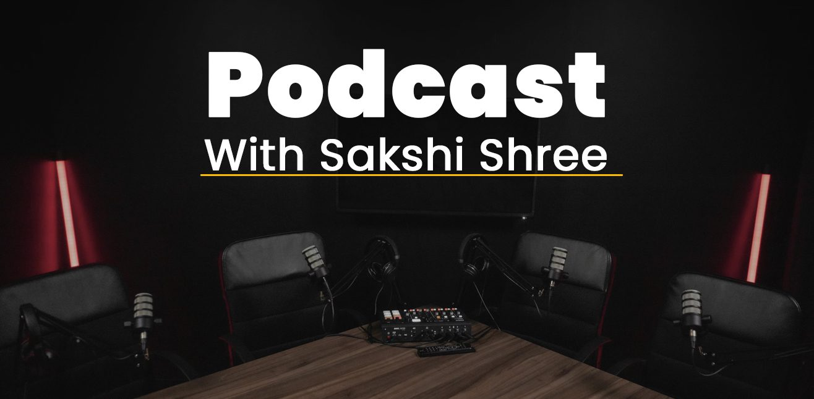

## DISCOVER OUR PODCAST

## EPISODES

"Sakshi Shree's podcast is a spiritual gem. His wisdom resonates in every episode, offering profound insights and practical guidance. It's a transformative journey I'm grateful to embark upon with each listen."

## Rahul Bansal

Start-up Owner, India 

All9 General03 Vikram Sampath06 Series C16 Series D18 All9 

## 

<iframe src="https://podcasters.spotify.com/pod/show/sakshi-shree-english/embed/episodes/Beyond-Possession-Discovering-True-Freedom-through-Love--Vikram-Sampath--Sakshi-Shree-Podcast-e28bavg" height="162px" width="400px" frameborder="0" scrolling="no"></iframe>

## 

<iframe src="https://podcasters.spotify.com/pod/show/sakshi-shree-english/embed/episodes/The-Secret-of-Joyful-Relationships--Sakshi-Shree--Vikram-Sampath-Podcast--Season-3-Ep-1-e28bac0" height="162px" width="400px" frameborder="0" scrolling="no"></iframe>

<iframe src="https://podcasters.spotify.com/pod/show/sakshi-shree-english/embed/episodes/How-to-Achieve-Superconsciousness-through-Love---Sakshi-Shree--Vikram-Sampath-Podcast--S3-E2-e28barm" height="162px" width="400px" frameborder="0" scrolling="no"></iframe>

<iframe src="https://podcasters.spotify.com/pod/show/sakshi-shree-english/embed/episodes/Transcending-Emotions-Journey-from-Jealousy-to-Divine-Love--Sakshi-Shree--Vikram-Sampath-Podcast-e28bb5e" height="162px" width="400px" frameborder="0" scrolling="no"></iframe>

<iframe src="https://podcasters.spotify.com/pod/show/sakshi-shree-english/embed/episodes/Drug-Addiction-and-Meditation--Vikram-Sampath--Sakshi-Shree-Podcast-e28pltf" height="162px" width="400px" frameborder="0" scrolling="no"></iframe>

<iframe src="https://podcasters.spotify.com/pod/show/sakshi-shree-english/embed/episodes/Should-we-really-go-back-to-the-roots-of-our-culture-Vikram-Sampath--Sakshi-Shree-e28pma0" height="162px" width="400px" frameborder="0" scrolling="no"></iframe>

<iframe src="https://podcasters.spotify.com/pod/show/sakshi-shree-english/embed/episodes/The-Message-of-a-Spiritual-Master--Sakshi-Shree-e1l2v2q" height="160px" width="400px" frameborder="0" scrolling="no"></iframe>

<iframe src="https://podcasters.spotify.com/pod/show/sakshi-shree-english/embed/episodes/How-To-Find-Your-Ultimate-Happiness--Sakshi-Shree-e1l2vak" height="162px" width="400px" frameborder="0" scrolling="no"></iframe>

<iframe src="https://podcasters.spotify.com/pod/show/sakshi-shree-english/embed/episodes/How-past-life-deeds-affect-our-current-life---Sakshi-Shree-e1n05bp" height="162px" width="400px" frameborder="0" scrolling="no"></iframe>

General03

<iframe src="https://podcasters.spotify.com/pod/show/sakshi-shree-english/embed/episodes/The-Message-of-a-Spiritual-Master--Sakshi-Shree-e1l2v2q" height="160px" width="400px" frameborder="0" scrolling="no"></iframe>

<iframe src="https://podcasters.spotify.com/pod/show/sakshi-shree-english/embed/episodes/How-To-Find-Your-Ultimate-Happiness--Sakshi-Shree-e1l2vak" height="162px" width="400px" frameborder="0" scrolling="no"></iframe>

<iframe src="https://podcasters.spotify.com/pod/show/sakshi-shree-english/embed/episodes/How-past-life-deeds-affect-our-current-life---Sakshi-Shree-e1n05bp" height="162px" width="400px" frameborder="0" scrolling="no"></iframe>

Vikram Sampath06 

<iframe src="https://podcasters.spotify.com/pod/show/sakshi-shree-english/embed/episodes/The-Secret-of-Joyful-Relationships--Sakshi-Shree--Vikram-Sampath-Podcast--Season-3-Ep-1-e28bac0" height="162px" width="400px" frameborder="0" scrolling="no"></iframe>

<iframe src="https://podcasters.spotify.com/pod/show/sakshi-shree-english/embed/episodes/How-to-Achieve-Superconsciousness-through-Love---Sakshi-Shree--Vikram-Sampath-Podcast--S3-E2-e28barm" height="162px" width="400px" frameborder="0" scrolling="no"></iframe>

<iframe src="https://podcasters.spotify.com/pod/show/sakshi-shree-english/embed/episodes/Beyond-Possession-Discovering-True-Freedom-through-Love--Vikram-Sampath--Sakshi-Shree-Podcast-e28bavg" height="162px" width="400px" frameborder="0" scrolling="no"></iframe>

<iframe src="https://podcasters.spotify.com/pod/show/sakshi-shree-english/embed/episodes/Transcending-Emotions-Journey-from-Jealousy-to-Divine-Love--Sakshi-Shree--Vikram-Sampath-Podcast-e28bb5e" height="162px" width="400px" frameborder="0" scrolling="no"></iframe>

<iframe src="https://podcasters.spotify.com/pod/show/sakshi-shree-english/embed/episodes/Drug-Addiction-and-Meditation--Vikram-Sampath--Sakshi-Shree-Podcast-e28pltf" height="162px" width="400px" frameborder="0" scrolling="no"></iframe>

<iframe src="https://podcasters.spotify.com/pod/show/sakshi-shree-english/embed/episodes/Should-we-really-go-back-to-the-roots-of-our-culture-Vikram-Sampath--Sakshi-Shree-e28pma0" height="162px" width="400px" frameborder="0" scrolling="no"></iframe>

Series C16 

## PODCAST 1 : WHY NO ONE UNDERSTANDS YOU

Sakshi Shree is a new-age enlightened mentor who believes Lorem Ipsum is simply dummy text of the printing and typesetting industry. Lorem Ipsum has been the industry’s standard dummy text ever since the 1500s, when an unknown printer took a galley of type and scrambled it to make a type specimen book. It has survived not only five Centuries, but also the leap into electronic typesetting, remaining essentially unchanged.

## PODCAST 1 : WHY NO ONE UNDERSTANDS YOU

Sakshi Shree is a new-age enlightened mentor who believes Lorem Ipsum is simply dummy text of the printing and typesetting industry. Lorem Ipsum has been the industry’s standard dummy text ever since the 1500s, when an unknown printer took a galley of type and scrambled it to make a type specimen book. It has survived not only five Centuries, but also the leap into electronic typesetting, remaining essentially unchanged.

## PODCAST 1 : WHY NO ONE UNDERSTANDS YOU

Sakshi Shree is a new-age enlightened mentor who believes Lorem Ipsum is simply dummy text of the printing and typesetting industry. Lorem Ipsum has been the industry’s standard dummy text ever since the 1500s, when an unknown printer took a galley of type and scrambled it to make a type specimen book. It has survived not only five Centuries, but also the leap into electronic typesetting, remaining essentially unchanged.

## PODCAST 1 : WHY NO ONE UNDERSTANDS YOU

Sakshi Shree is a new-age enlightened mentor who believes Lorem Ipsum is simply dummy text of the printing and typesetting industry. Lorem Ipsum has been the industry’s standard dummy text ever since the 1500s, when an unknown printer took a galley of type and scrambled it to make a type specimen book. It has survived not only five Centuries, but also the leap into electronic typesetting, remaining essentially unchanged.

Series D18

<iframe style="border-radius:12px" src="https://open.spotify.com/embed/episode/7yxfOR8Oi3lzOlhihg2JBs?utm_source=generator" width="100%" height="352" frameborder="0" allowfullscreen allow="autoplay; clipboard-write; encrypted-media; fullscreen; picture-in-picture" loading="lazy"></iframe>
