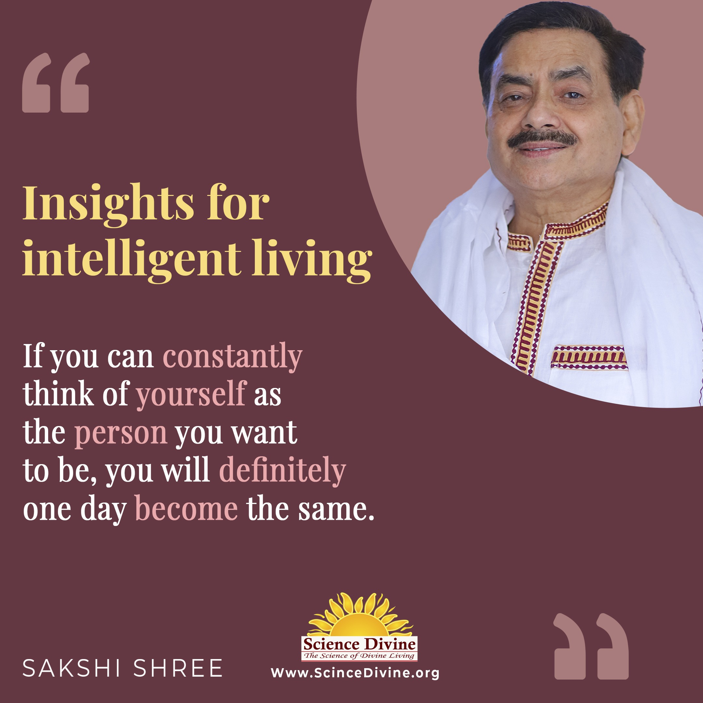
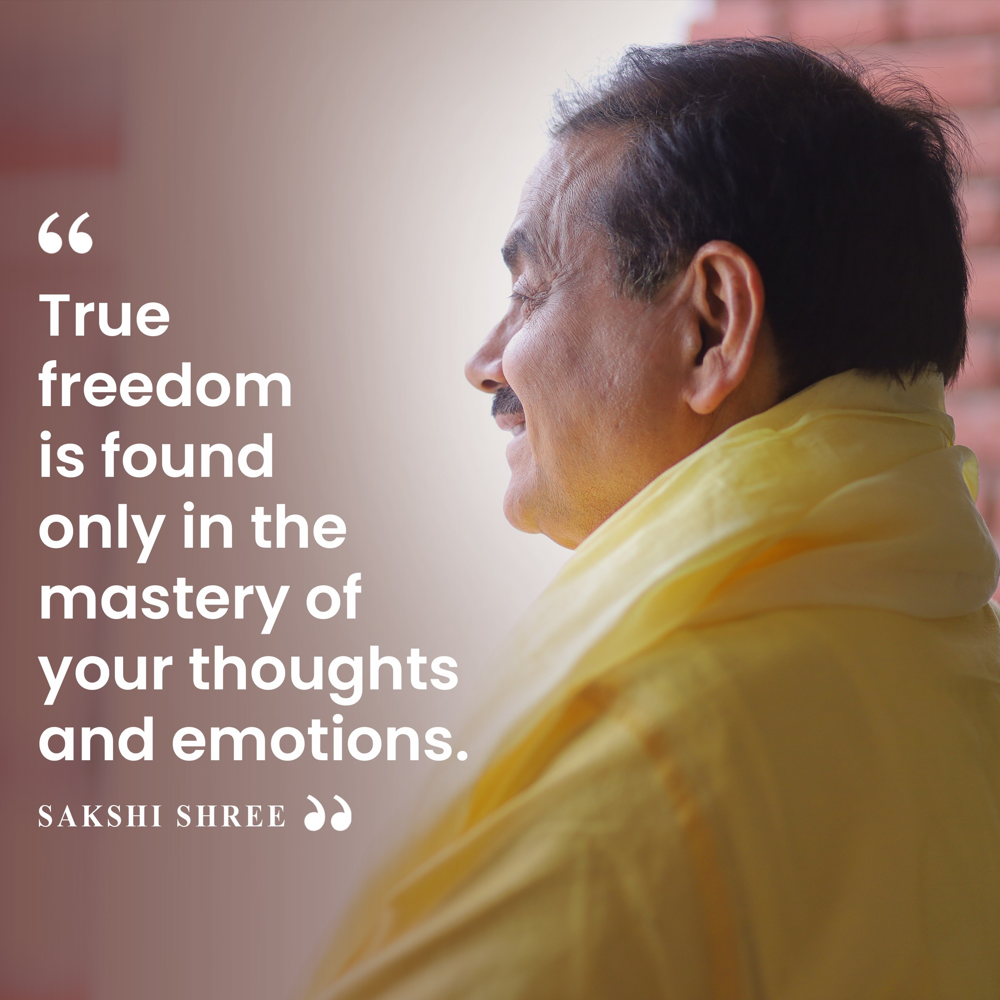

## Positive Thinking

The Power of Positive Thinking: With Sakshi Shree

Positive thinking is like having a sunny outlook on life, even when it's cloudy. Just like meditation helps calm the mind, positive thinking can lift your spirits and make tough times feel more manageable. When you believe in yourself and focus on your strengths, opportunities seem to appear out of nowhere. With Sakshi Shree's guidance, you can amplify this positive energy and manifest your dreams into reality. So, why not take a leap of faith and start embracing the power of positive thinking today? You never know what wonders it might bring into your life.

Articles Quotes Videos Podcasts Articles 

### [7 Ways to Foster an Optimistic Mind](https://sciencedivine.org/optimistic-mind/)

### [10 Ways to Overcome Negative Thoughts](https://sciencedivine.org/stop-negative-thinking/)

### [How to Activate Seven Chakras in Human Body](https://sciencedivine.org/seven-chakras/)

### [What Your Conscious Mind Can Do: Simple Explained](https://sciencedivine.org/what-is-conscious-mind/)

### [The Basics of Conscious mind and Subconscious mind](https://sciencedivine.org/conscious-mind-and-subconscious-mind/)

### [How to Be Conscious: Wake Up Your Mind Every Day](https://sciencedivine.org/conscious/)

### [How to Feel Calm: Easy Ways to Find Peace of Mind](https://sciencedivine.org/what-is-peace-of-mind/)

### [What Is Positive Thinking and Why It Matters](https://sciencedivine.org/what-is-positive-thinking/)

### [The Simple Guide to Effective Manifestation](https://sciencedivine.org/what-is-manifestation/)

Quotes 

  

  

  

Videos 

Podcasts Lorem ipsum dolor sit amet, consectetur adipiscing elit. Ut elit tellus, luctus nec ullamcorper mattis, pulvinar dapibus leo.

\[elementor-template id="8373"\]
