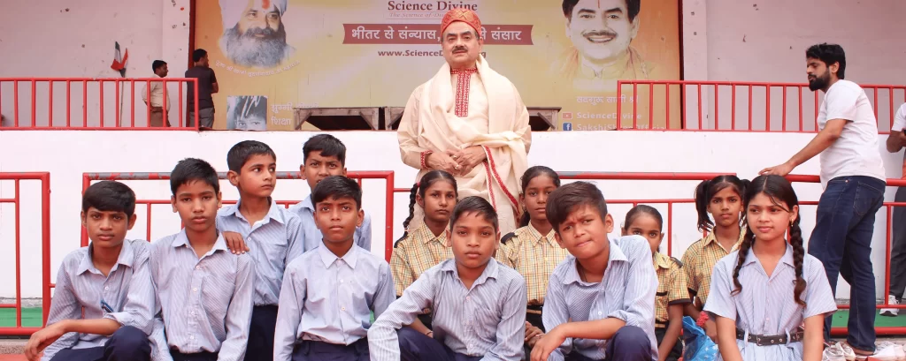
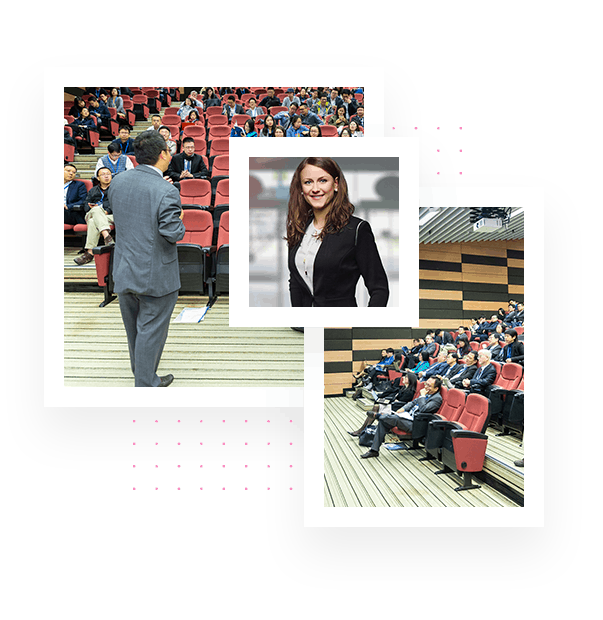
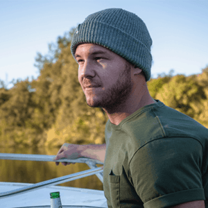

# Our Approach: The trinity

We believe in a holistic approach that nurtures the complete development of a child - intellectual, practical, and spiritual.

- [Education](#Content-438611669318c30e6ab8)
- [Vocation](#Content-059263469318c30e6ab8)
- [Meditation](#Content-2b7e38d69318c30e6ab8)

# Education: Access That Builds Futures

We ensure that every child from marginalized communities, especially those in jhugghis, is admitted into the nearest public or private school.

# Our support includes:

- Enrollment assistance and administrative support
- One-on-one mentoring and after-school tutoring

- Uniforms, books, and essential learning supplies
- Safe and reliable transportation to schools

Education is the foundation upon which we build empowered lives. By ensuring access to quality education, we break generational cycles of poverty and open doors to unlimited possibilities.

# Vocation: Skills for Self-Reliance

Our EVM centers offer age-appropriate vocational training through community volunteers, helping children develop practical skills for future employment and entrepreneurship.

# We help children explore:

- Basic digital literacy and computer skills
- Communication and essential soft skills

- Artistic expression and traditional craftsmanship
- Sports, teamwork, and leadership skills

These centers will equip children to dream big and earn with dignity, preparing them for a future where they can support themselves and contribute to society.

# Meditation: Inner Strength from the Start

We teach scientific meditation practices from early childhood, developing mental, emotional and spiritual capacities that support lifelong success.

# Our meditation curriculum focuses on:

- Improving attention, concentration, and memory
- Building stress management and mental clarity

- Developing emotional intelligence and empathy
- Fostering positive character and identity formation

Meditation will be the foundation of resilience and inner growth, giving children the tools to navigate life’s challenges with composure and wisdom.

# Education: Access That Builds Futures

We ensure that every child from marginalized communities, especially those in jhugghis, is admitted into the nearest public or private school.

# Our support includes:

- Enrollment assistance and administrative support
- One-on-one mentoring and after-school tutoring

- Uniforms, books, and essential learning supplies
- Safe and reliable transportation to schools

Education is the foundation upon which we build empowered lives. By ensuring access to quality education, we break generational cycles of poverty and open doors to unlimited possibilities.

# Vocation: Skills for Self-Reliance

Our EVM centers offer age-appropriate vocational training through community volunteers, helping children develop practical skills for future employment and entrepreneurship.

# We help children explore:

- Basic digital literacy and computer skills
- Communication and essential soft skills

- Artistic expression and traditional craftsmanship
- Sports, teamwork, and leadership skills

These centers will equip children to dream big and earn with dignity, preparing them for a future where they can support themselves and contribute to society.

# Meditation: Inner Strength from the Start

We teach scientific meditation practices from early childhood, developing mental, emotional and spiritual capacities that support lifelong success.

# Our meditation curriculum focuses on:

- Improving attention, concentration, and memory
- Building stress management and mental clarity

- Developing emotional intelligence and empathy
- Fostering positive character and identity formation

Meditation will be the foundation of resilience and inner growth, giving children the tools to navigate life's challenges with composure and wisdom.

Days Hours Minutes Seconds

# Contact Us

We would love to speak with you.  
Feel free to reach out using the below details.

#### Get In Touch

- 123-456-7890
- contact@mysite.com

#### Hours

- Mon-Fri 9:00AM - 5:00PM
- Sat-Sun 10:00AM - 6:00PM

Fill out the form below and we will contact you as soon as possible!

<iframe loading="lazy" src="https://maps.google.com/maps?q=Broadway%20%26%2C%20Chambers%20St%2C%20New%20York%2C%20NY%2010007%2C%20United%20States&amp;t=m&amp;z=17&amp;output=embed&amp;iwloc=near" title="Broadway &amp;, Chambers St, New York, NY 10007, United States" aria-label="Broadway &amp;, Chambers St, New York, NY 10007, United States"></iframe>

## Visit Us

#### Address:

123 Main Street New York, NY 10001

### Join Our Newsletter

Subscribe to receive our latest updates in your inbox!

- Contact@Mysite.com |
- 123-456-7890 

## test form with crm

### Learn Anything

## Conference meet 2019

5 to 7 June 2019, Waterfront Hotel, London

### Live out your life.

## Welcome to the Greatest Conference 2019

Thousands of WordPress themes to start your new website withings a  
bang. Beautiful templates for the world's most popular content man age  
ement of our system controll.

[Learn More](#) 

## Event Speakers

A small river named Duden flows by their place and supplies it with the necessary regelialia. It is a paradise

 )

## [James Killer](javascript:void\(0\))

Microsoft Office lead Speaker

event@speaker.com

- 
- 
- 
- 

## James Killer

Microsoft Office lead Speaker

A small river named Duden flows by their place and supplies it with the necessary

- **Phone:**[+1 (859) 254-6589](<tel:+1 \(859\) 254-6589>)
- **Email:**[info@example.com](mailto:info@example.com)

- 
- 
- 
- 

 )

## [Fredric Martin](javascript:void\(0\))

Google Office lead Speaker

event@speaker.com

- 
- 
- 
- 

## Fredric Martin

Google Office lead Speaker

A small river named Duden flows by their place and supplies it with the necessary

- **Phone:**[+1 (859) 254-6589](<tel:+1 \(859\) 254-6589>)
- **Email:**[info@example.com](mailto:info@example.com)

- 
- 
- 
- 

 )

## [Henri Robert](javascript:void\(0\))

Apple Office lead Speaker

event@speaker.com

- 
- 
- 
- 

## Henri Robert

Apple Office lead Speaker

A small river named Duden flows by their place and supplies it with the necessary

- **Phone:**[+1 (859) 254-6589](<tel:+1 \(859\) 254-6589>)
- **Email:**[info@example.com](mailto:info@example.com)

- 
- 
- 
- 

        

## Event Schedule

A small river named Duden flows by their place and supplies it with the necessary regelialia. It is a paradise

## Get your Ticket

A small river named Duden flows by their place and supplies it with the necessary regelialia. It is a paradise

### Earlybird

$ 200

- Available tickets for this price
- One Day Conference Ticket
- Coffee-break & Networking

[Get Ticket](#)

### platinum

$ 500

- Available tickets for this price
- Two Day Conference Ticket
- Coffee-break & Networking
- Lunch and Networking
- Talking the Editors Session

[Get Ticket](#)

### regular

$ 300

- Available tickets for this price
- One Day Conference Ticket
- Coffee-break & Networking

[Get Ticket](#)

## Latest News

A small river named Duden flows by their place and supplies it with the necessary regelialia. It is a paradise

## Get to the venue

A small river named Duden flows by their place and supplies it with the necessary regelialia. It is a paradise

### REACH US

## Get Direction the Event Hall

Street 140 Avenue, NY 90001 USA

[Get Directions](https://goo.gl/maps/vGw9MJkvQvN2z4sk9) 

<iframe loading="lazy" src="https://maps.google.com/maps?q=London%20Eye%2C%20London%2C%20United%20Kingdom&amp;t=m&amp;z=10&amp;output=embed&amp;iwloc=near" title="London Eye, London, United Kingdom" aria-label="London Eye, London, United Kingdom"></iframe>

## inn eindhoven hotel

Elements users get 30 days of free access professional images sponsor.

[Hotel Website](#)
