Science Divine Foundation

## Har Ghar Shiksha, Har Ghar Dhyan

Bringing education and meditation to the doorsteps of India and its forgotten children.

"Education without meditation is incomplete; meditation without purpose is unfulfilled. Together, they create the enlightened human of tomorrow."

**– Sakshi Shree**

[Sponsor a Child](#) [Join the Movement](#) 

Our Vision

## Sakshi Shree's Commitment

To create a new human being flourishing on earth, which is only possible through education and meditation.

 About Sakshi Shree​

An enlightened master and divine messenger, Sakshi Shree has dedicated her life to spreading the message of love, awareness, and meditation throughout the world.

Through the Science Divine Foundation, she has created a movement to transform lives and awaken human potential, guiding thousands toward a more conscious existence.

### Spiritual Guidance

Providing wisdom and practices for inner transformation

### Compassionate Service

Leading with love and care for all beings

About Us

## About Har Ghar Shiksha, Har Ghar Dhyan

**Empowering Every Individual Through Education and Meditation.**  
A visionary movement by Guru Sakshi Shree and the Science Divine Foundation, Har Ghar Shiksha, Har Ghar Dhyan brings together ancient wisdom and modern science to transform lives across communities.

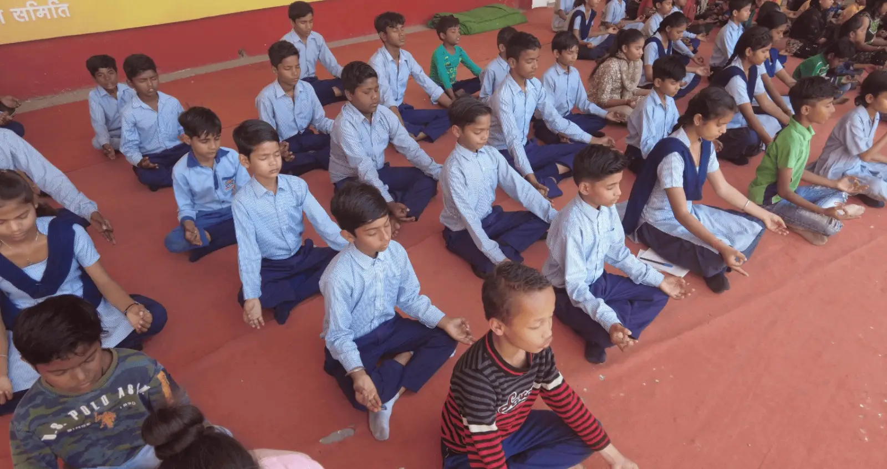

### What We Do

Transform lives through the power of meditation and education, creating a ripple effect of positive change.

### Why We Do It

We believe in the inherent potential of every human being to live a fulfilled, conscious life.

### How We Do It

Through a holistic approach combining traditional wisdom with modern teaching methodologies.

Our Vision

## Our Purpose

We awaken human potential through meditation and education. Our goal is to create conscious individuals who live joyfully and break cycles of poverty by providing inner transformation through Sanjeevani Kriya and quality education to underprivileged children.

## Our Goal

To create conscious individuals who live joyfully and meaningfully.

## Our Vision

To provide quality education and meditation practices to those who need it most.

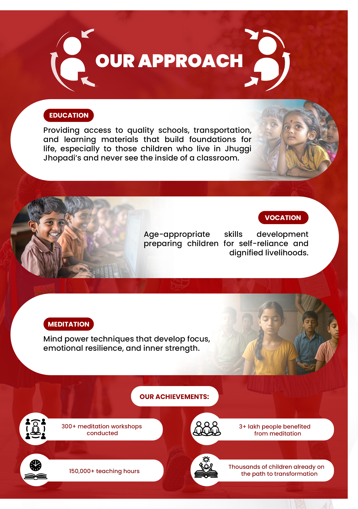

## Our Approach

Guided by the wisdom and vision of Sakshi Shree to create positive change.

Our Impact

## Enriching Over

100,000 Lives

With Meditation and Education

### 50,000+

Lives

Changed Worldwide Through Meditation

### 12,000+

Students Educated

Empowering students through quality education

### 20+

Years in Operation

Dedicated educational service

45% Female Students Educated

Fostering gender-balanced education

Our Solutions

## We Solve Real Problems

Transform Your Life

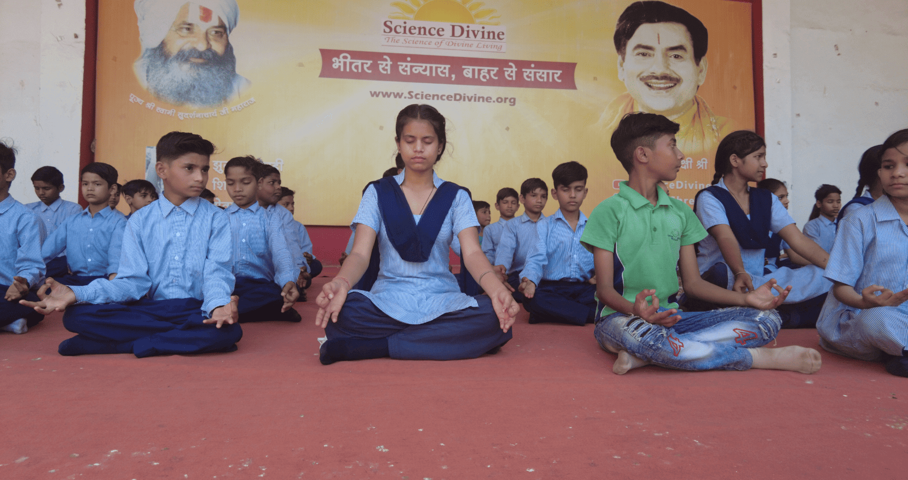

### Spiritual Growth

Discover your inner divinity and connect with your true self through guided meditation practices. [Learn More](#) 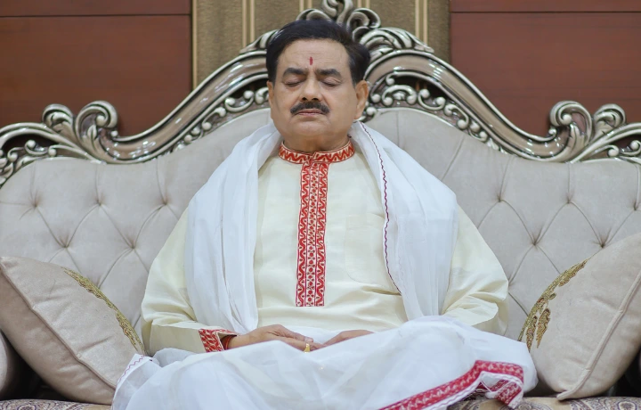

### Mental Clarity

Achieve peace of mind and enhanced focus through regular meditation practice.

[Learn More](#) 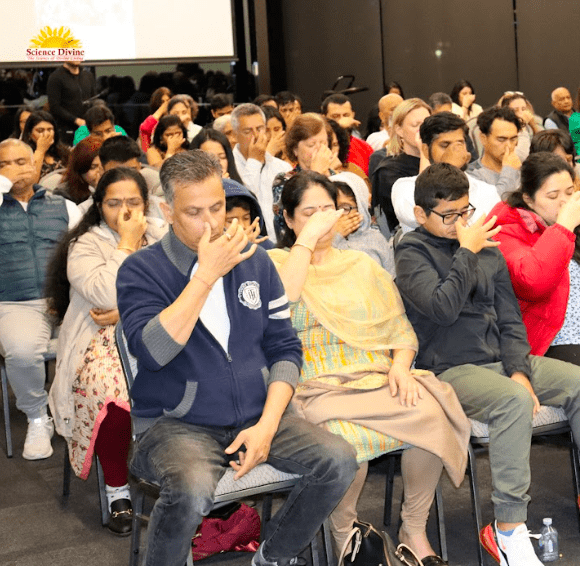

### Knowledge for All

Access spiritual wisdom and practical knowledge that transforms daily life.

[Learn More](#)

Events & Activities

## Our Events

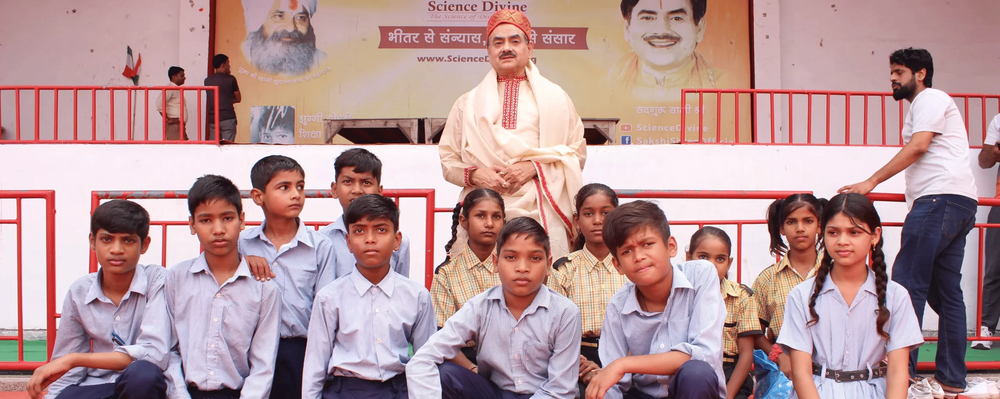

**Event 1  
**Transforming lives through meditation

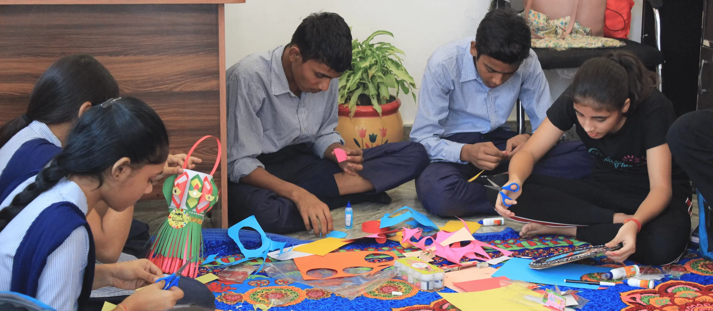

**Event 2**  
Transforming lives through meditation

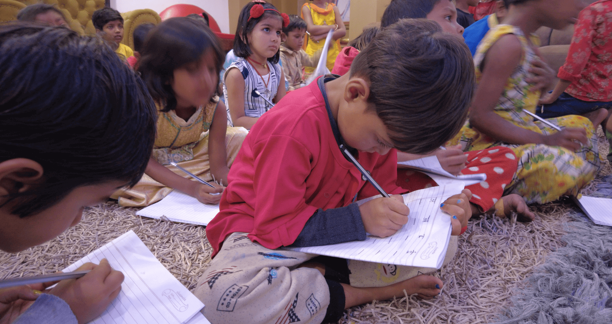

**Event 3  
**Transforming lives through meditation

**Event 4  
**Transforming lives through meditation

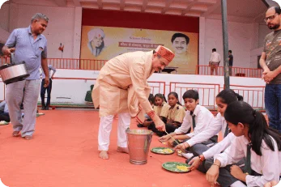

**Event 5  
**Transforming lives through meditation

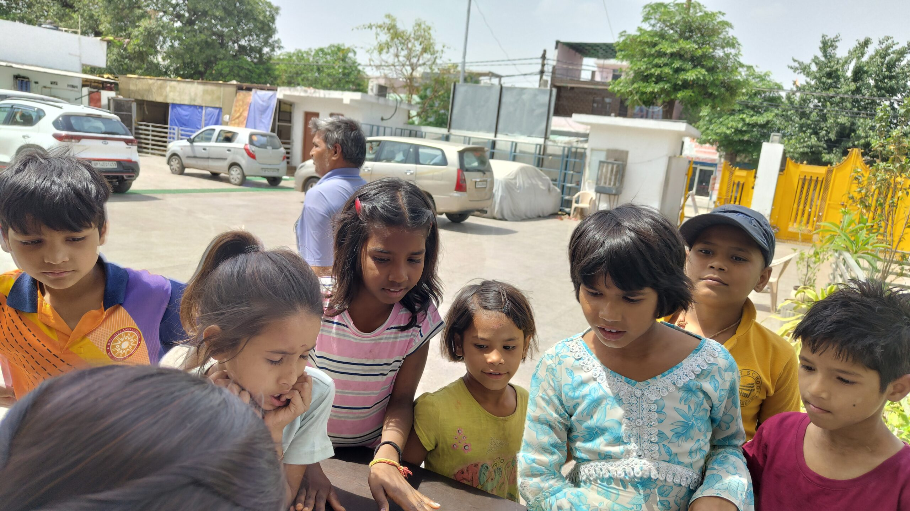

**Event 6  
**Transforming lives through meditation

### Our Dedicated Volunteers

#### Ranjana Sharma

Volunteer

#### Archana Nirali

Volunteer

Success Stories

## Stories of Transformation

We're not just changing lives. We're building a new India — child by child, soul by soul.

"Education is the key to achieving something bigger."

### Sneha Kumari

Student

At just 12 years old, Sneha Kumari already knows her life's purpose. Supported by her mother, who works as a housemaid in the city, and her father, who provides for the family from their village, Sneha has developed remarkable skills in mehndi art while nurturing a bigger dream: becoming a teacher.

"I want to show that no matter where you come from, you can achieve great things with hard work and passion."

### Khushi Rajput

Student

Khushi Rajput, along with her three siblings, is raised by their father, a driver, and their mother, a homemaker. This talented young girl has already made her mark by winning first prize in the Sanskriti Art and Craft Competition.

"When I'm on stage, I feel unstoppable. It's where I belong."

### Akhilesh

StudentFrom overcoming stage fright to becoming his school's most accomplished speaker, Akhilesh's journey exemplifies the power of determination. His breakthrough moment came during an Independence Day celebration, where he delivered a compelling speech to an audience of over 500 people.Recognition

## Recognized by Top Leaders & Media

Our initiatives have received recognition and support from leaders across various sectors

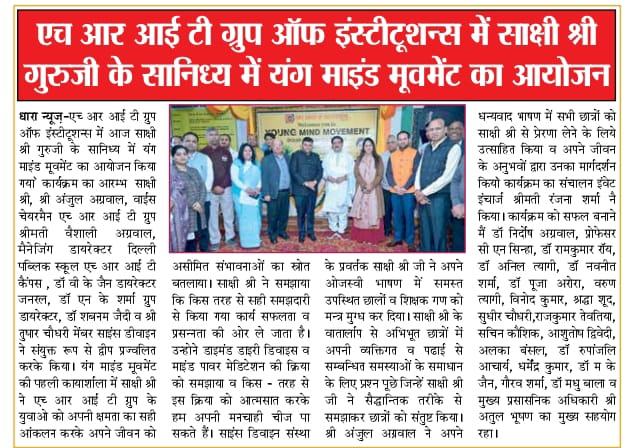 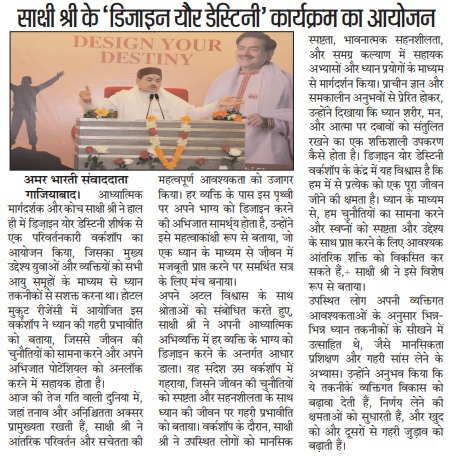 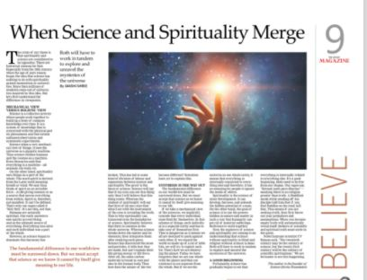  

Media Coverage

 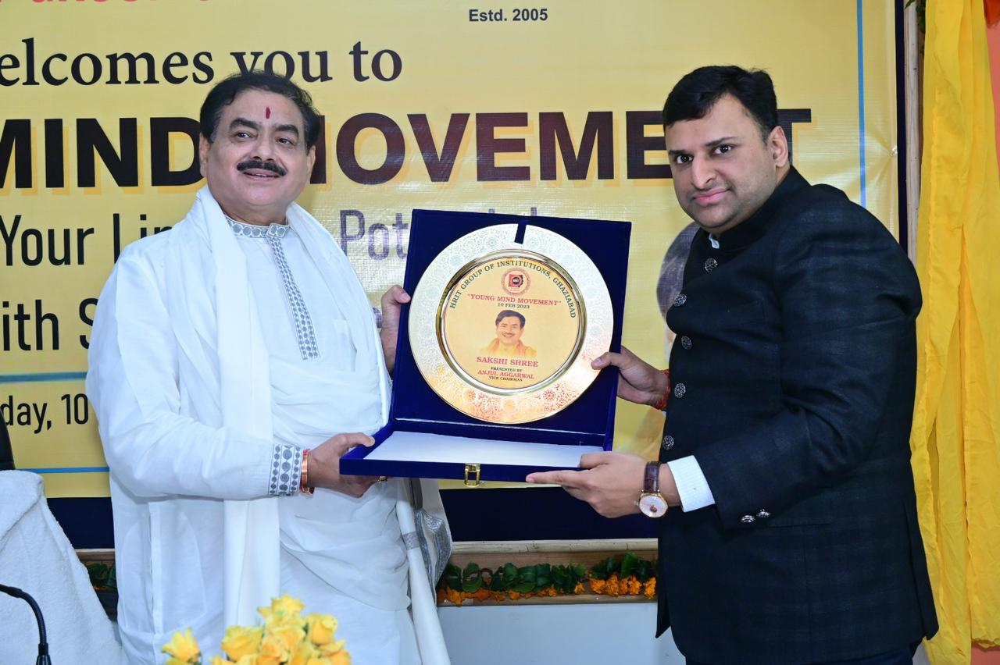 

## Join the Divine Movement

Together, we can bring the light of education to every underprivileged child and the peace of meditation to every troubled mind.

[Join Us Now](#)

Testimonials

## They Believe In Us

Transformative Experiences

 **— Piyush Pasbola**

"Growing up in Dehradun, I searched for spiritual truth in ashrams and books, but something essential was always missing. The day I met Guruji, that missing piece was revealed—not through words but through presence."

 **— Preeti Kimoth**

"After working in finance for years, I was looking for something meaningful. Thanks to my sister, I discovered Sakshi Shree and Gurudev's Sanjeevani Kriya. This meditation practice is remarkably easy to learn and quick to do, yet it offers deep benefits."

 **— Tulika Sharma**

"After practicing Sanjeevani Kriya taught by Gurudev, I experienced feelings that are difficult to put into words. I felt an incredible sense of calm and a profound connection with my inner self. This beautiful practice has opened a doorway to deeper self-understanding."

Make a Difference

## Donate to make a child's future brighter!

Your contribution helps provide quality education and meditation training to underprivileged children.

[Donate Now](#) 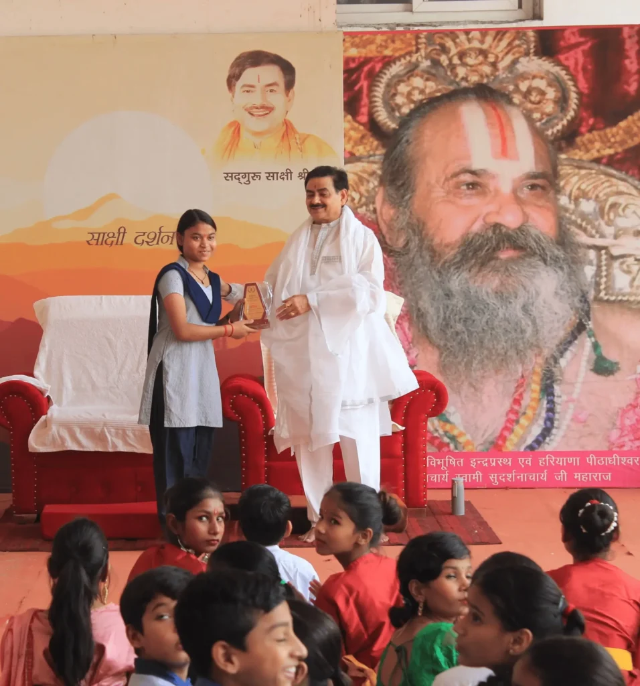 Contact Us

## Drop us a line and keep in touch
