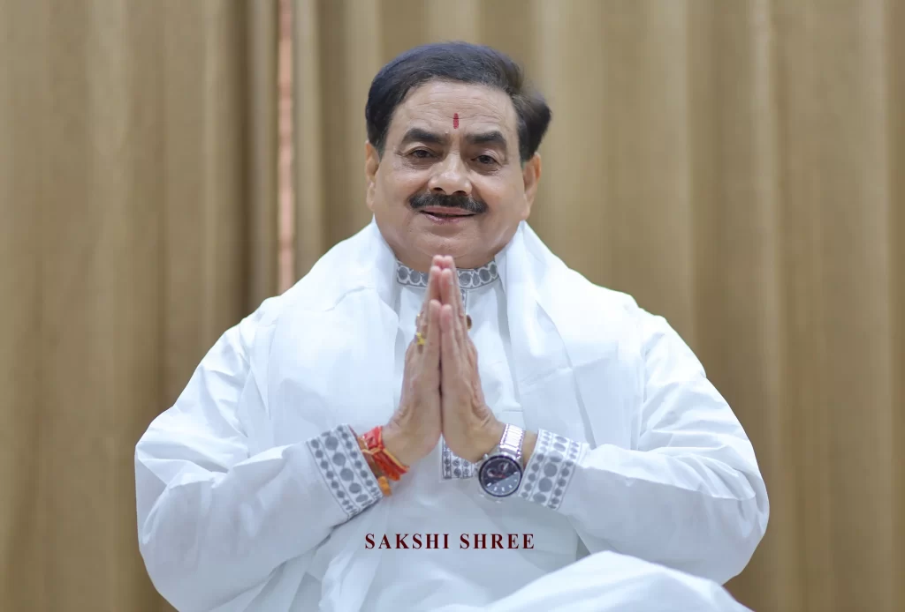

# FREE Masterclass:  
Discover the Power of Meditation to Find  
Peace, Clarity and Joy

Join Sakshi Shree, an enlightened spiritual master and mystic with 40 years of experience, as he helps you unlock the calm and clarity already within you.

- 5 April 2026
- 10 AM
- Siddha Sudarshan Sakshi Dham 9, Avanthika Rd, Chiranjiv Vihar, Shastri Nagar, Ghaziabad, Uttar Pradesh 201002

## This is your chance to make meditation  
work for you – and it’s free.

[

### Join Now for FREE ₹199

Registration is limited

](#scroll-btn)

# Limited Time Offer

## Submit this form to book your spot

Students impacted worldwide 0 M Events Organized Globally 0 + Feel inner peace and clarity 0 /10

# Seeker success stories

I cannot believe I didn't find this sooner. The clarity of life I found through Guruji's teachings and meditation techniques cannot be measured in terms of money. Highly recommend everyone to attend his meditation camp and experience it yourself.

 **Dheeraj Madaan** IIT Roorkee, IIM Lucknow, Management Consultant

Guruji's meditation kriyas are extremely simple to follow. Sanjeevani kriya helped me get rid of the stress & negativity that was stopping me from going deep into meditation and made me an extremely calm minded person. Truly the best investment of my life on myself!

 **Nancy Thakur** SRCC, ISB, Conversion Optimization Lead

Sakshi Shree's blessings and guidance have had a profound impact on my life, leading me towards growth and spiritual fulfillment. I am deeply grateful for Guruji's wisdom and presence in my journey.

 **Vikram Sampath** Top Indian Historian & Writer

Sakshi Shree's blessings and guidance have had a profound impact on my life, leading me towards growth and spiritual fulfillment. I am deeply grateful for Guruji's wisdom and presence in my journey.

 **Vikram Sampath** Top Indian Historian & Writer 

## What you’ll learn

What if your mind held the key to creating the life you’ve always wanted? Learn how to transform every area of your life—health, wealth, love, and happiness

### Strengthen Your Intuition

Your intuition is more than a feeling—it’s your inner compass. Learn how to connect with this powerful inner guide and gain clarity, and confidence in every decision you make.

### Say Goodbye to Stress in Minutes

In just 15 minutes, learn how to release negativity and experience immediate calm and balance.

### Boost Your Health and Energy Naturally

Feel recharged and rejuvenated with meditation’s physical benefits. Sleep better, reduce blood pressure, and energize your body to take on life with renewed vitality.[

### Join Now for FREE ₹199

Registration is limited

](#scroll-btn-1)

## Join us for a live meditation session on

- 5 April 2026
- 10 AM
- Siddha Sudarshan Sakshi Dham 9, Avanthika Rd, Chiranjiv Vihar, Shastri Nagar, Ghaziabad, Uttar Pradesh 201002

## Meet Sakshi Shree

Sakshi Shree is a world-renowned mystic and enlightened spiritual master with over 40 years of intense research and experience guiding people to harness the power of spirituality and meditation for profound self-discovery, and a life of purpose.As the founder of the Science Divine Foundation, Sakshi Shree’s transformative techniques are uniquely designed to empower each person to tap into their innate, limitless potential, achieving both material success and spiritual heights. Sakshi Shree's impact is truly global - he has transformed millions of lives across the world. 

### Key highlights

### 40+ Years of Expertise:

A seasoned guide in spirituality and meditation, empowering individuals to achieve self-discovery, inner peace, and life transformation.

### Founder of Science Divine Foundation:

Established a global NGO dedicated to bridging spirituality and science, spreading the message of conscious living worldwide.

### Commitment to societal welfare:

Founder of the Science Divine Vidyapeeth School, providing free education and nourishment to underprivileged children, embodying his vision of a more compassionate and equitable society.

### Former Indian Civil Servant:

Served as an esteemed RTO officer while pursuing his mission to uplift lives through spirituality and meditation.

## Recognized by Top Leaders & Media

\[elementor-template id="25999"\]

## What's Included

Science of Mind PowerProblem: Struggling with negativity while trying to stay positive and manifest your dreams? Quick motivational boosts often fade when reality hits.
  
Solution: Mind power meditation. This proven practice rewires your mind into a positivity powerhouse.
  
Benefit: From glowing skin to dream careers or finding love, unlock your potential and make your goals a reality. Science of No Mind

Problem: Can’t calm your mind? Mental chatter and burnout leave no room for peace, even during sleep.
  
Solution: Sanjeevani Kriya, a 30-minute meditation, resets your overworked brain.

Benefit: Instantly reduce stress, sleep deeply, and recharge your energy.

Science of Joyful Living

Problem: Happiness tied to life events leaves us vulnerable to life’s chaos.
  
Solution: Inner cleansing meditation teaches unconditional joy as a Sakshi—an observer of life.
  
Benefit: Flush out negativity, nurture inner peace, and find happiness that never leaves you.

Exclusive network to connect, and build friendships

Problem: Many people feel isolated and disconnected in their journey of self-discovery and personal growth.  
Solution: Our in-person meditation masterclass provides an exclusive network where you can connect with like-minded individuals who share your passion for personal growth.  
Benefit: Build lifelong friendships, gain support, and accelerate your personal growth while finding joy and purpose through a transformative community experience.

## Voice of Transformation

### See what poeple are saying after meeting Sakshi shree

\[elementor-template id="25533"\]

## FAQs

Have a specific question? Check out our Support Center How is this workshop different from other meditation programs?

This workshop is designed to make meditation accessible and affordable for everyone. Unlike typical programs, it offers a blend of online and in-person sessions along with personalized guidance —all designed to create lasting transformation.

Do I need any prior experience with meditation before I take these sessions?

No, these sessions are designed for everyone—beginners and experienced meditators alike.

I've tried meditation before and it didn't work, is this workshop for me?

Absolutely! Many participants who struggled with meditation before have found profound success through these sessions. Give it a try—you may be surprised at the transformation!

How soon can I expect results after joining the workshop?

9/10 participants notice a sense of calm, clarity, and reduced stress after just one session. With consistent practice for 21 days, deeper transformations in mental, emotional, and physical well-being follow.

How do I join the workshops after registering?

Once you register, you can join the whatsapp group, the link for which will be shown after you submit your registration. The whatsapp group will have all the information for the session. Additionally, you will also get an email, with link to the session.

What if I miss a workshop? Will there be recordings available?

Yes, we will provide the recording link in the whatsapp group. You can join the whatsapp group through the link provided after you submit your registration.

# Limited Time Offer

## Submit this form to book your spot
