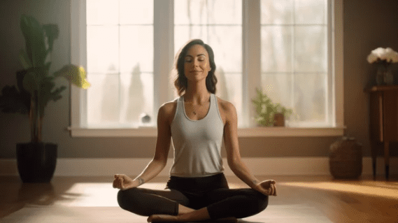

In today's fast-paced world, Where each turn presents new challenges and stressors, a beacon of serenity shines brightly for those who seek it meditation. This ancient practice, with roots deeply embedded in the traditions of numerous cultures, offers a refuge for the mind, body, and spirit. Through meditation, individuals can unlock a profound sense of calm and clarity, navigating the tumults of life with grace and resilience. Let's understand the fundamentals of meditation, its countless benefits, and how to do meditation effectively, especially for beginners eager to transform their lives from the comfort of their homes.

### What is Meditation?

Meditation is a practice that involves training the mind to focus and redirect thoughts. It is often associated with mindfulness, a mental state achieved by focusing one's awareness on the present moment while calmly acknowledging and accepting one's feelings, thoughts, and bodily sensations. Through regular meditation practice, individuals can develop a heightened sense of self-awareness, emotional regulation, and mental clarity.

### The Quintessence of Meditation

At its heart, meditation is a practice of focus and mindfulness. It invites us to pause, breathe, and observe our thoughts without attachment or judgment. This process of turning inward helps to quiet the incessant chatter of the mind, leading to a state of deep relaxation and awareness. The importance of meditation cannot be overstated, as it offers a sanctuary for personal reflection and growth.

### Types of Meditation

There are various types of meditation practices that cater to different preferences and goals. Understanding the types of meditation is crucial for beginners, as it highlights the practice's versatility and accessibility. Whether it's the gentle observation of mindfulness meditation, the focused repetition of a mantra in Transcendental Meditation, or the guided visualizations of guided meditation, there's a method to suit every preference and need. Zen meditation, with its emphasis on seated posture and mindfulness, offers another path to inner peace. These types of meditation underscore the practice's adaptability to individual lifestyles and goals.

### Meditation Benefits for Brain

The benefits of meditation extend far beyond temporary relaxation, impacting various aspects of physical and mental health. Regular practice can significantly reduce stress, making meditation a powerful tool in today's high-pressure society. Moreover, meditation benefits for brain include enhanced focus, memory, and cognitive flexibility. Physiologically, meditation can lower blood pressure, improve sleep, and bolster the immune system. Emotionally, it cultivates resilience, emotional intelligence, and a sense of well-being, underscoring the power of meditation to transform lives.

In a world filled with constant stimulation and distractions, carving out time for meditation is more crucial than ever. It offers us a sanctuary within ourselves where we can find peace amidst chaos, clarity amidst confusion, and strength amidst challenges. The importance of integrating meditation into our daily lives cannot be overstated – it is a gift we give ourselves that keeps on giving in countless ways.

### Meditation for Beginners

If you are new to meditation, starting with guided meditations or beginner-friendly apps can be helpful in establishing a regular practice. These resources provide step-by-step instructions, soothing music or narration, and gentle guidance to ease beginners into the process of meditation. Remember that consistency is key – even short daily sessions can yield significant benefits over time.

### How to Do Meditation at Home

Meditation for beginners might seem intimidating, but the practice is remarkably accessible. How to do meditation at home requires no special equipment or extensive training, making it an ideal practice for individuals of all ages and backgrounds. By finding a quiet space, adopting a comfortable posture, and gently focusing on the breath, beginners can embark on their meditation journey. The key is consistency and patience, allowing the mind to become accustomed to periods of stillness and reflection.

### Power of Meditation

The true power of meditation lies in its ability to transform not just our minds but our entire being. By cultivating mindfulness and presence through regular practice, individuals can tap into their inner wisdom, enhance their emotional resilience, foster compassion towards themselves and others, and ultimately lead more fulfilling lives. The profound effects of meditation ripple outwards into all aspects of our existence.

### Integrating Meditation into Your Daily Life

The importance of meditation in daily life cannot be understated. It provides a foundation for handling stress, making mindful decisions, and approaching life with a sense of calm and purpose. How to do meditation at home offers flexibility, allowing practitioners to integrate meditation into their routines at their convenience. This accessibility ensures that the benefits of meditation can be harnessed to enhance quality of life, promote mental health, and foster a deep sense of inner peace.

As we explore the types of meditation, how to do meditation at home, and the profound benefits of meditation for the brain and body, The power of meditation lies in its simplicity and universality, making it a timeless practice for cultivating resilience, clarity and peace in our lives. we find not only a method for coping with the challenges of modern life but also a gateway to discovering our truest selves. Whether you're a beginner or a seasoned practitioner, the journey of meditation offers endless opportunities for personal exploration and growth. meditation is not just a relaxation technique but a profound tool for personal growth and transformation. By understanding the basics of meditation, exploring its various forms, practicing regularly at home with dedication and intentionality. Start your meditation practice today and witness its transformative power in your life and self-discovery like never before.
