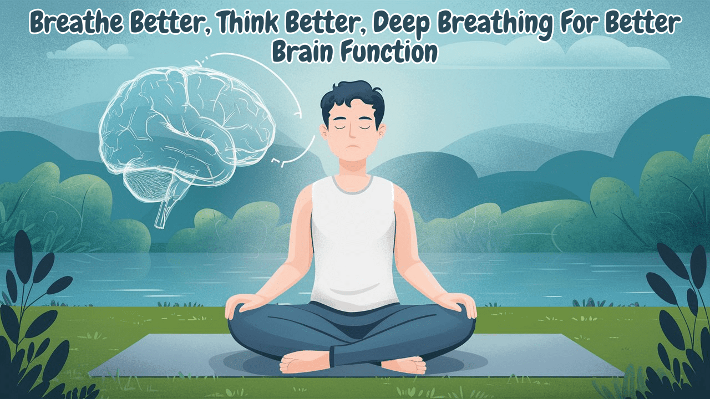

Our brain is one of the most incredibly fascinating organs of our body, the control center. So it’s a no-brainer that we should keep it healthy. Although scientific studies have shown that our brain cannot multitask, it manages everything from our thoughts and emotions to our physical movements and bodily functions. Taking care of our physical health is not enough, we need to pay attention to our mental well-being as well. When our brain is healthy, we think more clearly, manage stress better, and generally feel much happier.

Now you must be wondering how to keep the brain healthy, doing math? Well, good for you, we have a much better solution! Maintaining brain health is vital, and one simple yet effective way to do this is through deep breathing. Deep breathing can help improve our brain function, reduce stress, and even enhance our mood. Scientific studies have shown that controlled breathing can lead to better attention and emotional control. For example, a study published in ‘Frontiers in Human Neuroscience’ found that breathing exercises could significantly improve focus and emotional stability.

## Connection Between Brain and Deep Breathing

Deep breathing affects the brain in several positive ways. When we breathe deeply, we activate the parasympathetic nervous system, which promotes relaxation and helps counteract stress. Normally, when we are stressed, our bodies release hormones like cortisol, which can harm the brain over time. Deep breathing reduces these stress hormones, helping us feel calmer and think more clearly. That is why we are asked to take deep breaths when facing stressful situations.

<iframe src="https://www.youtube.com/embed/o1a5xY0vNf0?si=RMcC2-YJbpqIuD2I" title="deep-breathing-for-better-brain"></iframe>

Another benefit of deep breathing is that it increases the amount of oxygen in our blood. The brain needs a constant supply of oxygen to function well. By breathing deeply, we ensure our brain gets plenty of oxygen, which can improve concentration, boost cognitive performance, and elevate our mood.

Deep breathing also stimulates the vagus nerve, which is a key part of the parasympathetic nervous system. This nerve helps regulate our heart rate and blood pressure, promoting a state of calm. It also plays a role in the brain-gut connection, which impacts mental health. So, by practicing deep breathing, we can improve both our cognitive and emotional well-being.

## Deep Breathing Techniques

Deep breathing is like giving your brain a nice, calming hug. For beginners, it's as easy as pretending you are inflating a big balloon in your belly, not your chest. Just take a slow, deep breath through your nose, feel your belly rise like a balloon, and then slowly exhale through your mouth, like you are gently blowing out birthday candles. It's a simple way to chill out and keep those stress monsters away! This is just basic, but here are a few breathing techniques you can choose from- check which one works for you best.

## Diaphragmatic Breathing or Belly Breathing

Diaphragmatic breathing, also known as belly breathing, involves breathing deeply into the abdomen instead of shallowly into the chest. This technique is excellent for promoting relaxation and reducing stress. To practice diaphragmatic breathing, sit or lie down comfortably. Place one hand on your chest and the other on your abdomen. Inhale deeply through your nose, letting your abdomen rise while keeping your chest still. Exhale slowly through your mouth, allowing your abdomen to fall. Repeat this for several minutes, focusing on the movement of your abdomen.

Studies have shown that diaphragmatic breathing can significantly lower cortisol levels, helping to reduce stress and improve brain function.

## 4-7-8 Breathing Technique

The 4-7-8 breathing technique is simple and effective for promoting relaxation and improving brain function. It involves inhaling for a count of four, holding the breath for a count of seven, and exhaling for a count of eight. This technique helps expel more carbon dioxide from the lungs and allows for greater oxygen intake.

To practice the 4-7-8 technique, sit or lie down comfortably and close your eyes. Inhale quietly through your nose for a count of four. Hold your breath for a count of seven. Exhale completely through your mouth, making a whooshing sound, for a count of eight. Repeat this cycle for four breaths at first, gradually increasing to eight breaths as you get used to it.

Research in the ‘Journal of Clinical Psychology’ indicates that controlled breathing exercises like the 4-7-8 technique can reduce anxiety and improve emotional regulation.

## Box Breathing or Square Breathing

Box breathing, or square breathing, is used by professionals like Navy SEALs to stay calm and focused under pressure. This method involves inhaling, holding the breath, exhaling, and holding the breath again, each for an equal count of four.

To practice box breathing, sit comfortably with your feet flat on the ground. Close your eyes and visualize a square. Inhale deeply through your nose for a count of four, filling your lungs completely. Hold your breath for a count of four. Exhale slowly through your mouth for a count of four. Hold your breath again for a count of four. Repeat this cycle for several minutes, focusing on the rhythm of your breath.

Box breathing has been shown to improve performance under stress by promoting a state of calm and focused attention.

## Nadi Shodhana

Alternate nostril breathing, or Nadi Shodhana, is a traditional yogic practice that balances the left and right hemispheres of the brain. In this you breathe through one nostril at a time while closing the other with your fingers.

To practice alternate nostril breathing, sit comfortably with your spine straight. Use your right thumb to close your right nostril and inhale deeply through your left nostril. Close your left nostril with your ring finger and release your right nostril. Exhale slowly through your right nostril. Inhale deeply through your right nostril, then close your right nostril and release your left nostril. Exhale through your left nostril. This completes one cycle. Continue for several minutes, focusing on the balance and flow of your breath.

Studies have shown that alternate nostril breathing can enhance cognitive function and reduce stress by promoting a balanced autonomic nervous system.

The human brain can generate enough electricity to power a small light bulb. When you are awake, your brain produces about 12-25 watts of electricity, enough to keep that little bulb glowing! So, in a sense, you could say that thinking really does light up your world. Take a moment to take care of this incredible organ. Practice deep breathing and experience the positive effects on your mind and body in a few weeks.
