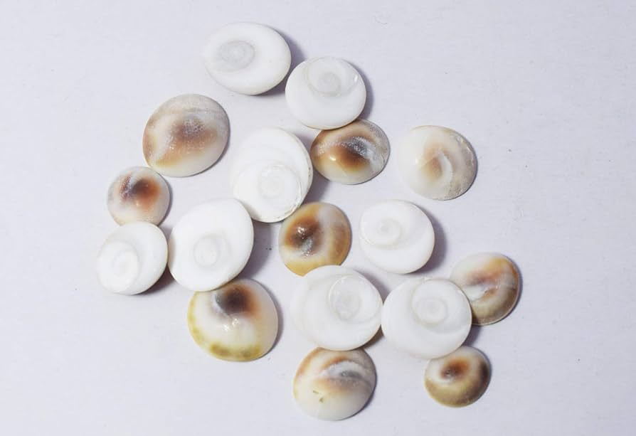

In the realm of spiritual and healing practices, the magic of Gomti Chakra stands out as a beacon of positive energy, prosperity, and protection. This small, naturally-formed shell, named after the sacred Gomti River in Dwarka, India, holds ancient powers and secrets that have been revered for generations. But what is Gomti Chakra, and how can it change your life? This article will explore the mystical properties of Gomti Chakra, its benefits, and practical ways to harness its energy to transform your existence.

### **What is Gomti Chakra?**

Gomti Chakra, a rare natural phenomenon, is found in the Gomti River and is considered a representation of the divine. These small, spiral-shaped stones are believed to embody the universe's mystical energy, making them powerful tools in Vedic rituals and healing practices. The Gomti Chakra tree benefits are also often highlighted, as these stones are said to grow on a tree within the river, adding to their spiritual significance.

### **The Magical Power in Gomti Chakra:**

The magic of Gomti Chakra lies in its ability to attract positive energies while warding off negative influences. It is said to be a manifestation of Lord Krishna's love, bringing the blessings of health, wealth, and prosperity to its possessor. The magical power in Gomti Chakra is not just a matter of faith but has been experienced by many who have welcomed this sacred stone into their lives.

### **Gomti Chakra Benefits:**

**Prosperity and Wealth:** Keeping Gomti Chakra in your home or workplace is believed to attract financial abundance and remove obstacles in the path of your success.

**Health and Healing:** Its energy is said to promote physical well-being, protect from diseases, and aid in the recovery process from illness.

**Protection Against Evil:** Gomti Chakra is known for its protective properties, shielding the holder from negative energies and evil eyes.

**Spiritual Growth:** For those on a spiritual journey, Gomti Chakra can enhance meditation, deepen spiritual practices, and promote inner peace.

### **How to Energise Gomti Chakra:**

To unlock the full potential of Gomti Chakra, it is important to energize it properly. This process involves cleansing the stone in salt water or milk, then exposing it to sunlight for a few hours. Reciting specific mantras or prayers while holding the Gomti Chakra can also infuse it with your personal energy and intentions.

### **Practical Uses in Daily Life:**

Incorporating Gomti Chakra into your daily life can be simple yet profoundly effective. Here are a few ways to harness its benefits:

- Place Gomti Chakra in your wallet or purse to attract financial prosperity.
- Keep it in your home's entrance to invite positive energy and protect against negative influences.
- Use it during meditation or prayer to deepen your spiritual connection.
- Carry a Gomti Chakra with you for overall protection and good health.

### **Testimonials and Success Stories:**

Numerous testimonials from individuals across the globe attest to the transformative impact of Gomti Chakra. From miraculous recoveries from illnesses to unexpected financial gains and enhanced spiritual awakening, the stories of Gomti Chakra changing lives are both inspiring and compelling.

The magic of Gomti Chakra offers a pathway to a life filled with prosperity, health, and spiritual fulfillment. By understanding what Gomti Chakra is, its benefits, and how to energize and incorporate it into your life, you can unlock the doors to transformation. Embrace the mystical powers of Gomti Chakra and witness the positive changes it can bring into your existence.
