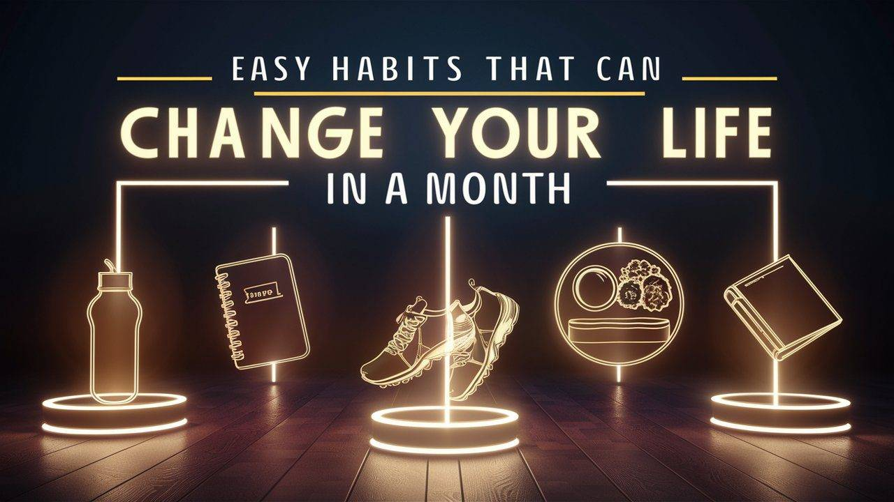

Ever wondered how some people effortlessly achieve success and happiness while others struggle? It often boils down to their habits- the small, everyday choices that shape our lives more than we realize. As Aristotle wisely said, "We are what we repeatedly do. Excellence, then, is not an act, but a habit." This sentiment echoes through time and across cultures, underscoring the profound impact habits have on our bodies, minds, and overall quality of life.

Our habits are not just routines, they are powerful drivers of change. Whether it's eating healthier, exercising regularly, or practicing mindfulness, these changing habits practiced consistently can lead to significant transformations over time. In the words of Charles Duhigg, author of "The Power of Habit," "Change might not be fast and it isn't always easy. But with time and effort, almost any habit can be reshaped."

## How to Build Habits

Building life changing habits isn't just about willpower- it's about understanding the science behind behavior change. Studies in psychology show that habits are formed through repetition and reward. By consistently performing a behavior in a specific context and associating it with a positive outcome, our brains learn to automate these actions. This process, known as "habit formation," is a fundamental aspect of human behavior that can be harnessed for personal growth. According to studies, if we manage to do one thing repeatedly for 21 days, it becomes a habit.

<iframe src="https://www.youtube.com/embed/SDNUvvSZtN4?si=yjVuujcKYBDHANKG" title="habits-that-can-change-your-life"></iframe>

Ancient spiritual practices also emphasize the power of habits in shaping our lives. From meditation in Buddhism to rituals in Hinduism, these traditions recognize the transformative potential of daily practices. They teach us not only discipline but also mindfulness- a state of present-moment awareness that fosters inner peace and clarity. Meditation techniques like Vipassana in Buddhism and various forms of Dhyana in Hinduism calm the mind and cultivate concentration. Yoga combines physical postures, breath control (pranayama), and meditation to enhance mental clarity and spiritual growth. Rituals and ceremonies, including chanting mantras and offering prayers, reinforce spiritual values throughout the day.

## Art of Relaxation

Many times, we misjudge relaxation with laziness and vice versa. In today's fast-paced world, relaxation isn't just a luxury, it's a necessity for maintaining physical and mental well-being. Spiritual traditions offer insights into relaxation techniques that go beyond mere physical rest. Practices like mindfulness and meditation not only relax the body but also calm the mind, allowing us to stay present and enhance our creativity and productivity.

As the Zen proverb goes, "You should sit in meditation for twenty minutes every day- unless you are too busy. Then you should sit for an hour." It’s a humorous yet poignant reminder of prioritizing relaxation amid our busy schedules.

## Habits to Inculcate in Daily Life

We often prioritize temporary pleasures over what truly matters, thinking it's a win. If you have ever found yourself caught in this cycle, don’t worry, there are simple habits you can incorporate into your daily routine to bring lasting fulfillment and well-being:

### 1\. Fuel Your Body Right

Food makes everything better. Bad food makes a day bad, but good food can change the tone of a bad day. The food we eat directly impacts our energy levels, mood, and overall health. Think of it as investment, where you invest, decides the return. Therefore, invest in fruits, vegetables, whole grains, and lean proteins in your diet. Small changes like swapping sugary snacks for healthier alternatives or cooking nutritious meals at home can make a world of difference. Always remember to keep your body hydrated, after all, we are mostly water.

### 2\. The Power of Sleep

Can’t seem to sleep properly? We'll send a seasoned toddler to school you in the art of slumber! Sleep is crucial for cognitive function, emotional well-being, and physical health. Therefore, creating a bedtime routine is pivotal for your wellbeing. We need to train our body to learn signals that it's time to unwind, such as reading a book or taking a warm bath. You know if our body misses 1 day of sleep, it needs around 6-7 days to recover? Ensure your sleep environment is comfortable and free from distractions so you can have a restful sleep.

### 3\. Move Your Body

Physical activity not only strengthens your body but also boosts your mood and cognitive function. Find activities you enjoy, whether it's cycling, yoga, jogging, or dancing, and aim for at least 30 minutes of exercise most days of the week. Start small and gradually increase intensity as your fitness improves.

### 4\. Practice Mindfulness

Stress can take a toll on both our physical and mental health. Incorporate stress-relieving practices like meditation, deep breathing, or mindfulness exercises into your daily routine. These techniques help reduce cortisol levels, improve focus, and cultivate a sense of calm amidst life's challenges.

### 5\. Hydrate Your Body: Drink More Water

Hydration is essential for overall health and well-being. Carry a reusable water bottle with you throughout the day and aim to drink at least 8 glasses of water daily. Staying hydrated improves concentration, supports digestion, and boosts energy levels.

Incorporating these simple habits into your daily life isn't just about checking boxes, it's about cultivating a lifestyle that promotes health, happiness, and personal growth. As author James Clear advises in "Atomic Habits," "You do not rise to the level of your goals. You fall to the level of your systems." By building positive habits systematically and consistently, you pave the way for a more fulfilling and meaningful life.

Remember, transformation doesn't happen overnight. Start small, be patient with yourself, and celebrate each step forward. Your journey to a healthier, happier you begins with these simple yet powerful habits. Cheers to a life well-lived!
