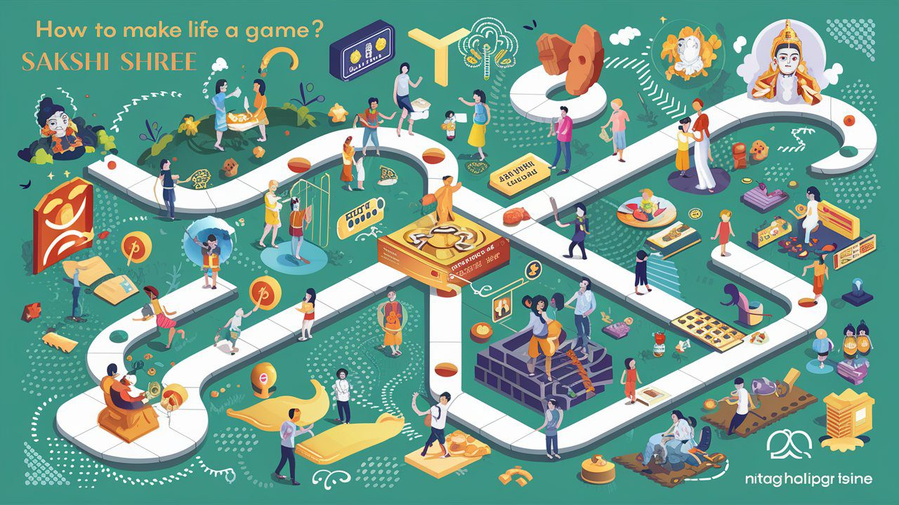

Life can often feel like a series of challenges and obstacles. However, what if you could transform your life into a game? By adopting a playful mindset and embracing life's experiences with enthusiasm, you can create a more fulfilling and joyful existence. This approach is championed by spiritual leader Sakshi Shree, who teaches that viewing life as a game can lead to profound personal growth and happiness.

## Embrace a Playful Mindset

The first step to making life a game is to adopt a playful mindset. This means approaching life with curiosity, enthusiasm, and a sense of adventure. When you view challenges as opportunities to learn and grow, they become less daunting and more exciting. Remember, in a game, every level presents new challenges and rewards. Similarly, in life, each experience offers valuable lessons and growth opportunities.

## Set Clear Goals

Just like in any game, setting clear goals is essential. These goals give you direction and purpose. Break down your larger life goals into smaller, manageable tasks. Celebrate each achievement, no matter how small, as it brings you closer to your ultimate objective. This not only keeps you motivated but also makes the journey enjoyable.

<iframe src="https://www.youtube.com/embed/gkisJi9A4Lc?si=TClalGjjYt6LI58J" title="How-to-make-life-a-game"></iframe>

## Practice Mindfulness

Mindfulness is a powerful tool in the game of life. It involves being fully present in the moment and appreciating each experience. By practicing mindfulness, you can reduce stress and increase your awareness of the beauty and joy in everyday activities. This heightened awareness helps you navigate life's challenges with grace and ease.

## Learn from Mistakes

In any game, mistakes are inevitable. They are part of the learning process. Similarly, in life, it's important to view mistakes as opportunities for growth. Rather than dwelling on failures, use them as stepping stones to improve and move forward. Each mistake is a lesson that brings you closer to success.

## Cultivate Positive Relationships

In the game of life, having a supportive team can make all the difference. Surround yourself with positive, like-minded individuals who uplift and inspire you. These relationships provide encouragement, support, and joy, making your journey more enjoyable. Remember, the people you interact with can significantly impact your overall experience of life.

## Stay Curious and Keep Learning

A key aspect of making life a game is to remain curious and open to new experiences. Lifelong learning keeps your mind active and engaged. Whether it's acquiring a new skill, exploring a new hobby, or seeking knowledge, staying curious ensures that life remains exciting and dynamic.

## Maintain a Healthy Balance

In any game, balance is crucial. It's important to maintain a healthy balance between work, play, and rest. Overworking can lead to burnout, while too much play can result in neglecting responsibilities. Strive for a balanced lifestyle that allows you to enjoy life's pleasures while fulfilling your obligations.

## Celebrate Your Achievements

Celebrating your achievements, no matter how small, is an essential part of making life a game. Recognize and reward yourself for the progress you make. This not only boosts your morale but also reinforces the idea that life is a series of enjoyable milestones.

## Practice Gratitude

Gratitude is a powerful practice that can transform your perspective on life. By focusing on the positive aspects of your experiences, you can cultivate a sense of contentment and joy. Start each day by acknowledging the things you are grateful for. This simple practice can significantly enhance your overall well-being.

## Conclusion

Transforming your life into a game is about adopting a playful mindset, setting clear goals, practicing mindfulness, learning from mistakes, cultivating positive relationships, staying curious, maintaining balance, celebrating achievements, and practicing gratitude. By following these principles, as taught by Sakshi Shree, you can create a fulfilling and joyful life. Embrace each day as a new level in the game of life and enjoy the journey.

By implementing these practices and viewing life as a game, you can unlock a world of joy and fulfillment. Visit Science Divine Foundation to learn more about Sakshi Shree's teachings and start your journey towards a playful and meaningful life.
