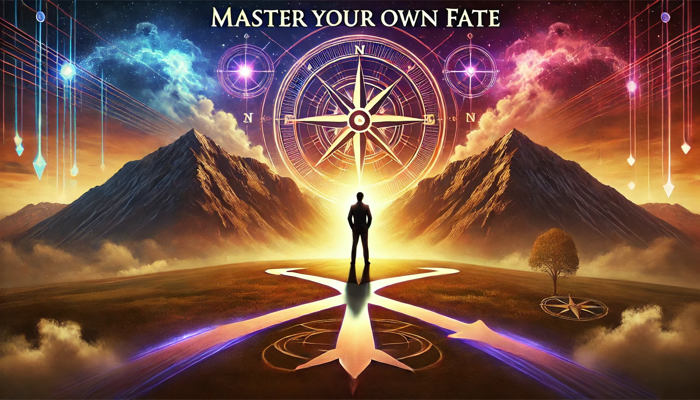

**Have you ever found yourself asking the age-old question:** can I truly control my fate, or is it already written for me? It’s similar to the debate of what came first, the chicken or the egg. This eternal dilemma has always put everyone in a puzzle for centuries. Let me tell you a story that might shed some light on this quandary.

**Once, there were two friends:** one was considered smart, and the other, not so much. One day, they visited a wise sage who told them, **"The smarter one will succeed, and the not-so-smart one will not."** The smarter friend believed the sage and, feeling assured of his future success, spent his days in leisure and frivolity. Unsurprisingly, he never succeeded in anything. The not-so-smart friend, also believing the sage, thought, **"If I can’t succeed, I might as well enjoy life."** So, he too did nothing meaningful and met the same fate. The sage's prediction was 50% right and 50% wrong. Life is full of potential and uncertainty. You never know the outcome until you try.

This story shows us the power to shape our destiny lies within our actions and mindset. Let's understand how fate intertwines with the power of karma, positive thinking, conscious living, and the profound state of thoughtlessness.

## The State of Thoughtlessness

In today's world of constant buzz and notifications, attaining a state of thoughtlessness may seem like an impossible task. Yet, it is more important than ever. Thoughtlessness, or a clear mind, helps our brain function more efficiently and improve our understanding of emotions, keeping them in check without the need for conscious control.

<iframe title="master-your-own-fate" src="https://www.youtube.com/embed/ruO99IvRAEM?si=zoS1YrpF4VYopEK0"></iframe>

The old age practice of mindfulness and meditation is key to get this state of thoughtfulness. A daily practice of 30 min will get you a few years ahead of others. It is not just a belief anymore, even science backs it up.

**A study published in the journal Psychiatry Research:** Neuroimaging found that mindfulness meditation can increase the density of gray matter in brain regions associated with memory, sense of self, empathy, and stress. Similarly, Daniel Goleman and Richard J. Davidson's book, **"Altered Traits: Science Reveals How Meditation Changes Your Mind, Brain, and Body,"** discusses how regular meditation can lead to long-lasting positive changes in brain structure and function.

Aren’t you tired of that constant chatterbox in your mind? Regular practice of mindfulness and meditation, reduces it, allowing us to focus on what truly matters and navigate our emotions more effectively. This state of mental clarity plays a crucial role in mastering our own fate by making thoughtful, deliberate decisions that align with our true goals and values.

## Power of Positive Thinking and Purposeful Living

As Norman Vincent Peale famously said, **"Change your thoughts and you change your world."** Not just him, many successful people stand behind this belief- ‘What we believe, we become.’ The power of positive thinking cannot be overstated. It is a force that can transform our lives by altering our perception of challenges and opportunities.

This notion is also backed by scientific studies. A study conducted by the Mayo Clinic found that individuals who engage in positive thinking experience numerous health benefits, including reduced stress levels, lower rates of depression, and improved cardiovascular health. Not just that, positive thinking can enhance our problem-solving skills and increase resilience in the face of any adverse situation.

Living purposefully is closely linked to positive thinking. Purposeful living means setting clear goals and pursuing them with determination and optimism. In his book, **"Man's Search for Meaning,"** Viktor Frankl emphasizes that finding a purpose in life is essential for enduring hardship and achieving fulfillment. When we live purposefully, we are more likely to maintain a positive outlook, as we are driven by a sense of meaning and direction.

By harnessing the power of positive thinking and living purposefully, we can create our own fate, steering our lives towards success and fulfillment. This proactive approach is necessary to overcome obstacles and seize opportunities with confidence and optimism.

## Conscious Living and Power of Karma

Conscious living is the practice of being fully aware and present in our actions, thoughts, and decisions. It is about making deliberate choices that align with our values and long-term goals. Sounds easy, right? Many must be thinking that they are doing it already. But how many of you can resist being swayed by immediate gratification or external influences? That is the key behind conscious living.

The concept of karma is rooted in spiritual traditions such as Hinduism and Buddhism. It reinforces the importance of conscious living. The concept of karma means that our actions, both good and bad, have consequences that affect our future. Just like the story we read earlier, doing and not doing, both have consequences. When we engage in good karma - positive, ethical, and mindful actions, we come closer to our desired fate.

Many self-help books often echo the same principles. In his book, **"The Power of Now,"** Eckhart Tolle discusses how living in the present moment and making conscious choices can lead to a more fulfilling and meaningful life. Deepak Chopra in this book **"The Seven Spiritual Laws of Success"** highlights the importance of intentional actions and the impact they have on our destiny.

When we embrace the power of conscious thinking and good karma, we actively and consciously shape our destiny. Every decision we make, no matter how small, contributes to the larger picture of our lives. This awareness encourages us to act with integrity and purpose, fostering a positive cycle of growth and success.

No one can control every twist and turn life makes. Mastering your own fate is not about controlling every aspect of life but about understanding and harnessing the power of your actions, thoughts, and mindset. All these things are ways of making an individual flexible enough to twist and turn when life does. Remember, the journey to mastering your destiny begins with a single, mindful step. Start today, and watch as your life transforms in ways you never thought possible.
