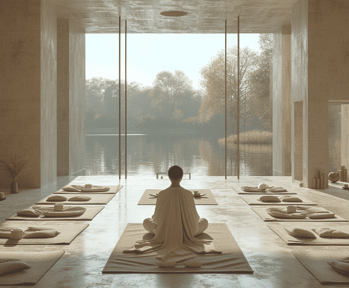

In the hustle and bustle of modern life, finding tranquility can often seem like a distant dream. However, the ancient practice of meditation offers a beacon of calm in the midst of chaos. Meditating at home isn’t just about sitting quietly; it’s about transforming your living space into a sanctuary of serenity. Whether you’re a seasoned practitioner or a curious newbie, this guide will walk you through the steps to establish a meaningful meditation practice at home, ensuring that peace and mindfulness are just a breath away.

#### Setting the Stage for Serenity

##### Creating a Conducive Environment

- **Choosing Your Space:** Identify a quiet, clutter-free area where interruptions are minimal.
- **Ambiance Matters:** Consider soft lighting, perhaps candles or dimmable lights, and maybe introduce calming scents like lavender or sandalwood.
- **Comfort is Key:** Equip your space with comfortable seating. A cushion or a yoga mat can work wonders.

##### Establishing a Routine

- **Consistency Counts:** Aim for a regular time each day to meditate, building a habit that sticks.
- **Start Small:** Begin with short sessions, gradually increasing the duration as your comfort with the practice grows.

#### Embracing the Practice

##### Understanding the Basics

- **Posture Pointers:** Learn the importance of sitting with a straight yet relaxed spine.
- **The Breath Connection:** Focus on your breathing, understanding its role as the anchor of your meditation practice.

##### Techniques and Tips

- **Variety of Methods:** Explore different meditation techniques, such as mindfulness meditation, guided meditation, or mantra meditation, finding the one that resonates with you.
- **Dealing with Distractions:** Learn to acknowledge distractions without judgment and gently redirect your focus back to your breath or chosen point of concentration.

#### Enhancing Your Experience

##### Integrating Mindfulness into Daily Life

- **Beyond the Cushion:** Find ways to incorporate mindfulness into everyday activities, like eating, walking, or even during work breaks.
- **The Ripple Effect:** Understand how regular meditation can improve not just your mental well-being but also have positive effects on your physical health and interpersonal relationships.

#### Tools and Resources

- **Apps and Online Resources:** Introduce readers to helpful meditation apps and online resources to guide their practice.
- **Community and Support:** Encourage joining online forums or local groups for motivation and sharing experiences.

Meditation at home is more than a practice; it's a journey towards self-discovery and inner peace. With the right environment, a solid routine, and an open heart, you can transform any corner of your home into a tranquil retreat. Embrace the silence, breathe through the distractions, and remember that each moment of meditation is a step closer to a more mindful and serene life. So, light a candle, find your spot, and let the journey begin. Peace is not just a dream; it’s a practice, and it starts in your very own sanctuary.
