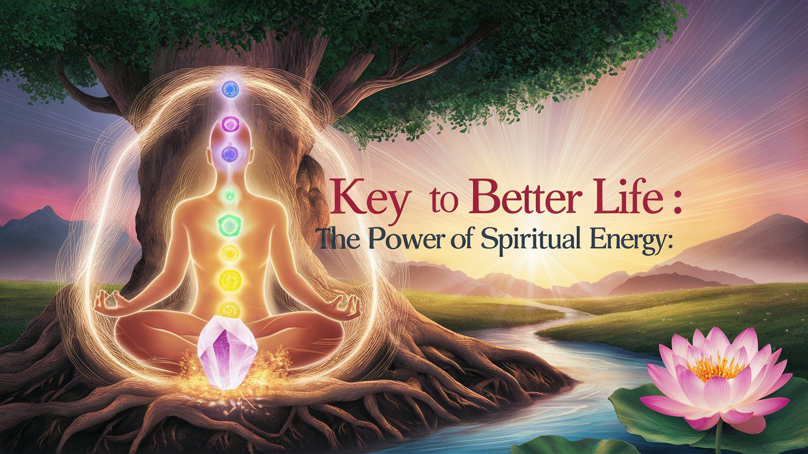

Do you believe in a force that infuses all of existence? If you do, then imagine what would happen if you could tap into this energy. There is a "life breath" that flows through our bodies which is the gateway to the divine. We call it our prana energy or soul energy.

## What is Prana Energy?

Prana is not merely a physical phenomenon, but a profound metaphysical reality that underpins our holistic well-being. When we start learning to consciously cultivate and direct this spiritual energy, we open gates to greater health, clarity of mind, and expansive states of consciousness. There are few effective ways to cultivate this energy that have been passed down by ancient sages. They have created time-honored practices to help us tap into the wellspring of our prana energy. Through conscious breathing, mindful movement, and deep meditation, we can attune ourselves to this universal life force, allowing it to nourish and rejuvenate us on every level of our being.

<iframe title="key-to-better-life" src="https://www.youtube.com/embed/wC93feZPrtk?si=_3rLVF-IBbMN6ZQ1"></iframe>

## How Prana Energy Affects Our Life?

Our spiritual energy connects the physical world with the unseen forces that bring everything to life. When we align with this energy, we feel deeply connected to the universe and our place within it. By harnessing this sacred energy, we can transform our lives in many ways. People who have learned to do it have seen significant improvement in their physical health, and found peace of mind. Being in tune with the world around them has helped them in their personal life, and their careers leading to a more fulfilling and enriched life.

Harnessing spiritual energy can lead to some amazing changes in your life. You will notice your health improving, you’ll have more energy, get sick less often, and recover faster when you do. Practices like yoga and meditation, which help channel this energy, are known to lower blood pressure and reduce stress. Mentally, you’ll likely find your mind becoming clearer and more focused. This can make decision-making easier, giving you better clarity in life. Tapping into spiritual energy will boost your creativity, and help you solve problems more effectively. Emotionally, spiritual energy brings balance. People who have undergone the changes, feel less anxious and depressed, and more content and joyful. It’s like having a calm and peaceful state of mind that’s hard to shake. This energy shift manifests into their life, bringing abundance and success.

## How Spiritual Energy Can Transform Our Life?

Be it professional or personal life, building relationships is the key to success. If someone is having issues in a relationship can also benefit from the exercises. As you become more in tune with your spiritual energy, you might notice your connections with others becoming deeper and more meaningful. You’ll likely find yourself being more empathetic, compassionate, and understanding.

Aligning with your spiritual energy can also give you a greater sense of purpose and fulfillment. You’ll discover what truly matters to you and pursue goals that resonate with your inner self, leading to a more satisfying life. When life throws challenges your way, you’ll be better equipped to handle them. With a stronger sense of inner peace and stability, you’ll navigate tough times with more grace and strength.

## How to Harness Spiritual Energy?

Tapping into your spiritual energy is easy as long as you don’t give up and be consistent. It will not fetch you instant results, rather something that will last. Here are some practical steps to help you harness this energy effectively.

### Morning Meditation Everyday

Meditation is a powerful way to calm the mental storm in your mind. Practicing it daily in the morning, preferably 4 am to 5 am will change your life in ways you can’t imagine. But don’t be disappointed if you are not a morning person. Just start with 15-20 min at a time that suits you. With consistent practice, meditation helps to quiet racing thoughts, allowing your intuition to become clearer. After being consistent for at least just 15 days, you will notice the changes. This practice can set a peaceful and centered tone for the rest of your day, making it easier to connect with your inner self and spiritual energy.

### Kindness and Community Service

The idea that “_Service to mankind is service to God_” goes beyond borders, culture and time. Show kindness and compassion towards others through service. It is a sureshot way to grow your spiritual energy. Engaging in community-building activities not only benefits those around you but also helps you find like-minded individuals who can support your spiritual journey. Spiritual growth is enhanced through meaningful connections with others, contributing to your emotional, physical, and spiritual health.

### Bask in Beauty of Nature

We come from mother nature, so no doubt we need to go to her when we want to be aligned with our prana energy. Amidst the concrete walls, artificial lights and digital screens, most of us have lost connection with our surroundings, resulting in growing feelings of confusion, anxiety, etc. Many of us these days suffer from deficiency of vitamin D, can you believe it? Something that we can easily get by getting out of our home. Spending time in nature builds a sense of holistic balance and personal growth. Nature has a unique ability to reduce stress, boost energy levels, and connect you with a higher power. The magnificence, strength, and beauty found in nature are humbling, reminding you that you are an integral part of the natural world. Take moments to appreciate and feel this connection, recognizing that as nature flows through you, you are a part of it.

### Healing Music

The healing power of music is well known and accepted. It helps connect you with your spirituality in ways that words alone cannot. It touches your thoughts, emotions, and physical well-being, reaching the deepest parts of your soul. Allow music to enhance your spiritual connection by listening to tunes that move you. You can take a sound bath, or practice chanting.

### Gut First

A clean gut means a sharp mind, clear vision and powerful intuition. Our gut is regulated by the enteric nervous system, which operates somewhat independently of our brain. It's often called our "second brain" for good reason. The gut communicates with the brain and can significantly influence our emotions and overall well-being. Trusting your gut feelings is essential because this "second brain" can offer insights that our logical mind might overlook. Tuning into your gut can help you make decisions that align with your true self. So keep your gut clean and take care of it.

### Gratitude for everything

Connection is the ultimate key for finding the well of our spiritual energy. Be it between our mind, body, spirit or with nature and people around us. An easy way to do that is through physical activities that allow self-expression, such as dancing, singing, musical instruments, or playing any sports. Train your mind through reading, writing, or creating art. Consciously try to be more appreciative and grateful for what you have. Even if you can’t seem to see the results right away, you’ll notice the changes once you become consistent. Simple acts like smiling or greeting your neighbors can extend this sense of appreciation to others, creating a ripple effect of positivity and kindness. Remember, what we sow, so we reap. So, show kindness and you’ll see what universe showers you with.

Understanding that everyone is on their own unique journey is crucial for spiritual growth. Don’t judge your progress with others and keep going. Each person's actions, words, and priorities are influenced by their individual experiences so rather than judging others based on your values and biases, give yourself the space you need. In doing so, you’ll inspire others to do the same. These simple practices will help you deeply connect with your inner self and the world around you.
