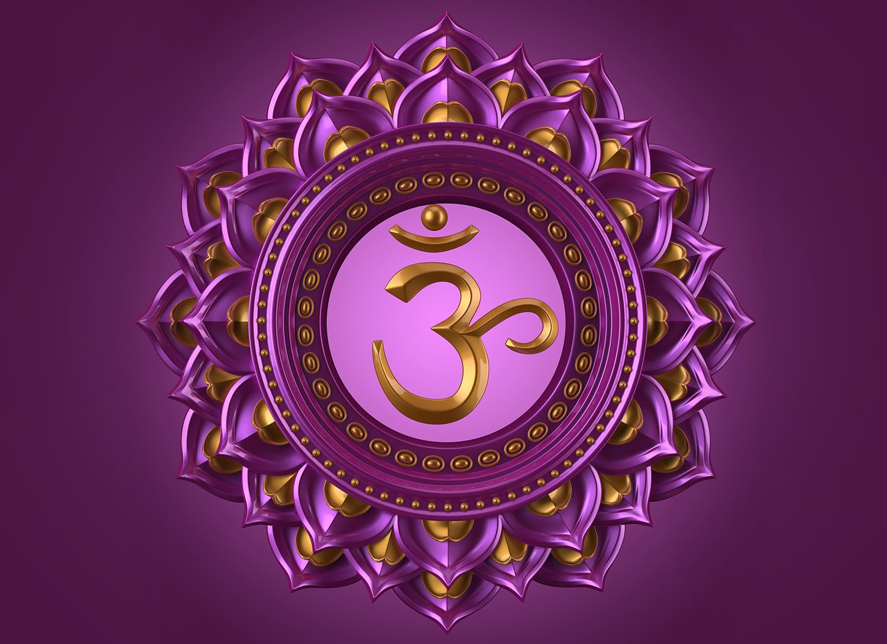
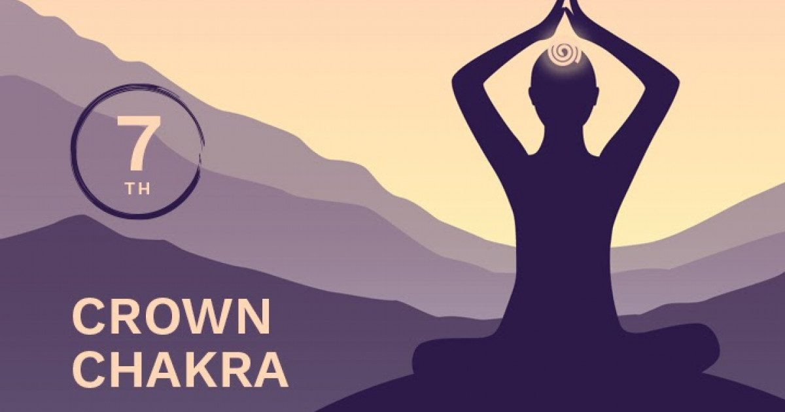
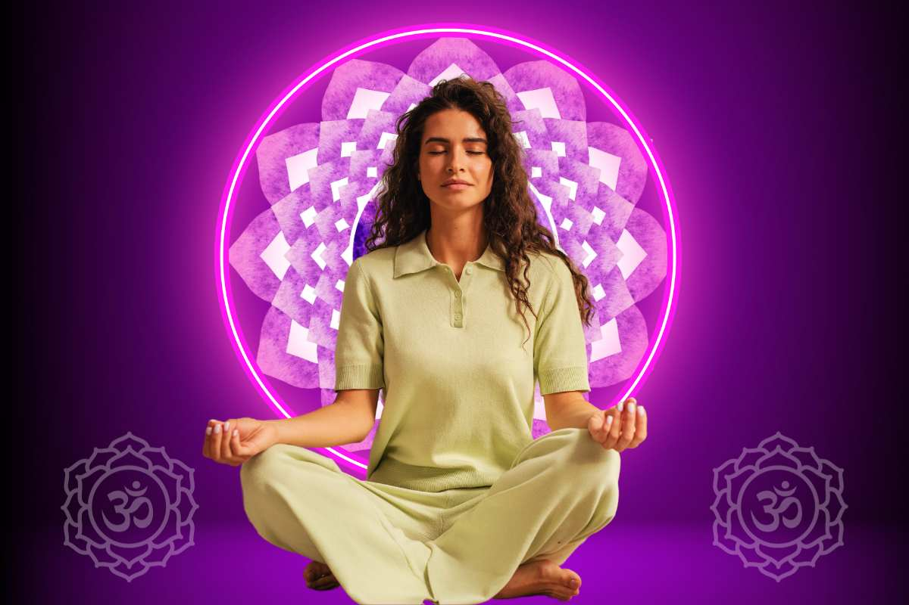

In the realm of spiritual awakening and energy healing, the Sahasrara Chakra stands as a beacon of divine connection and enlightenment. Also known as the crown chakra, this pivotal energy center is the gateway to higher consciousness, spiritual insight, and a profound sense of unity with the universe. In this comprehensive guide, we will explore the essence of the Sahasrara Chakra, including its location, unique powers, and the transformative benefits it offers. Most importantly, we will delve into practical techniques on how to activate the Sahasrara Chakra, facilitating a journey towards spiritual fulfillment and cosmic awareness.

### **What is Sahasrara Chakra?**

The Sahasrara [**Chakra**](https://sciencedivine.org/seven-chakras/), positioned at the crown of the head, is the seventh and most elevated chakra in the human energy system. It serves as the point of connection between the individual and the universe, enabling the flow of divine energy into the physical and subtle bodies. This chakra embodies the principle of pure consciousness and is often depicted as a thousand-petaled lotus, symbolizing the infinite potential and the boundless spiritual growth available to us.

### **Where is Sahasrara Chakra Location?**

The Sahasrara Chakra is located at the very top of the head, often described as being slightly above the crown. This placement is significant, as it represents the highest point of the physical self, where spiritual energy can enter and integrate with the energies of the lower chakras.

### **Sahasrara Chakra Powers:**

The powers of the Sahasrara [**Chakra**](https://sciencedivine.org/7-chakras-of-body/) are vast and profound, encompassing the highest forms of spiritual realization and enlightenment. Activation of this chakra opens the door to experiencing unbounded freedom, deep peace, and an unshakeable unity with all that is. It is here that individuals can transcend the limitations of the physical world, accessing a state of pure consciousness and divine wisdom.

### **Sahasrara Chakra Meditation:**

Meditation is a key practice for activating the Sahasrara Chakra. Techniques often involve visualization, focusing on the crown of the head, and imagining a luminous lotus opening to receive universal energy. Sahasrara meditation encourages the dissolution of personal identity and the experience of oneness with the cosmos, fostering a deep sense of inner peace and spiritual awakening.

### **Sahasrara Chakra Mudra:**

Incorporating specific hand gestures, or mudras, into meditation can enhance the activation of the Sahasrara [**Chakra**](https://sciencedivine.org/chakras-in-human-body/). The Khechari Mudra, for instance, involves curling the tongue back towards the soft palate, which is believed to stimulate the flow of energy towards the crown chakra. This mudra, along with focused intention and deep breathing, can significantly deepen one's meditation practice and facilitate the opening of the Sahasrara Chakra.

### **Sahasrara Chakra Benefits:**

Activating the Sahasrara Chakra brings numerous spiritual, emotional, and physical benefits. On a spiritual level, it fosters a profound connection to the divine and enhances intuition and psychic abilities. Emotionally, it promotes feelings of serenity, joy, and contentment. Physically, while the Sahasrara Chakra is more aligned with spiritual aspects, its activation can lead to a greater sense of harmony and balance throughout the body's energy system.

### **How to Activate Sahasrara Chakra:**

- **Regular Meditation:** Dedicate time to meditate daily, focusing on the crown of the head and visualizing the Sahasrara Chakra opening and expanding.
- **Sahasrara Chakra Mudra:** Integrate specific mudras, such as the Khechari Mudra, into your meditation practice to stimulate the crown chakra.
- **Aromatherapy and Crystals:** Use essential oils like lavender and frankincense and crystals like amethyst and clear quartz to support the activation process.
- **Chanting and Sound Therapy:** The sound “**OM**” or the Bija mantra “**AUM**” is associated with the Sahasrara Chakra. Chanting these sounds can help in aligning and opening the chakra.
- **Live a Purposeful Life:** Engage in activities that foster spiritual growth and a sense of connection to the greater whole. This can include acts of service, deepening your spiritual practice, and cultivating a mindset of openness and unity.

Activating the Sahasrara Chakra is a journey towards spiritual enlightenment, offering a path to discover the profound unity with the cosmos and the divine. By understanding where the Sahasrara Chakra is located, embracing its powers, and engaging in focused practices such as meditation and the use of specific mudras, individuals can unlock the immense benefits this chakra has to offer.
