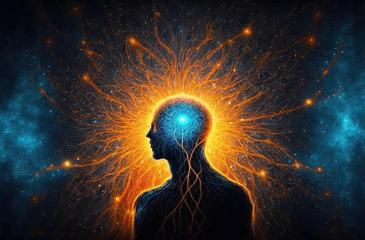

The conscious mind is an incredible force that shapes our reality, perceptions, and daily experiences. But what exactly is the conscious mind, and how can we leverage its power to transform our lives? This article delves into the essence of the conscious mind, exploring its capabilities, the different types of conscious awareness, and practical ways to harness its power for personal growth and fulfillment. By understanding and applying the principles of the conscious mind, you can unlock a world of possibilities, from enhancing creativity to improving decision-making and beyond.

### What is Conscious Mind?

The conscious mind is your awareness of yourself and the world around you. It encompasses everything you are currently thinking, feeling, and perceiving. This aspect of your mind is responsible for logic, reasoning, and voluntary actions. It's where you make decisions, contemplate life's questions, and direct your focus and attention. But what is the conscious mind's role in our overall mental framework?

### Power of Conscious Mind

The power of conscious mind lies in its ability to direct focus, make choices, and influence our subconscious patterns. It's the gatekeeper of our thoughts and perceptions, determining which experiences and memories take root in our subconscious mind. By harnessing the power of your conscious mind, you can effectively reprogram your thought patterns, beliefs, and behaviors, leading to profound changes in your life.

### Types of Conscious Mind

Understand the types of conscious mind awareness is crucial for leveraging its full potential. The [conscious mind](https://sciencedivine.org/conscious/) can be categorized into the waking conscious, where you're fully aware and engaged with your environment, and the reflective conscious, which involves introspection and self-awareness. Each type plays a significant role in how we navigate our internal and external worlds, influencing everything from how we process emotions to how we set and achieve goals.

### Harnessing the Power of Your Conscious Mind:

**Mindfulness and Meditation:** One of the most effective ways to strengthen your conscious mind is through mindfulness and meditation. These practices enhance your awareness of the present moment, allowing you to gain deeper insights into your thoughts and feelings. By cultivating a mindful state, you can improve focus, reduce stress, and create a more positive mental environment for growth and healing.

**Goal Setting and Visualization:** The conscious mind thrives on clarity and direction. Setting clear, achievable goals and regularly visualizing your success can program your subconscious to identify and pursue opportunities that align with your aspirations. This technique not only boosts motivation but also helps in overcoming obstacles by keeping your focus on the desired outcome.

**Positive Affirmations:** Repeating positive affirmations can significantly influence your subconscious beliefs and self-image. By consciously choosing empowering thoughts and affirmations, you can shift negative patterns and foster a mindset conducive to success and happiness.

**Continuous Learning:** Keeping your conscious mind engaged through learning and curiosity stimulates mental agility and creativity. Whether it's acquiring a new skill, reading, or exploring new hobbies, continuous learning expands your perspectives and enhances problem-solving capabilities.

**Emotional Intelligence:** Developing emotional intelligence involves the conscious mind's ability to recognize, understand, and manage emotions—both your own and those of others. By improving this aspect, you can navigate social interactions more effectively and build stronger, more meaningful relationships.

The conscious mind is a powerful tool at our disposal, influencing our perceptions, decisions, and interactions with the world. By understanding and tapping into the capabilities of your conscious mind, you can unlock new levels of personal growth, creativity, and fulfillment. Remember, the journey to mastering your conscious awareness is ongoing, requiring patience, practice, and persistence. Start today, and witness the transformative power of your conscious mind unfold in your life.
