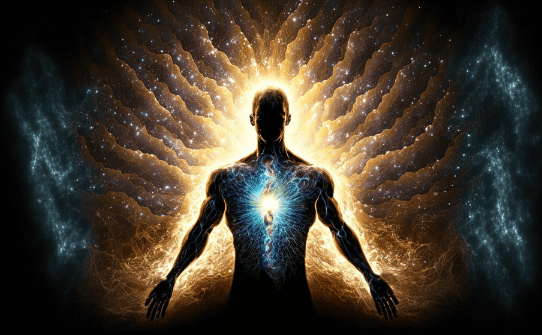

Today, we focus a lot on things we can touch and see right away. But, getting interested in spiritual growth takes us into a world that's not about what we can physically touch or see. What does being spiritual really mean? It's about looking for a deeper connection with ourselves and everything around us. This guide is here to help anyone just starting out on their [**Spiritual Journey**](https://sciencedivine.org/what-is-spirituality/). We'll show you how to find and use your inner spiritual strength, leading you towards a life filled with calmness, meaning, and deep happiness.

### **What is Spirituality?**

At its core, spirituality is a broad concept with room for many perspectives. It involves the sense of connection to something greater than ourselves, often leading to a search for meaning in life. As such, understanding what is the spiritual means is the first step in unlocking its power. Spirituality can manifest in various forms, from traditional religious practices to personal meditations on nature and the universe. The essence of a spiritual life lies in the realization that we are part of a larger existence, encouraging us to live in harmony with the world around us.

### **Cultivating Your Spiritual Power: Practices for Beginners**

- **Mindfulness and Meditation:** The cornerstone of a spiritual life, these practices help quiet the mind and foster an awareness of the present moment. By focusing on your breath or a simple mantra, you can begin to experience a sense of inner peace and connection to the world around you.
- **Nature Immersion:** Spending time in nature is a powerful way to enhance your [**Spiritual Connection**](https://sciencedivine.org/what-is-spiritual-healing/). The natural world offers a unique perspective on existence, reminding us of the beauty and complexity of life.
- **Journaling:** Reflecting on your thoughts and feelings through writing can clarify your spiritual path. Journaling allows you to explore your inner world, identifying areas of growth and gratitude.
- **Reading and Learning:** Exploring spiritual texts and teachings from various traditions can broaden your understanding and inspire your practice. Knowledge is a key component of spiritual growth.
- **Community Connection:** Joining a spiritual community or group can provide support and inspiration on your journey. Sharing experiences and practices with others fosters a sense of belonging and collective energy.

### **Common Challenges in Spiritual Journey:**

Becoming a spiritual person is not without its obstacles. Doubts, societal pressures, and the distractions of daily life can hinder progress. However, viewing these challenges as opportunities for growth can transform obstacles into stepping stones. Persistence, patience, and an open mind are crucial in navigating the path toward spiritual enlightenment.

### **How to Become a Spiritual Person:**

Becoming a spiritual person means finding a deeper connection with yourself and the world around you. It's about looking beyond everyday things to understand more about life and your place in it. Here’s how you can start:

- **Take Time for Yourself:** Spend some moments in quiet every day. This could be through meditation, sitting in nature, or just being in a peaceful spot where you can think and feel deeply.
- **Be Curious:** Read and learn about different spiritual beliefs and practices. There's a lot to discover, and finding what speaks to you can be a big part of your journey.
- **Practice Kindness:** Being kind to others and yourself is a powerful way to feel connected and spread positivity.
- **Listen to Your Inner Voice:** Pay attention to your thoughts and feelings. They can guide you to understand what really matters to you.
- **Find Joy in the Little Things:** Notice and appreciate the small, beautiful moments and things in your life. This can help you feel more connected to the world.

### **The Impact of a Spiritual Life:**

Living a spiritual life can really change you in many ways. It can make you feel better emotionally and give you a stronger sense of why you're here. The good things that come from being spiritual can't even be fully measured. Also, as you become more spiritual, you help make the world a kinder and more caring place. Becoming spiritual isn't just about changing yourself; it's about helping to make things better for everyone.

Starting a spiritual journey is a big step towards learning more about yourself and growing. There isn't just one way to become spiritual; there are many ways, and they're as different as the people looking for them. If you try out the tips and ideas we've talked about, you'll start to discover your inner spiritual strength. This can lead you to a happier and more meaningful life. Remember, it's not just about where you end up, but the experiences and lessons you pick up along the way. Every step has something valuable to offer. So, welcome to your spiritual journey, where every moment is a chance to change and grow wiser.
